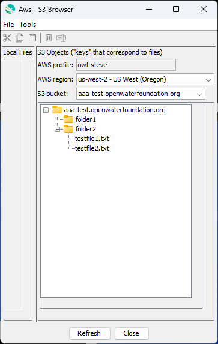
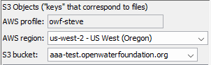

# TSTool / AWS Plugin / S3 Browser #

*   [Overview](#overview)
*   [User Interface](#user-interface)
    +   [Application Menus](#application-menus)
    +   [Application Tools](#application-tools)
    +   [Local Files and S3 Objects](#local-files-and-s3-objects)
    +   [S3 Configuration Data](#s3-configuration-data)
    +   [Tree Interactions](#tree-interactions)
    +   [Copy and Paste Between Applications](#copy-and-paste-between-applications)
*   [Command Line Syntax](#command-line-syntax)
*   [Examples](#examples)
*   [Troubleshooting](#troubleshooting)
*   [See Also](#see-also)

-------------------------

## Overview ##

The Aws plugin provides the stand-alone S3 Browser application,
which is started from the ***Browse S3*** button at the bottom of each plugin command editor.
The browser provides features to navigate, list, and manipulate S3 objects.
Multiple browsers can be run and must be closed independently.

The S3 Browser requires that the AWS command line interface (CLI) configuration files exist,
which is also a requirement for using the plugin with TSTool.
The S3 Browser provides an alternative to the web browser
[AWS Management Console](https://aws.amazon.com/console/),
which requires interactively providing login credentials.

Common uses for the S3 browser include:

*   Visually reviewing S3 bucket and folder contents, similar to using Windows File Explorer.
*   Viewing object properties, such as date, owner, and modification time.
*   Confirming that automated commands, such as [`AwsS3`](../../command-ref/AwsS3/AwsS3.md) upload commands,
    are working correctly.
*   Interactively correcting issues such as typos in filenames or misplaced files.
*   Copying object keys from the browser into command editors.

## User Interface ##

The following image illustrates the S3 Browser interface.

**<p style="text-align: center;">

</p>**

**<p style="text-align: center;">
S3 Browser Showing Example Bucket Contents (<a href="../S3Browser.png">see also the full-size image)</a>
</p>**

The browser, when started from a command editor, uses the profile, region, and bucket set in the command editor.
The command editor is a modal dialog, meaning that other TSTool features cannot be used until the command editor is closed.
Consequently, the S3 Browser is run as a separate application to allow interaction with the browser and TSTool at the same time.
TSTool passes information to he S3 Browser using command line parameters.

Currently the S3 Browser always shows the full bucket tree, with only the root-level folders initially expanded.
However, the browser will be updated in the future to implement "lazy loading" so that the tree only loads files when expanded.
Loading the entire tree may be slow or show an incomplete file list if the number of files is large.

### Application Menus ###

The application provides top-level menus, as listed in the following table.

**<p style="text-align: center;">
Application Menus
</p>**

| **Menu** | **Description** |
| -- | -- |
| ***File / Exit*** | Exit the application. |
| ***Tools / Diagnostics*** | Set the diagnostics levels for messages, used for troubleshooting. |
| ***Tools / Diagnostics / View Log File...*** | View the log file messages, used for troubleshooting. |

The log file is named `S3Browser.log` in the users files under the `.tstool/NN/logs` folder, where `NN` is the TSTool major version.

### Application Tools ###

The application provides tools as listed in the following table.
These tools are similar to the popup menus for the object tree.
Tools are only enabled when objects have been selected.

**<p style="text-align: center;">
Application Tools
</p>**

| **Menu**&nbsp;&nbsp;&nbsp;&nbsp;&nbsp;&nbsp;&nbsp;&nbsp;&nbsp;&nbsp;&nbsp;&nbsp;&nbsp;&nbsp;&nbsp;&nbsp; | **Description** | **Limits** |
| -- | -- | -- |
|  ***Cut*** | The selected S3 object(s) are added to the cut list.  Using ***Paste*** will delete the files and move to the selected folder when the ***Paste*** tool is used. | One or more objects can be cut. |
|  ***Copy*** | The selected S3 object(s) are added to the copy list.  Using ***Paste*** will copy the files to the selected folder when the ***Paste*** tool is used. | One or more objects can be copied. |
|  ***Paste*** | Paste the cut or copied objects into the selected S3 location. | One or more objects can be pasted. |
|  ***Delete*** | Delete selected objects, with confirmation. | Multiple objects can be deleted. |
|  ***Rename*** | Rename the selected object. | One object can be renamed. |

### Local Files and S3 Objects ###

The S3 Browser is split into local files (left) and S3 objects (right).
Currently only the S3 files are populated.
In the future local files will be listed to allow copying between local computer and S3.

### S3 Configuration Data ###

The top of the S3 Browser's shows S3 configuration data as shown in the following figure.

**<p style="text-align: center;">

</p>**

The configuration information provides information to authenticate the session
and the bucket under which files listed:

*   the profile, which is found in the AWS command line interface (CLI) configuration file,
    currently cannot be changed
*   the initial selections are provided by the calling TSTool command editor
*   selecting a different region will cause the bucket list to refresh
*   selecting a different bucket will cause the object tree to refresh

### Tree Interactions ###

S3 objects are listed in a tree, with bucket as the root folder and sub-folders consistent with the bucket.
S3 only stores files, so folders are a virtual construct used to indicate paths to files.

Objects must be selected (highlighted) to perform actions.

* ***left-click*** on folders or files to select
* ***Ctrl-left-click*** to toggle a selection on/off, leaving all other selections as is
* ***Shift-left-click*** to select the current and intervening objects

Once objects are selected (highlighted),
right-click on the tree to display the popup menu.
The following menu items are available.

**<p style="text-align: center;">
S3 Browser Tree Popup Menus for Selected Objects
</p>**

| **Menu** | **Description** |
| -- | -- |
| ***Copy Key*** | Copy the first selected S3 object key.  The key can then be pasted into other applications, such as TSTool commands. |
| ***Properties*** | Show S3 object properties. |

### Copy and Paste Between Applications ###

To copy and past between the applications, first select objects in the tree (left-click).
Then right-click to display the popup menu.
Use the ***Copy Key*** menu to copy the S3 object key,
and then paste into another application, for example the [`AwsS3`](../../command-ref/AwsS3/AwsS3.md) file upload list.

## Command Line Syntax ##

The S3 Browser is currently only run from TSTool
using software files distributed with the AWS plugin.
In the future a stand-alone program launcher and separate software installer may be provided.

The command syntax is as follows, as called from TSTool,
using the same Java program and classpath that is used by TSTool,
which ensures that the S3 Browser is consistent with TSTool:

```text
javaw.exe -classpath ... org.openwaterfoundation.tstool.plugin.aws.ui.S3Browser_App [parameters]
```

**<p style="text-align: center;">
Command Parameters
</p>**

|**Parameter**&nbsp;&nbsp;&nbsp;&nbsp;&nbsp;&nbsp;&nbsp;&nbsp;&nbsp;&nbsp;&nbsp;&nbsp;&nbsp;&nbsp;&nbsp;&nbsp;&nbsp;&nbsp;&nbsp;&nbsp;&nbsp;&nbsp;&nbsp;&nbsp;&nbsp;|**Description**|**Default**&nbsp;&nbsp;&nbsp;&nbsp;&nbsp;&nbsp;&nbsp;&nbsp;&nbsp;&nbsp;&nbsp;&nbsp;&nbsp;&nbsp;&nbsp;&nbsp;&nbsp;&nbsp;&nbsp;&nbsp;&nbsp;&nbsp;&nbsp;&nbsp;&nbsp;&nbsp;&nbsp;|
|--------------|-----------------|-----------------|
| | **Java Runtime Parameters** | |
|`-classpath ...`<br>**required** | A Java runtime environment classpath containing TSTool and AWS plugin `jar` files. | None - must be specified. |
| | **S3 Browser Parameters** | |
|`--bucket bucket`| The AWS S3 bucket, which will be initially selected in the S3 Browser.| First bucket found for the region, when buckets are alphabetized. |
|`--debug Term,LogFile` | Set debug levels (1+) for the terminal and log file. | Debug messages are off. |
|`--logfile log` | The log file to use for the S3 Browser. TSTool passes to open a log file `S3Browser.log` in the TSTool log file folder. | Temporary filename ending in `-S3Browser.log` |
|`--profile profile`<br>**required** | The AWS command line interface (CLI) configuration profile to use. | `default`|
|`--region region`| The AWS region for services, which will be initially selected in the S3 Browser. | First region found for the profile, when regions are alphabetized, or default region from the AWS CLI configuration. |
|`--title 'Title'` | The title to use for the S3 Browser window.  Surround with single quotes to protect spaces in the title. This parameter is not currently implemented. | ***Aws - S3 Browser*** |

## Examples ##

## Troubleshooting ##

If there is an error, view the log file using the ***Tools / Diagnostics - View Log File...*** menu.

## See Also ##

*   [`AwsS3`](../../command-ref/AwsS3/AwsS3.md) command
*   [`AwsS3Catalog`](../../command-ref/AwsS3Catalog/AwsS3Catalog.md) command
*   [`AwsCloudFront`](../../command-ref/AwsCloudFront/AwsCloudFront.md) command
