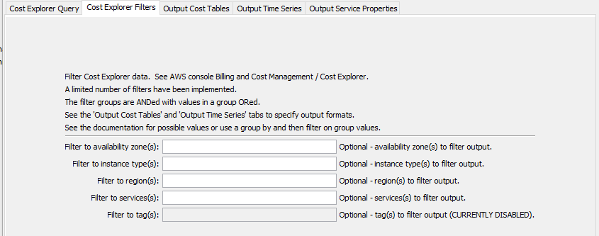

# TSTool / Command / AwsBilling #

*   [Overview](#overview)
    +   [Configuring Multi-year Data](#configuring-multi-year-data)
    +   [Granularity and Period](#granularity-and-period)
    +   [Grouped, Total, and Ungrouped Data Records](#grouped-total-and-ungrouped-data-records)
*   [Command Editor](#command-editor)
    +   [Cost Explorer Query](#cost-explorer-query)
    +   [Cost Explorer Filters](#cost-explorer-filters)
    +   [Output Cost Tables](#output-cost-tables)
    +   [Output Time Series](#output-time-series)
    +   [Output Service Properties](#output-service-properties)
*   [Command Syntax](#command-syntax)
    +   [General Command Parameters](#general-command-parameters)
    +   [Cost Explorer Query Command Parameters](#cost-explorer-query-command-parameters)
    +   [Cost Explorer Filters Command Parameters](#cost-explorer-filters-command-parameters)
    +   [Output Cost Tables Command Parameters](#output-cost-tables-command-parameters)
    +   [Output Time Series Command Parameters](#output-time-series-command-parameters)
    +   [Output Service Properties Command Parameters](#output-service-properties-command-parameters)
*   [Examples](#examples)
    +   [Checking for Untagged Services](#checking-for-untagged-services)
*   [Troubleshooting](#troubleshooting)
*   [See Also](#see-also)

-------------------------

## Overview ##

This command processes AWS billing and cost data,
for example to support an organization's analysis of costs for internal use and invoicing.
Automating cost processing helps ensure that a consistent approach is used and can help avoid unaccounted costs.

The `AwsBilling` command performs tasks for [Amazon Billing and Cost Management](https://aws.amazon.com/aws-cost-management/aws-billing/) services.
AWS tracks service costs based on the service's region, availability zone (AZ), and data specific to the service.
For example, EC2 (cloud compute server) instances have a type (size) and involve virtual hard drive and network services.
Service cost records are stored in an AWS database that is analyzed to produce monthly AWS bills.

Understanding, optimizing, and assigning costs can be difficult
because the AWS invoice is organized by service type and region, which may not be granular enough.
This can lead to wasted resources (e.g., EC2 servers that are unused or oversized)
and costs might be lumped into overhead when they should be billed to customers that use the services.

One strategy to improve cost tracking is to define tags on services.
For example, EC2 instances, virtual drives, and snapshots; virtual cloud networks; S3 buckets; and CloudFront distributions can
be assigned tags to identify an operational unit associated with the service.
Cost data can then be aggregated and filtered using the tags,
which allows granular handling of costs.
If tags are not used, other data such as regions and EC2 instance type must be used,
which may not be granular enough.

The AWS ***Billing and Cost Management / Cost Explorer*** tool is an interactive tool to query cost data.
This `AwsBilling` command uses the Cost Explorer API and provides similar functionality as the interactive tool.
However, the API and this command provide additional functionality, including:

*   Multiple ***Group By***.
*   Output as time series, which can be processed and visualized.

The following AWS concepts and terminology are used in the `AwsBilling` command parameters:

*   The AWS command line interface (CLI) [profile](https://docs.aws.amazon.com/cli/latest/userguide/cli-configure-profiles.html)
    is used to authenticate the AWS connection and provides the default region for the plugin.
*   The AWS [`aws-global` region](https://docs.aws.amazon.com/general/latest/gr/rande.html) is used by default because cost
    data are centralized in this region.
*   AWS uses "dimensions" (data types) to group and filter cost data.
    Each service provides specific dimensions and some general dimensions (e.g., region) are typically available for all services.
*   The ***Cost Explorer*** allows grouping by:
    +   dimension (e.g., region)
    +   and tag, which requires specifying the tag name (key) and value
    +   zero, one, or two group by and tag can be specified
*   The ***Cost Explorer*** allows filtering by dimensions and tags.
*   AWS uses "metrics" for cost data (e.g., "Unblended costs" in dollars).
    "Unblended costs" match the invoices generated by AWS.
*   Costs are based on various criteria (e.g., hours of a service used, or amount of disk space used).
    Ultimately, costs in dollars are used to normalize and optimize services.
*   Some cost data may be returned with a service of `Unknown Service` because they do not map to AWS services,
    including the following.  Such charges should be minimal and if they persist, contact AWS support.
    +   Costs may be uncategorized or miscellaneous charges such as tax-related charges,
        marketplace purchases, support charges, AWS credits and refunds
    +   Billing system latency or delays prevent the correct service attribution.
    +   Indirect costs such as data transfer between services.
    +   Third party or custom usage that do not map clearly to AWS services.
    +   Billing bugs or anomalies.  Contact AWS support if these persist.

### Configuring Multi-year Data ###

Cost Explorer data is available for daily granularity data for the current month plus up to 13 previous months.
See the AWS User Guide articles for information about enabling up to 38 months of monthly data (current month and 37 historical months):

*   [Configuring multi-year and granular data](https://docs.aws.amazon.com/cost-management/latest/userguide/ce-configuring-data.html)
*   [Multi-year data at monthly granularity](https://docs.aws.amazon.com/cost-management/latest/userguide/ce-multi-year-data.html)

Data beyond 14 months can only be specified using a monthly granularity (current month plus up to 37 historical months).
See the AWS User Guide:

*   [AWS Cost Explorer now provides more historical and granular data (Nov 16, 2023)](https://aws.amazon.com/about-aws/whats-new/2023/11/aws-cost-explorer-provides-historical-granular-data/). 

If it is desired to store an archive of historical daily and monthly data, download the data as an output table and save the tables as files to read later.
For example, run a scheduled process to harvest and save the data.  The archived data can be read and processed into time series and reports.
This will ensure that as AWS is used for more than 38 months, the data will be saved locally for historical analysis.
It my be necessary to save multiple versions of the data with different groupings and/or total to support analysis.
Using no groupings will result in totals for the specified time granularity (see the next section for an explanation of granularity).

### Granularity and Period ###

Cost aggregation based on granularity occurs by default as the first level of aggregation, whether or not groups are specified:

*   Hourly granularity data are available only for a short period and might be useful to understand intense usage,
    but is not the focus of this command.
*   Daily granularity data (available for the current month and 13 previous months)
    are useful to understand a recent period, such as a month,
    to understand daily variations, trends, and evaluate charges that are not tagged.
*   Monthly granularity data (available for the current month and 37 previous months)
    are useful to understand charges throughout the year and annual total.

The data included in the overall analysis and individual data records (based on granularity and other grouping),
is indicated by the start and end date.
The start date is inclusive, but the end date is exclusive.

*   The AWS API treats the ending date for the overall period as exclusive:
    +   See the AWS [`GetCostAndUsageRequest`](https://docs.aws.amazon.com/sdk-for-ruby/v2/api/Aws/CostExplorer/Types/GetCostAndUsageRequest.html#time_period-instance_method) service documentation.
    +   For example, using command parameter `InputStart=2024-01-01` and `InputEnd=2024-09-03` would
        return data for `2024-01-01 00:00:00` through `2024-09-02 23:59:59`.
    +   This ensures that partial data for the current day are ignored.
    +   Using an end date of the first day of a month results in all the data for the previous month being processed.
    +   The `TimeChunk` command parameter requests multiple periods of data to avoid limits on any single request (typically 5000 records),
        while propertly incrementing the query period to handle the exclusive end date.
*   The AWS API treats the ending date for internal `ResultByTime` objects as exclusive:
    +   Running the command with debug turned on will output `ResultByTime` data to the log file.
    +   See the AWS [`DataInterval`](https://docs.aws.amazon.com/aws-cost-management/latest/APIReference/API_DateInterval.html) documentation.
    +   For daily granularity, the data are totaled for a day (e.g., period with start `2024-09-02` and end `2024-09-03`)
        includes the start day time 00:00:00 through 23:59:59.
    +   Midnight is therefore considered part of the "next" day.

### Grouped, Total, and Ungrouped Data Records ###

AWS uses an internal database to track service usage and understanding the charges may require a lot of study.
Some of the usage tracking is straightforward, such as how much data is transferred.
However, there are complexities that can be difficult to understand, including:

*   Does a charge apply to a transaction (e.g., a data transfer),
    a state at a point in time (e.g., storage), or a cumulative value (e.g., number of CloudFront invalidations)?
*   Is a charge applied instantaneously, daily, or once a month (e.g., at the beginning or end of the month,
    such as once a month tax charges)?

It may not be obvious how services are billed and consequently what is important may be to focus on high-cost services
and make sure that they are understood and are managed.
This typically requires grouping the data, for example by a tag indicating resources associated with a business operation,
and by service to understand the costs for a service (so that costs can be reduced).

Grouping data using tags and other information (e.g., service or region) is recommended because otherwise it is necessary to
sort through instance names and regions to understand how costs are being tracked.
For example, group the data by service and a tag.

Data from the AWS web services is returned in various ways, which are indicated in the `RecordType` column in the output table from this command:

*   Grouped:
    +   If `GroupBy1` and/or `GroupBy2` are specified, the data will be grouped as indicated, as per the Cost Explorer groups.
    +   Grouping the data will hide ungrouped attributes, such as the region.
    +   These data are useful for understanding AWS service costs associated with a business unit.
*   Total:
    +   Data are the total charge for all services for the period indicated by the start (inclusive) and end (exclusive).
    +   For example, for granularity of `Daily`, the data values will be the total charges per day.
    +   These data are useful for tracking overall costs and comparing monthly API granularity
        time series to AWS monthly invoices (should match exactly).
*   Ungrouped (raw data):
    +   It does not seem possible to only group by the granularity.
        If no group is specified, totals are returned by the API.

## Command Editor ##

The following dialog is used to edit the command and illustrates the syntax for the command.
Tabs are provided for related groups of command parameters.

Some command parameters are provided to help with automated tests and error checks.
For example the `GroupedTableRowCountProperty` parameter can be used to set a processor property
containing the number of rows in the grouped output table.
The [`If`](https://opencdss.state.co.us/tstool/latest/doc-user/command-ref/If/If/)
command can then be used to check the property value.

**<p style="text-align: center;">

</p>**

**<p style="text-align: center;">
`AwsBilling` Command Editor (<a href="../AwsBilling.png">see full-size image)</a>
</p>**

### Cost Explorer Query ###

Use the ***Cost Explorer Query*** parameters to specify how to read AWS cost data.

There does not appear to be a way to query the raw AWS cost data.
Instead, query parameters can be used to group the data into charges by dollars.
If groups are not specified, the total cost for all services for the granularity is output.
The ***Output Cost Tables*** and ***Output Time Series*** tabs specify how the results are output.

**<p style="text-align: center;">

</p>**

**<p style="text-align: center;">
`AwsBilling` Command Editor for Cost Explorer Query Parameters (<a href="../AwsBilling-cost-explorer-query.png">see full-size image)</a>
</p>**

### Cost Explorer Filters ###

The ***Cost Explorer Filters*** tab provides parameters to filter the cost data,
for example to a specific region and service.

**These features have been partially implemented.**

**<p style="text-align: center;">

</p>**

**<p style="text-align: center;">
`AwsBilling` Command Editor for Cost Explorer Filter Parameters (<a href="../AwsBilling-cost-explorer-filters.png">see full-size image)</a>
</p>**

### Output Cost Tables ###

The ***Output Cost Tables*** tab provides parameters to control creating output tables and/or files
for grouped and total data records.
Either grouped or total data can be output, depending on how the data were queried.

**<p style="text-align: center;">

</p>**

**<p style="text-align: center;">
`AwsBilling` Command Editor for Output Cost Tables Parameters (<a href="../AwsBilling-output-cost-tables.png">see full-size image)</a>
</p>**

For example, the following is the output table for daily granularity grouped by service and a tag.
Note that the charges are computed inclusive of the start date and exclusive of the end date.

**<p style="text-align: center;">

</p>**

**<p style="text-align: center;">
`AwsBilling` Example Output Table (<a href="../AwsBilling-output-table.png">see full-size image)</a>
</p>**

### Output Time Series ###

The ***Output Time Series*** tab provides parameters to control creating output time series.
Either grouped or total data can be output, depending on how the data were queried.

**<p style="text-align: center;">

</p>**

**<p style="text-align: center;">
`AwsBilling` Command Editor for Output Time Series Parameters (<a href="../AwsBilling-output-time-series.png">see full-size image)</a>
</p>**

The time series objects are created with time series identifiers that match the data records.
Parameters are available to control the format of the location and data type in the time series identifier.
Each record from the cost table (see previous section) is converted into a time series data value.
Time series can be manipulated and graphed by TSTool.
For example, the following graph illustrates how implementing tags on higher-cost services
can reduce unaccounted charges to less than a dollar a day.

**<p style="text-align: center;">

</p>**

**<p style="text-align: center;">
Example Graph for AWS Costs (<a href="../AwsBilling-output-graph">see full-size image)</a>
</p>**

### Output Service Properties ###

The ***Output Service Properties*** tab provides parameters to control creating tables of service properties.
Features are implemented to list services with high costs, and can be used to identify untagged services.
The following properties are included in the output tables:

*   EC2-related properties:
    +   EC2 service instance:
        -   An EC2 instance is a virtual machine, such as a Linux server,
            which typically has multiple related services.
        -   See the [`DescribeInstances` API](https://docs.aws.amazon.com/AWSEC2/latest/APIReference/API_DescribeInstances.html) documentation
        -   General properties (ID, region, instance type, public and private IP, state)
        -   Tags
    +   Virtual Private Cloud (VPC):
        -   
        -   See the [`DescribeVpcs` API](https://docs.aws.amazon.com/AWSEC2/latest/APIReference/API_DescribeVpcs.html) documentation
        -   Identifier
        -   Tags
    +   Virtual Private Network (VPN) Connection - optional:
        -   A VPN connection is refers to the secure communication link established between an on-premises network (or another cloud network)
            and the AWS VPC, which is typically set up to route traffic between on-premises network and resources inside the AWS VPC.
        -   Involves multiple components including Customer Gateway (on-premises) and VPN Gateway (AWS).
        -   Provides redundancy with two tunnels for each connection.
        -   See the [`DescribeVpnConnections` API](https://docs.aws.amazon.com/AWSEC2/latest/APIReference/API_DescribeVpnConnections.html) documentation
        -   Connection identifier
        -   Tags
    +   VPN Endpoint - optional for VPN connection:
        -   A VPN endpoint refers to a specific point where a VPN connection terminates or where traffic
            enters/exits the VPN, and can refer to endpoints on either side of the connection.
        -   In client VPN setups, the endpoint is a publicly-accessible URL where users connect to establish a VPN session.
        -   Endpoints do not have their own tags and are properties on the VPN connection.
    +   Elastic IP - may not be used for public IP:
        -   The Elastic IP is the public address for an EC2 instance.
        -   See the [`DescribeAddresses` API](https://docs.aws.amazon.com/AWSEC2/latest/APIReference/API_DescribeAddresses.html) documentation
        -   IP address (should match public IP, an account may have multiple public IP addresses per region)   
        -   Tags
    +   EBS volumes:
        -   An EBS volume is the virtual hard drive for an EC2 instance.
        -   See the [`DescribeVolumes` API](https://docs.aws.amazon.com/AWSEC2/latest/APIReference/API_DescribeVolumes.html) documentation
        -   Identifier
        -   Tags
*   Elastic Block Storage (EBS) snapshots - separate table
    +   See the [`DescribeSnapshots` API](https://docs.aws.amazon.com/AWSEC2/latest/APIReference/API_DescribeSnapshots.html) documentation
    +   The AWS account for the current session is used to filter the EBS snapshots due to the high number of public objects
    +   Will be stored even if the EC2 instance is deleted
    +   Region
    +   Identifier
    +   Description
    +   Tags
*   Amazon Machine Image (AMI) (EC2 images) - separate table
    +   See the [`DescribeImages` API](https://docs.aws.amazon.com/AWSEC2/latest/APIReference/API_DescribeImages.html) documentation
    +   The AWS account for the current session is used to filter the EC2 images due to the high number of public objects
    +   Will be stored even if the EC2 instance is deleted
    +   Region
    +   Identifier
    +   Description
    +   Tags

**<p style="text-align: center;">

</p>**

**<p style="text-align: center;">
`AwsBilling` Command Editor for Output Service Properties Parameters (<a href="../AwsBilling-output-service-properties.png">see full-size image)</a>
</p>**

## Command Syntax ##

The command syntax is as follows:

```text
AwsBilling(Parameter="Value",...)
```

The following tables list command parameters for general parameters and each command editor tab.

### General Command Parameters ###

General command parameters are used with all of the command options.
Note that because these parameters are used to provide important information in the editor,
the `${Property}` notation is not supported for some parameters and will cause issues for interactive command editing,
but can be used at run-time.

**<p style="text-align: center;">
Command Parameters - General
</p>**

|**Parameter**|**Description**|**Default**&nbsp;&nbsp;&nbsp;&nbsp;&nbsp;&nbsp;&nbsp;&nbsp;&nbsp;&nbsp;&nbsp;&nbsp;&nbsp;&nbsp;&nbsp;&nbsp;&nbsp;&nbsp;&nbsp;&nbsp;&nbsp;&nbsp;&nbsp;&nbsp;&nbsp;&nbsp;&nbsp;|
|--------------|-----------------|-----------------|
|`Profile`|The AWS command line interface profile to use for authentication, can use `${Property}` syntax. | <ul><li>If a single profile exists in the configuration file, it is used.</li><li>If multiple profiles exist in the configuration file, the one named `default` is used.|
|`Region`| The AWS region to use for ***Cost Explorer*** service requests. Use the [AWS Management Console website](https://aws.amazon.com/console/) to check which region is used for an account, can use `${Property}`. | `aws-global`, which is where billing information seems to be stored.  |

### Cost Explorer Query Command Parameters ###

These command parameters correspond to the ***Cost Explorer Query*** tab.

**<p style="text-align: center;">
Command Parameters - Cost Explorer Query 
</p>**

|**Parameter**&nbsp;&nbsp;&nbsp;&nbsp;&nbsp;&nbsp;&nbsp;&nbsp;&nbsp;&nbsp;&nbsp;&nbsp;&nbsp;&nbsp;&nbsp;&nbsp;&nbsp;&nbsp;|**Description**|**Default**&nbsp;&nbsp;&nbsp;&nbsp;&nbsp;&nbsp;&nbsp;&nbsp;&nbsp;&nbsp;&nbsp;&nbsp;&nbsp;&nbsp;&nbsp;&nbsp; |
|-----|-----------------|-----------------|
| `InputStart` | The starting date to query data in format `YYYY-MM-DD`.  Specify to day precision. Can use `${Property}` notation. Use the [`SetInputStart`](https://opencdss.state.co.us/tstool/latest/doc-user/command-ref/SetInputPeriod/SetInputPeriod/) command to have more control. Cost explorer data inclusive of this date will be returned. | None - must be specified. |
| `InputEnd` | The ending date to query data in format `YYYY-MM-DD`.  Specify to day precision. Can use `${Property}` notation. Cost explorer data **exclusive** of this date will be returned (so no partial data for the current day). Specifying the first day of a month will return up to the last month's data. | None - must be specified. |
| `TimeChunk` | The Cost Explorer will return up to 5000 records of grouped or total data for the specified granularity.  If this limit is reached, the returned dataset will be truncated and a warning will be shown for the command.  Use this parameter to indicate time chunks as multiples of days (e.g., `30Day`) to process using multiple requests. | Use one chunk for the requested period. |
|`Granularity` | The time granularity for aggregating cost data:<ul><li>`Monthly` - aggregate output to month (up to 38 months, current plus 37 previous months)</li><li>`Daily` - aggregate output to day (up to 14 months, current month plus 13 previous months)</li><li>`Hourly` - aggregate output to hour (up to 14 days) - **has not been tested**</li></ul> See the [Configuration Multi-Year Data](#configuring-multi-year-data) section for how to enable multi-year data.| `Monthly` |
|`GroupBy1`| The first dimension to group output. | `Service`|
|`GroupByTag1`| If `GroupBy1=Tag`, specify the tag name (key) to group output. | |
|`GroupBy2`| The scond dimension to group output. | Not used. |
|`GroupByTag2`| If `GroupBy2=Tag`, specify the tag name (key) to group output. | Not used. |
|`Metric` | The cost metric that is output. See [Understanding your AWS Cost Datasets: A Cheat Sheet](https://aws.amazon.com/blogs/aws-cloud-financial-management/understanding-your-aws-cost-datasets-a-cheat-sheet/). | `UnblendedCosts` (monthly granularity output will match AWS invoices) |

### Cost Explorer Filters Command Parameters ###

These command parameters correspond to the ***Cost Explorer Filter*** tab.

Filters can be used to limit the output.

**A limited number of filters are enabled and only one filter per dimension can currently be specified (e.g., only one region).
Implementation of filters is under development.**

**<p style="text-align: center;">
Command Parameters - Cost Explorer Filters 
</p>**

|**Parameter**&nbsp;&nbsp;&nbsp;&nbsp;&nbsp;&nbsp;&nbsp;&nbsp;&nbsp;&nbsp;&nbsp;&nbsp;&nbsp;&nbsp;&nbsp;&nbsp;&nbsp;&nbsp;&nbsp;&nbsp;&nbsp;&nbsp;&nbsp;&nbsp;&nbsp;&nbsp;&nbsp;&nbsp;&nbsp;&nbsp;&nbsp;&nbsp;&nbsp;|**Description**|**Default** |
|-----|-----------------|-----------------|
| `FilterAvailabilityZones`| A list of one or more availability zones (e.g., `us-west-1a`), separated by commas, can use `${Property}` syntax. | |
| `FilterInstanceTypes`| A list of one or more EC2 instance types (e.g., `t2-xlarge`), separated by commas, can use `${Property}` syntax. | |
| `FilterRegions`| A list of one or more regions (e.g., `us-west-1`), separated by commas, can use `${Property}` syntax. | |
| `FilterServices`| A list of one or more services, using long names from the tabular output (e.g., `Amazon Simple Storage Service`), separated by commas, can use `${Property}` syntax. | |
| `FilterTags`| A list of one or more tags, separated by commas, can use `${Property}` syntax. **Currently not implemented.**| |

### Output Cost Tables Command Parameters ###

These command parameters correspond to the ***Output Cost Tables*** tab.

Output can be saved to a table and/or file for grouped or total aggregations (not both in one command).
If a table is output with an output file, the table is used to create the output file.
If outputting to a file only, a temporary table is used internally and then the file is created from the table.

**<p style="text-align: center;">
Command Parameters - Output Cost Tables
</p>**

|**Parameter**&nbsp;&nbsp;&nbsp;&nbsp;&nbsp;&nbsp;&nbsp;&nbsp;&nbsp;&nbsp;&nbsp;&nbsp;&nbsp;&nbsp;&nbsp;&nbsp;&nbsp;&nbsp;&nbsp;&nbsp;&nbsp;&nbsp;&nbsp;&nbsp;&nbsp;&nbsp;&nbsp;&nbsp;&nbsp;&nbsp;&nbsp;&nbsp;&nbsp;&nbsp;&nbsp;&nbsp;&nbsp;&nbsp;&nbsp;&nbsp;&nbsp;|**Description**|**Default**&nbsp;&nbsp;&nbsp;&nbsp;&nbsp;&nbsp;&nbsp;&nbsp;&nbsp;&nbsp;&nbsp;&nbsp;&nbsp;&nbsp;&nbsp;&nbsp;&nbsp;&nbsp;&nbsp;&nbsp;&nbsp;&nbsp;&nbsp;&nbsp;&nbsp;&nbsp;&nbsp;|
|--------------|-----------------|-----------------|
|`GroupedTableID`| Table identifier for grouped output, can use `${Property}` syntax.  | |
|`GroupedTableFile`| Name of the file for grouped output, can use `${Property}` syntax.  The file extension (`.csv`) indicates the format. Currently only `csv` format is supported.  If `OutputTableID` is specified, that table will be used to output the file, and if not specified a temporary table will be created and then output.  If necessary, write the table to a different format using a separate command.| |
|`GroupedTableRowCountProperty` | The name of the property to set as the count of grouped output table rows, useful for testing, error-handling, and logic control. | Count is not set. |
|`TotalTableID`| Table identifier for totalized output, can use `${Property}` syntax.  | |
|`TotalTableFile`| Name of the file for totalized output, can use `${Property}` syntax.  The file extension (`.csv`) indicates the format. Currently only `csv` format is supported.  If `OutputTableID` is specified, that table will be used to output the file, and if not specified a temporary table will be created and then output.  If necessary, write the table to a different format using a separate command.| |
|`TotalTableRowCountProperty` | The name of the property to set as the count of totalized output table rows, useful for testing, error-handling, and logic control. | Count is not set. |
|`AppendOutput` | Append the output to an existing table (and file).  Create the table/file if they do not exist. | Overwrite the existing table and file without appending. |

### Output Time Series Command Parameters ###

These command parameters correspond to the ***Output Time Series*** tab and define how time series should be identified.
The AWS API uses up to two groups to group the data according to different categories (e.g., service and tag).
The results are returned by the specified group.

It is recommended to specifically set the `TimeSeriesLocationID` and `TimeSeriesDataType` to desired format
because the `Auto` behavior is complex and may change in the future.
The `Auto` values are useful for reviewing what data are available, but should then be made more specific.

`UPPERCASE` names are used to indicate specific data to use for the time series metadata.

**<p style="text-align: center;">
Command Parameters - Output Time Series Parameters
</p>**

|**Parameter**&nbsp;&nbsp;&nbsp;&nbsp;&nbsp;&nbsp;&nbsp;&nbsp;&nbsp;&nbsp;&nbsp;&nbsp;&nbsp;&nbsp;&nbsp;&nbsp;&nbsp;&nbsp;&nbsp;&nbsp;&nbsp;&nbsp;&nbsp;&nbsp;&nbsp;&nbsp;&nbsp;&nbsp;&nbsp;&nbsp;&nbsp;&nbsp;&nbsp;|**Description**|**Default**&nbsp;&nbsp;&nbsp;&nbsp;&nbsp;&nbsp;&nbsp;&nbsp;&nbsp;&nbsp;&nbsp;&nbsp;&nbsp;&nbsp;&nbsp;&nbsp;&nbsp;&nbsp;&nbsp;&nbsp;&nbsp;&nbsp;&nbsp;&nbsp;&nbsp;&nbsp;&nbsp;&nbsp;&nbsp;&nbsp;&nbsp;&nbsp;&nbsp;|
|--------------|-----------------|-----------------|
|`CreateTimeSeries`| Indicate whether time series should be created for the output (`True`) or not (`False`). | `False` |
|`TimeSeriesLocationID` | The time series metadata to use for the location identifier. A built-in special value can be specified as follows:<ul><li>`Auto` (**recommended only for reviewing data availability**)- determine the location identifier based on the `GroupBy` parameters<ul><li>`Tag:TagValue` if tag is specified for the first "group by" and no second "group by"</li><li>`Tag:TagValue-GroupBy` - if tag is specified for first or second "group by" and another "group by" is used</li><li>`GroupBy1:GroupBy1Value` if no tag and only first "group by" is specified</li><li>`GroupBy1:GroupBy1Value-GroupBy2Value` - if both "group by" are specified and are not tags</li></ul></li><li>`GroupBy1` - `GroupBy1:GroupBy1Value` value is used for the location</li><li>`GroupBy2` - `GroupBy2:GroupBy2Value` value is used for the location</li></ul> Or, specify a format string containing any of the following values:<ul><li>`GROUPBY1` - the `GroupBy1` parameter value</li><li>`GROUPBYTAG1` - the `GroupByTag1` parameter value<li>`GROUPBY1VALUE` - the cost data record corresponding to `GroupByTag1` (tag value) or `GroupBy1` output (e.g., service or region name)</li><li>`GROUPBY2` - the `GroupBy2` parameter value</li><li>`GROUPBYTAG2` - the `GroupByTag2` parameter value</li><li>`GROUPBY2VALUE` - the cost data record value corresponding to `GroupByTag2` (tag value) or `GroupBy2` output (e.g., service or region name)</li><li>`METRIC` - metric (e.g., `UnblendedCost`)</ul>| `Auto` |
|`TimeSeriesDataType` | The time series metadata to use for the data type:<ul><li>`Auto` (**recommended for reviewing data availability**) - "group by 1" value, dash, and metric</li><li>`GroupBy1` - "group by 1" value, dash, and metric</li><li>`GroupBy2` - "group by 2" value, dash, and metric</li></ul> | `Auto` |
|`TimeSeriesMissingGroupBy` | Value to use if the group by value is missing, including tag names that were not set in the early part of the cost history. | `Unknown` |
|`Alias`|The alias to assign to the time series, as a literal string or using the special formatting characters listed by the command editor.  The alias is a short identifier used by other commands to locate time series for processing, as an alternative to the time series identifier (`TSID`). | |

### Output Service Properties Command Parameters ###

These command parameters correspond to the ***Output Service Properties*** tab
and are used to read properties for services.
This output is independent of cost data and is useful for identifying services that have not been tagged
(tag results in `Unknown` in time series identifiers).

**<p style="text-align: center;">
Command Parameters - Output Service Properties Parameters
</p>**

|**Parameter**&nbsp;&nbsp;&nbsp;&nbsp;&nbsp;&nbsp;&nbsp;&nbsp;&nbsp;&nbsp;&nbsp;&nbsp;&nbsp;&nbsp;&nbsp;&nbsp;&nbsp;&nbsp;&nbsp;&nbsp;&nbsp;&nbsp;&nbsp;&nbsp;&nbsp;&nbsp;&nbsp;&nbsp;&nbsp;&nbsp;&nbsp;&nbsp;&nbsp;|**Description**|**Default**&nbsp;&nbsp;&nbsp;&nbsp;&nbsp;&nbsp;&nbsp;&nbsp;&nbsp;&nbsp;&nbsp;&nbsp;&nbsp;&nbsp;&nbsp;&nbsp;&nbsp;&nbsp;&nbsp;&nbsp;&nbsp;&nbsp;&nbsp;&nbsp;&nbsp;&nbsp;&nbsp;&nbsp;&nbsp;&nbsp;&nbsp;&nbsp;&nbsp;|
|--------------|-----------------|-----------------|
|`EC2PropertiesTableID`| Table identifier for EC2-related services, can use `${Property}` syntax.  | |
|`EBSSnapshotsTableID`| Table identifier for EBS snapshots, can use `${Property}` syntax.  | |
|`EC2ImagesTableID`| Table identifier for EC2 images (Amazon Machine Images, AMI), can use `${Property}` syntax.  | |

## Examples ##

See the [automated tests](https://github.com/OpenWaterFoundation/owf-tstool-aws-plugin/tree/master/test/commands/AwsBilling).
Automated tests require AWS permissions to run.

### Checking for Untagged Services ###

AWS service charges associated with specific business units can be difficult to track.
Defining tags on services is one way to group the charges.
However, if an AWS account is complex, with many business units, untracked services may fall through the cracks,
leading to unexplained costs.

One way to group costs is to define a tag on services, especially high-cost services such as EC2 instances.
For example, if each system has a unique identifier, define a tag `SystemId=SomeIdentifier`.
Then, use this command with group by `Service` and tag `SystemId`.
Any time series that do not have the tag defined will have `Unknown` in the time series identifier.
The resulting `Unknown` time series can be graphed, for example as a stacked area graph, to show the largest costs.
However, because the `Unknown` costs will be lumped together,
it is not possible to identify the root cause without more investigation.
The graphs are useful to evaluate how `Unknown` charges change over time,
for example for new servers that do not have tags properly defined.

To find the root cause, use the ***Output Service Properties*** command parameters
to output tables of EC2 properties and images, and EBS snapshots.
Services that are missing tags can be updated to define tags.
The daily time series graph should show less `Unknown` charges the next day.

## Troubleshooting ##

If there is an error, view the TSTool log file using the ***Tools / Diagnostics - View Log File...*** menu.
If necessary, use the 
[`SetDebugLevel`](https://opencdss.state.co.us/tstool/latest/doc-user/command-ref/SetDebugLevel/SetDebugLevel/)
command to troubleshoot (turn debug on to the log file before a command and then set levels to zero after a command).

### Error Message: `To retrieve data beyond the past 14 months, your start date needs to be the first day of the month` ###

This is due to requesting a period longer than 14 months
and may be shown even if the `InputStart` is specified as daily data for the first day of a month.
Data beyond 14 months can only be specified using a monthly granularity
See [Configuring Multi-year Data](#configuring-multi-year-data) for information about enabling multi-year data.
The `InputStart` and `InputEnd` should still be specified using dates to day precision.

### Data are Truncated ###

If the returned data are truncated, it may be due to the AWS API limiting the number of records.
For example, if an output table is created, it may have a size of exactly 5000 rows, which is the query limit.
To fix, use the `TimeChunk` command parameter to specify a shorter time period to query,
and the command will make multiple requests until the data are retrieved.

### Data for the Current Day is Missing ###

Although TSTool typically handles `InputStart` and `InputEnd` as inclusive,
the AWS API uses inclusive for the start date and exclusive for the end date.
This ensures that only full data records are returned because the current day will be incomplete.
Requesting data on the first of the month, for example for a scheduled process,
will also ensure that full data for the previous month is returned
and avoids the complications of calculating the day for the end of each month.

## See Also ##

*   [`AwsS3`](../AwsS3LandingPage/AwsS3LandingPage.md) command
*   [`If`](https://opencdss.state.co.us/tstool/latest/doc-user/command-ref/If/If/) command
*   [`SetDebugLevel`](https://opencdss.state.co.us/tstool/latest/doc-user/command-ref/SetDebugLevel/SetDebugLevel/) command
*   [`SetInputPeriod`](https://opencdss.state.co.us/tstool/latest/doc-user/command-ref/SetInputPeriod/SetInputPeriod/) command
