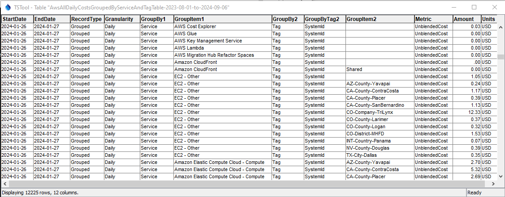

# TSTool / Command / AwsBilling #

*   [Overview](#overview)
*   [Command Editor](#command-editor)
    +   [Cost Explorer Query](#cost-explorer-query)
    +   [Cost Explorer Filters](#cost-explorer-filters)
    +   [Output](#output)
    +   [Time Series](#time-series)
*   [Command Syntax](#command-syntax)
    +   [General Command Parameters](#general-command-parameters)
    +   [Cost Explorer Query Command Parameters](#cost-explorer-query-command-parameters)
    +   [Cost Explorer Filters Command Parameters](#cost-explorer-filters-command-parameters)
    +   [Output Command Parameters](#output-command-parameters)
    +   [Time Series Command Parameters](#time-series-command-parameters)
*   [Examples](#examples)
*   [Troubleshooting](#troubleshooting)
*   [See Also](#see-also)

-------------------------

## Overview ##

This command processes AWS billing and cost data,
for example to support an organization's analysis of costs for internal use and invoicing.
Automating cost processing helps ensure that a consistent approach is used and can help avoid unaccounted costs.

The `AwsBilling` command performs tasks for [Amazon Billing and Cost Management](https://aws.amazon.com/aws-cost-management/aws-billing/) services.
AWS tracks service costs based on the service's region, availability zone (AZ), and data specific to the service.
For example, EC2 (cloud compute server) instances have a type (size) and involve virtual hard drive and network services.
Service cost records are stored in an AWS database that is analyzed to produce monthly AWS bills.

Understanding, optimizing, and assigning costs, for example to paying customers, can be difficult
because the AWS invoice is organized by service type and region, which may not be granular enough.
This can lead to wasted resources (e.g., EC2 servers that are unused or oversized)
and absorbing costs into overhead when they should be billed to customers that use the services.

One simple strategy to improve cost tracking is to define tags on services.
For example, EC2 instances, virtual drives, and snapshots; virtual private networks; S3 buckets; and CloudFront distributions can
be assigned tags to identify an operational unit associated with the service.
Cost data can then be aggregated and filtered using the tags,
which allows granular handling of costs.

The AWS ***Billing and Cost Management / Cost Explorer*** tool is an interactive tool to query cost data.
This `AwsBilling` command uses the Cost Explorer API and provides similar functionality as the interactive tool.
However, the API and this command provide additional functionality, including:

*   Multiple ***Group By***.
*   Output as time series, which can be processed and visualized.

AWS concepts and terminology are used in the `AwsBilling` command parameters:

*   The AWS command line interface (CLI) [profile](https://docs.aws.amazon.com/cli/latest/userguide/cli-configure-profiles.html)
    is used to authenticate the AWS connection and provides the default region for the plugin.
*   The AWS [`aws-global` region](https://docs.aws.amazon.com/general/latest/gr/rande.html) is used by default because cost
    data are centralized in this region.
*   AWS uses "dimensions" (data types) to group and filter cost data.
    Each service provides specific dimensions and some general dimensions (e.g., region) are typically available for all services.
*   The ***Cost Explorer*** allows grouping by:
    +   dimension (e.g., region)
    +   and tag, which requires specifying the tag name (key) and value
*   The ***Cost Explorer*** allows filtering by dimensions and tags.
*   AWS uses "metrics" for cost data (e.g., "Unblended costs" in dollars).
*   Costs are based on various criteria (e.g., hours of a service used, or amount of disk space used).
    Ultimately, costs in dollars are used to normalize and optimize services.

## Command Editor ##

The following dialog is used to edit the command and illustrates the syntax for the command.
Tabs are provided for related groups of command parameters.

Some command parameters are provided to help with automated tests and error checks.
For example the `OutputTableRowCountProperty` parameter can be used to set a processor property
containing the number of rows in the output table.
Use the [`If`](https://opencdss.state.co.us/tstool/latest/doc-user/command-ref/If/If/) command to check the property value.

**<p style="text-align: center;">

</p>**

**<p style="text-align: center;">
`AwsBilling` Command Editor (<a href="../AwsBilling.png">see full-size image)</a>
</p>**

### Cost Explorer Query ###

Use the ***Cost Explorer Query*** parameters to specify how to read AWS cost data.

There does not appear to be a way to query the raw AWS cost data.
Instead, query parameters can be used to group the data into charges by dollars.
The ***Output*** and ***Time Series*** tabs control how the results are represented.

**<p style="text-align: center;">

</p>**

**<p style="text-align: center;">
`AwsBilling` Command Editor for Cost Explorer Query Parameters (<a href="../AwsBilling-cost-explorer-query.png">see full-size image)</a>
</p>**

### Cost Explorer Filters ###

The ***Cost Explorer Filters*** tab provides parameters to filter the cost data.

**These features have been partially implemented.**

**<p style="text-align: center;">

</p>**

**<p style="text-align: center;">
`AwsBilling` Command Editor for Cost Explorer Filter Parameters (<a href="../AwsBilling-cost-explorer-filters.png">see full-size image)</a>
</p>**

### Output ###

The ***Output*** tab provides parameters to control creating an output table and/or file.

**<p style="text-align: center;">

</p>**

**<p style="text-align: center;">
`AwsBilling` Command Editor for Output Parameters (<a href="../AwsBilling-output.png">see full-size image)</a>
</p>**

For example, the following is the output table grouped by service and a tag.

**<p style="text-align: center;">

</p>**

**<p style="text-align: center;">
`AwsBilling` Example Output Table (<a href="../AwsBilling-output-table.png">see full-size image)</a>
</p>**

### Time Series ###

The ***Time Series*** tab provides parameters to control creating output time series.

**<p style="text-align: center;">

</p>**

**<p style="text-align: center;">
`AwsBilling` Command Editor for Time Series Parameters (<a href="../AwsBilling-time-series.png">see full-size image)</a>
</p>**

The time series objects are created with time series identifiers that match the data records.
Each record from the cost table (see previous section) is converted into a time series data value.
Time series can be manipulated and graphed by TSTool.
For example, the following graph illustrates how implementing tags on higher-cost services
was able to reduce unaccounted charges to less than a dollar a day.

**<p style="text-align: center;">

</p>**

**<p style="text-align: center;">
Example Graph for AWS Costs (<a href="../AwsBilling-output-graph">see full-size image)</a>
</p>**

## Command Syntax ##

The command syntax is as follows:

```text
AwsBilling(Parameter="Value",...)
```

The following tables list command parameters for general parameters and each command editor tab.

### General Command Parameters ###

General command parameters are used with all of the command options.
Note that because these parameters are used to provide important information in the editor,
the `${Property}` notation is not supported for some parameters and will cause issues for interactive command editing.

**<p style="text-align: center;">
Command Parameters - General
</p>**

|**Parameter**|**Description**|**Default**&nbsp;&nbsp;&nbsp;&nbsp;&nbsp;&nbsp;&nbsp;&nbsp;&nbsp;&nbsp;&nbsp;&nbsp;&nbsp;&nbsp;&nbsp;&nbsp;&nbsp;&nbsp;&nbsp;&nbsp;&nbsp;&nbsp;&nbsp;&nbsp;&nbsp;&nbsp;&nbsp;|
|--------------|-----------------|-----------------|
|`Profile`|The AWS command line interface profile to use for authentication, can use `${Property}` syntax. | <ul><li>If a single profile exists in the configuration file, it is used.</li><li>If multiple profiles exist in the configuration file, the one named `default` is used.|
|`Region`| The AWS region to use for ***Cost Explorer*** service requests. Use the [AWS Management Console website](https://aws.amazon.com/console/) to check which region is used for an account, can use `${Property}`. | `aws-global`, which is where billing information seems to be stored.  |

### Cost Explorer Query Command Parameters ###

These command parameters correspond to the ***Cost Explorer Query*** tab.

**<p style="text-align: center;">
Command Parameters - Cost Explorer Query 
</p>**

|**Parameter**&nbsp;&nbsp;&nbsp;&nbsp;&nbsp;&nbsp;&nbsp;&nbsp;&nbsp;&nbsp;&nbsp;&nbsp;&nbsp;&nbsp;&nbsp;&nbsp;&nbsp;&nbsp;|**Description**|**Default**&nbsp;&nbsp;&nbsp;&nbsp;&nbsp;&nbsp;&nbsp;&nbsp;&nbsp;&nbsp;&nbsp;&nbsp; |
|-----|-----------------|-----------------|
| `InputStart` | The starting date to query data in format `YYYY-MM-DD`.  Specify to day precision. Can use `${Property}` notation. Use the [`SetInputStart`](https://opencdss.state.co.us/tstool/latest/doc-user/command-ref/SetInputPeriod/SetInputPeriod/) command to have more control. | None - must be specified. |
| `InputEnd` | The ending date to query data in format `YYYY-MM-DD`.  Specify to day precision. Can use `${Property}` notation. | None - must be specified. |
|`Granularity` | The time granularity for aggregating cost data:<ul><li>`Monthly` - aggregate output to month (up to 38 months)</li><li>`Daily` - aggregate output to day (up to 14 days)</li><li>`Hourly` - aggregate output to hour (up to 14 days)</li></ul> | `Monthly` |
|`GroupBy1`| The first dimension to group output. | `Service`|
|`GroupByTag1`| If `GroupBy1=Tag`, specify the tag name (key) to group output. | |
|`GroupBy2`| The scond dimension to group output. | Not used. |
|`GroupByTag2`| If `GroupBy2=Tag`, specify the tag name (key) to group output. | Not used. |
|`Metric` | The cost metric that is output. See [Understanding your AWS Cost Datasets: A Cheat Sheet](https://aws.amazon.com/blogs/aws-cloud-financial-management/understanding-your-aws-cost-datasets-a-cheat-sheet/). | `UnblendedCosts` |

### Cost Explorer Filters Command Parameters ###

These command parameters correspond to the ***Cost Explorer Filter*** tab.

Filters can be used to limit the output.

**A limited number of filters are enabled and only one filter per dimension can currently be specified (e.g., only one region).
Implementation of filters is under development.**

**<p style="text-align: center;">
Command Parameters - Cost Explorer Filters 
</p>**

|**Parameter**&nbsp;&nbsp;&nbsp;&nbsp;&nbsp;&nbsp;&nbsp;&nbsp;&nbsp;&nbsp;&nbsp;&nbsp;&nbsp;&nbsp;&nbsp;&nbsp;&nbsp;&nbsp;&nbsp;&nbsp;&nbsp;&nbsp;&nbsp;&nbsp;&nbsp;&nbsp;&nbsp;&nbsp;&nbsp;&nbsp;&nbsp;&nbsp;&nbsp;|**Description**|**Default** |
|-----|-----------------|-----------------|
| `FilterAvailabilityZones`| A list of one or more availability zones (e.g., `us-west-1a`), separated by commas, can use `${Property}` syntax. | |
| `FilterInstanceTypes`| A list of one or more EC2 instance types (e.g., `t2-xlarge`), separated by commas, can use `${Property}` syntax. | |
| `FilterRegions`| A list of one or more regions (e.g., `us-west-1`), separated by commas, can use `${Property}` syntax. | |
| `FilterServices`| A list of one or more services, using long names from the tabular output (e.g., `Amazon Simple Storage Service`), separated by commas, can use `${Property}` syntax. | |
| `FilterTags`| A list of one or more tags, separated by commas, can use `${Property}` syntax. **Currently not implemented.**| |

### Output Command Parameters ###

These command parameters correspond to the ***Output*** tab.

Output can be saved to a table and/or file.
If a table is output with an output file, the table is used to create the output file.
If outputting to a file only, a temporary table is used internally and then the file is created from the table.

**<p style="text-align: center;">
Command Parameters - Output
</p>**

|**Parameter**&nbsp;&nbsp;&nbsp;&nbsp;&nbsp;&nbsp;&nbsp;&nbsp;&nbsp;&nbsp;&nbsp;&nbsp;&nbsp;&nbsp;&nbsp;&nbsp;&nbsp;&nbsp;&nbsp;&nbsp;&nbsp;&nbsp;&nbsp;&nbsp;&nbsp;&nbsp;&nbsp;&nbsp;&nbsp;&nbsp;&nbsp;&nbsp;&nbsp;&nbsp;&nbsp;&nbsp;&nbsp;&nbsp;&nbsp;&nbsp;&nbsp;|**Description**|**Default**&nbsp;&nbsp;&nbsp;&nbsp;&nbsp;&nbsp;&nbsp;&nbsp;&nbsp;&nbsp;&nbsp;&nbsp;&nbsp;&nbsp;&nbsp;&nbsp;&nbsp;&nbsp;&nbsp;&nbsp;&nbsp;&nbsp;&nbsp;&nbsp;&nbsp;&nbsp;&nbsp;|
|--------------|-----------------|-----------------|
|`OutputTableID`| Table identifier for output, can use `${Property}` syntax.  | |
|`OutputFile`| Name of file for output, can use `${Property}` syntax.  The file extension (`.csv`) indicates the format. Currently only `csv` format is supported.  If necessary, write the table to a different format using a separate command.| |
|`AppendOutput` | Append the output to an existing table (and file).  Create the table/file if they do not exist. | Overwrite the existing table and file without appending. |
|`OutputTableRowCountProperty` | The name of the property to set the count of output table rows, useful for testing, error-handling, and logic control. | Count is not set. |

### Time Series Command Parameters ###

These command parameters correspond to the ***Time Series*** tab.

**<p style="text-align: center;">
Command Parameters - Time Series Parameters
</p>**

|**Parameter**&nbsp;&nbsp;&nbsp;&nbsp;&nbsp;&nbsp;&nbsp;&nbsp;&nbsp;&nbsp;&nbsp;&nbsp;&nbsp;&nbsp;&nbsp;&nbsp;&nbsp;&nbsp;&nbsp;&nbsp;&nbsp;&nbsp;&nbsp;&nbsp;&nbsp;&nbsp;&nbsp;&nbsp;&nbsp;|**Description**|**Default**&nbsp;&nbsp;&nbsp;&nbsp;&nbsp;&nbsp;&nbsp;&nbsp;&nbsp;&nbsp;&nbsp;&nbsp;&nbsp;&nbsp;&nbsp;&nbsp;&nbsp;&nbsp;&nbsp;&nbsp;&nbsp;&nbsp;&nbsp;&nbsp;&nbsp;&nbsp;&nbsp;&nbsp;&nbsp;&nbsp;&nbsp;&nbsp;&nbsp;|
|--------------|-----------------|-----------------|
|`CreateTimeSeries`| Indicate whether time series should be created for the output (`True`) or not (`False`). | `False` |
|`TimeSeriesLocationID` | The time series metadata to use for the location identifier:<ul><li>`Auto` - determine the location identifier based on the `GroupBy` parameters</li><li>`GroupBy1` - `GroupBy1` value is used for the location</li><li>`GroupBy2` - `GroupBy2` value is used for the location</li></ul> | `Auto` (if the tag is specified, the tag name is used for location type and tag value for the location ID) |
|`Alias`|The alias to assign to the time series, as a literal string or using the special formatting characters listed by the command editor.  The alias is a short identifier used by other commands to locate time series for processing, as an alternative to the time series identifier (`TSID`).|The alias in the file will be used if present.|

## Examples ##

See the [automated tests](https://github.com/OpenWaterFoundation/owf-tstool-aws-plugin/tree/master/test/commands/AwsBilling).
Automated tests require AWS permissions to run.

## Troubleshooting ##

If there is an error, view the TSTool log file using the ***Tools / Diagnostics - View Log File...*** menu.
If necessary, use the 
[`SetDebugLevel`](https://opencdss.state.co.us/tstool/latest/doc-user/command-ref/SetDebugLevel/SetDebugLevel/)
command to troubleshoot (turn debug on to the log file before a command and then set levels to zero after a command).

## See Also ##

*   [`AwsS3`](../AwsS3LandingPage/AwsS3LandingPage.md) command
*   [`If`](https://opencdss.state.co.us/tstool/latest/doc-user/command-ref/If/If/) command
*   [`SetDebugLevel`](https://opencdss.state.co.us/tstool/latest/doc-user/command-ref/SetDebugLevel/SetDebugLevel/) command
*   [`SetInputPeriod`](https://opencdss.state.co.us/tstool/latest/doc-user/command-ref/SetInputPeriod/SetInputPeriod/) command
