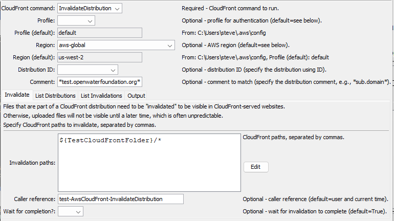
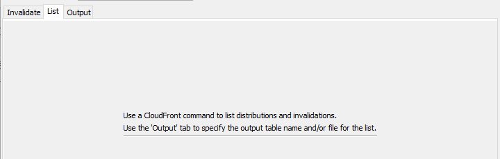
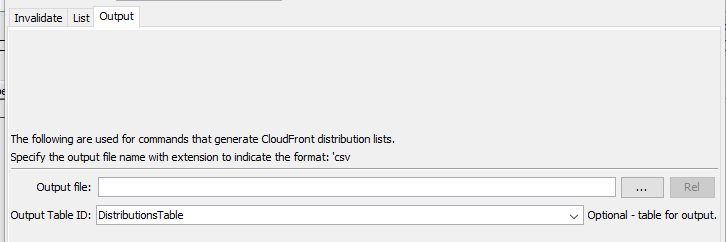

# TSTool / Command / AwsCloudFront #

* [Overview](#overview)
* [Command Editor](#command-editor)
* [Command Syntax](#command-syntax)
* [Examples](#examples)
* [Troubleshooting](#troubleshooting)
* [See Also](#see-also)

-------------------------

## Overview ##

The `AwsCloudFront` command performs tasks for [Amazon CloudFront](https://aws.amazon.com/cloudfront/).
CloudFront is typically used to implement a Content Delivery Network (CDN),
including `https` protocol, cached resources on distributed servers, and invalidation to provide rapid "time to live" for uploaded files.
CloudFront is often used with S3 (see the [`AwsS3`](../AwsS3/AwsS3.md) command) and improves the performance of static websites that use S3 for storage.

CloudFront concepts and terminology are used in the command parameters:

* The AWS command line interface (CLI) [profile](https://docs.aws.amazon.com/cli/latest/userguide/cli-configure-profiles.html)
  is used to authenticate the AWS connection and provides the default region for the plugin.
* An AWS [region](https://docs.aws.amazon.com/general/latest/gr/rande.html) is used identify the geographic location of the CloudFront request endpoint.
  From experience, it appears that the `aws-global` region may need to be used with CloudFront requests and not the S3 region associated with a CloudFront distribution.
* CloudFront uses [distributions](https://docs.aws.amazon.com/AmazonCloudFront/latest/DeveloperGuide/distribution-overview.html) to manage content.
* CloudFront uses [invalidations](https://docs.aws.amazon.com/AmazonCloudFront/latest/DeveloperGuide/Invalidation.html) to indicate that content needs to be updated in caches.

## Command Editor ##

The following dialog is used to edit the command and illustrates the syntax for the command.

**<p style="text-align: center;">

</p>**

**<p style="text-align: center;">
`AwsCloudFront` Command Editor for Invalidate Parameters (<a href="../AwsCloudFront-invalidate.png">see also the full-size image)</a>
</p>**

**<p style="text-align: center;">

</p>**

**<p style="text-align: center;">
`AwsCloudFront` Command Editor for List Parameters (<a href="../AwsCloudFront-list.png">see also the full-size image)</a>
</p>**

**<p style="text-align: center;">

</p>**

**<p style="text-align: center;">
`AwsCloudFront` Command Editor for Output Parameters (<a href="../AwsCloudFront-output.png">see also the full-size image)</a>
</p>**

## Command Syntax ##

The command syntax is as follows:

```text
AwsCloudFront(Parameter="Value",...)
```

**<p style="text-align: center;">
Command Parameters
</p>**

|**Tab**|**Parameter**&nbsp;&nbsp;&nbsp;&nbsp;&nbsp;&nbsp;&nbsp;&nbsp;&nbsp;&nbsp;&nbsp;&nbsp;&nbsp;&nbsp;&nbsp;&nbsp;&nbsp;&nbsp;&nbsp;&nbsp;&nbsp;&nbsp;&nbsp;&nbsp;&nbsp;|**Description**|**Default**&nbsp;&nbsp;&nbsp;&nbsp;&nbsp;&nbsp;&nbsp;&nbsp;&nbsp;&nbsp;&nbsp;&nbsp;&nbsp;&nbsp;&nbsp;&nbsp;&nbsp;&nbsp;&nbsp;&nbsp;&nbsp;&nbsp;&nbsp;&nbsp;&nbsp;&nbsp;&nbsp;|
|--|--------------|-----------------|-----------------|
|***All***|`CloudFrontCommand`<br>**required**|The CloudFront command to run, which indicates which tab's parameters are used, can use `${Property}` syntax. | None - must be specified. |
||`Profile`|The AWS command line interface profile to use for authentication, can use `${Property}` syntax. | Use the `default` profile or use the single profile if only one profile is provided in the configuration files.|
||`Region`| The AWS region to use for service requests. Use the [AWS Management Console website](https://aws.amazon.com/console/) to check which region is used for an account, can use `${Property}` syntax. | Default region from the user's AWS configuration file. |
||`DistributionId`| The CloudFront distribution identifier, can use `${Property}` syntax. The `DistributionID` or `Comment` parameter must be specified. | A distribution ID must be specified for CloudFront commands that act on specific distributions. |
||`Comment`|The distribution comment to match, useful because a distribution may match a domain name that is easy to understand, whereas the distribution ID is a sequence of characters. The `DistributionID` or `Comment` parameter must be specified. | A distribution ID must be specified for CloudFront commands that act on specific distributions. |
||`IfInputNotFound`| Message level when input is not found:  `Ignore`, `Warn`, or `Fail`. | `Warn` |
|***List***|| No parameters are currently needed to list distributions, but additional filtering parameters may be added in the future. | |
|***Invalidate***|`InvalidationPaths`| List of CloudFront paths (files and folders) to invalidate separated by commas: `path1,path2`. Can use `${Property}` syntax. See the editor notes for path syntax.| |
||`CallerReference`| A unique string to identify the service caller, used to ignore invalidations that are not unique, can use `${Property}` syntax. | The user's login name and current time. |
||`WaitForCompletion`| Whether the command should wait for CloudFront to complete the invalidation (`True`) or allow processing to complete without waiting (`False`).  Use `CloudFrontCommand=ListInvalidations` to list invalidations that have not completed. | `True`. |
|***Output***|`OutputFile`| Name of file for output, used with list commands, can use `${Property}` syntax.  The file extension (`.csv`) indicates the format. | |
||`OutputTableID`| Table identifier for output, used with list commands, can use `${Property}` syntax.  | |

## Examples ##

See the [automated tests](https://github.com/OpenWaterFoundation/owf-tstool-aws-plugin/tree/master/test/commands/AwsCloudFront).
Automated tests require AWS permissions to run.

## Troubleshooting ##

If there is an error, see the TSTool log file using the ***Tools / Diagnostics - View Log File...*** menu.

## See Also ##

* [`AwsS3`](../AwsS3/AwsS3.md) command
