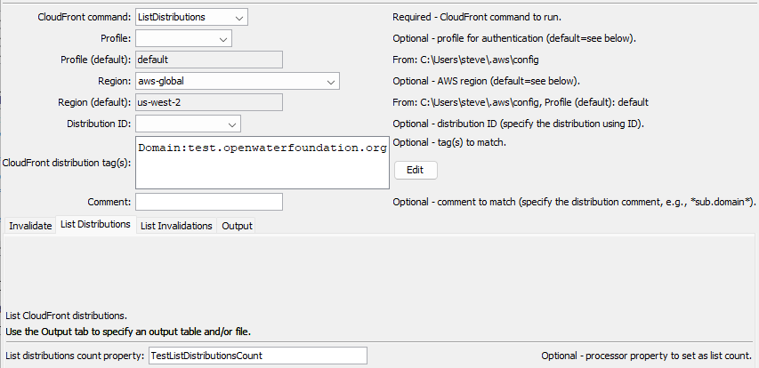
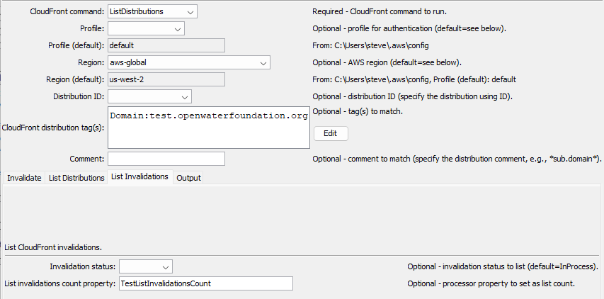
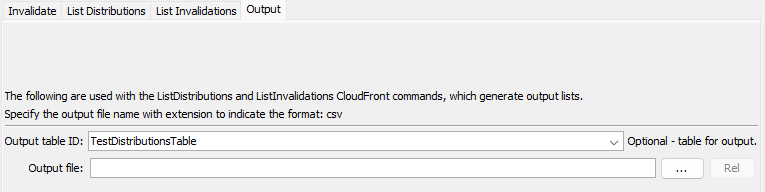

# TSTool / Command / AwsCloudFront #

*   [Overview](#overview)
*   [Command Editor](#command-editor)
    +   [Invalidate Distribution](#invalidate-distribution)
    +   [List Distributions](#list-distributions)
    +   [List Invalidations](#list-invalidations)
    +   [Output](#output)
*   [Command Syntax](#command-syntax)
    +   [Invalidate Distribution Command Parameters](#invalidate-distribution-command-parameters)
    +   [List Distributions Command Parameters](#list-distributions-command-parameters)
    +   [List Invalidations Command Parameters](#list-invalidations-command-parameters)
*   [Examples](#examples)
*   [Troubleshooting](#troubleshooting)
*   [See Also](#see-also)

-------------------------

## Overview ##

The `AwsCloudFront` command performs tasks for [Amazon CloudFront](https://aws.amazon.com/cloudfront/).
CloudFront is typically used to implement a Content Delivery Network (CDN) with the following features:

*   `https` protocol (S3 static websites only provide `http`)
*   cached resources on distributed "edge" servers
*   invalidation functionality to push updates to the CDN edge servers and provide rapid "time to live" for uploaded files

CloudFront is often used with S3 (see the [`AwsS3`](../AwsS3/AwsS3.md) command) and improves the security and
performance of static websites that use S3 for storage.
For example, automation tools can upload files to S3 storage and then run a CloudFront invalidation
to force the files to be updated in the CDN.

CloudFront concepts and terminology are used in the command parameters:

*   The AWS command line interface (CLI) [profile](https://docs.aws.amazon.com/cli/latest/userguide/cli-configure-profiles.html)
    is used to authenticate the AWS connection and provides the default region for the plugin.
*   An AWS [region](https://docs.aws.amazon.com/general/latest/gr/rande.html) is used identify the geographic location of the CloudFront request endpoint.
    From experience, it appears that the `aws-global` region may need to be used with CloudFront requests and not the S3 region associated with a CloudFront distribution.
*   CloudFront uses [distributions](https://docs.aws.amazon.com/AmazonCloudFront/latest/DeveloperGuide/distribution-overview.html) to manage content.
*   CloudFront uses [invalidations](https://docs.aws.amazon.com/AmazonCloudFront/latest/DeveloperGuide/Invalidation.html) to indicate that content needs to be updated in caches.

## Command Editor ##

The following dialog is used to edit the command and illustrates the syntax for the command.
Each `AwsCloudFront` command has a tab for parameters specific to that command.
The ***Output*** tab is used with the `ListDistributions` and `ListInvalidations` CloudFront commands.

Some command parameters are provided to help with automated tests and error checks.
For example, the `ListDistributionsCountProperty` parameter can be used to set a processor property containing
the number of buckets in the returned list.
Use the [`If`](https://opencdss.state.co.us/tstool/latest/doc-user/command-ref/If/If/) command to check the property value.

### Invalidate Distribution ###

Use the `CloudFrontCommand=InvalidateDistribution` parameter to invalidate files (paths) in a CloudFront distribution.
For example, use the command to update a dataset's files after files have been uploaded to S3 and
if invalidation did not occur in the [`AwsS3`](../AwsS3/AwsS3.md) command.

The following example shows how to match a distribution using a tag.
Using a tag generally works well because unique tag values can be defined for CloudFront distributions.

**<p style="text-align: center;">

</p>**

**<p style="text-align: center;">
`AwsCloudFront` Command Editor for Invalidate Distribution Parameters using a Tag (<a href="../AwsCloudFront-invalidate-tag.png">see full-size image)</a>
</p>**

The following example shows how to match a distribution using a comment substring.
Note the use of asterisk at front and back as wildcards.
Matching a comment can be prone to errors if the substring is found in multiple distribution comments.

**<p style="text-align: center;">

</p>**

**<p style="text-align: center;">
`AwsCloudFront` Command Editor for Invalidate Distribution Parameters Using a Comment (<a href="../AwsCloudFront-invalidate-comment.png">see full-size image)</a>
</p>**

### List Distributions ###

Use the `CloudFrontCommand=ListDistributions` parameter to list CloudFront distributions.
For example, use the general `Tags` parameter to match the domain name in the CloudFront tag
to look up the distribution ID.

**<p style="text-align: center;">

</p>**

**<p style="text-align: center;">
`AwsCloudFront` Command Editor for List Distributions Parameters (<a href="../AwsCloudFront-list-distributions.png">see full-size image)</a>
</p>**

### List Invalidations ###

Use the `CloudFrontCommand=ListInvalidations` parameter to list CloudFront invalidations.
For example, use the command to list whether invalidations have recently been run on a distribution
and to see if any invalidations are in process.
Note that the default is to list only invalidations that have status of `InProcess`.
Use the `InvalidatationStatus` command parameter to filter the status.
The following example matches a CloudFront distribution tag.

**<p style="text-align: center;">

</p>**

**<p style="text-align: center;">
`AwsCloudFront` Command Editor for List Invalidations Parameters (<a href="../AwsCloudFront-list-invalidations.png">see full-size image)</a>
</p>**

### Output ###

The ***Output*** tab is used to specify the output table and/or file used with the CloudFront `ListDistributions` and `ListInvalidations` commands.

**<p style="text-align: center;">

</p>**

**<p style="text-align: center;">
`AwsCloudFront` Command Editor for Output Parameters (<a href="../AwsCloudFront-output.png">see full-size image)</a>
</p>**

## Command Syntax ##

The command syntax is as follows:

```text
AwsCloudFront(Parameter="Value",...)
```

**<p style="text-align: center;">
Command Parameters - General
</p>**

|**Parameter**&nbsp;&nbsp;&nbsp;&nbsp;&nbsp;&nbsp;&nbsp;&nbsp;&nbsp;&nbsp;&nbsp;&nbsp;&nbsp;&nbsp;&nbsp;&nbsp;&nbsp;&nbsp;&nbsp;&nbsp;&nbsp;&nbsp;&nbsp;&nbsp;&nbsp;|**Description**|**Default**&nbsp;&nbsp;&nbsp;&nbsp;&nbsp;&nbsp;&nbsp;&nbsp;&nbsp;&nbsp;&nbsp;&nbsp;&nbsp;&nbsp;&nbsp;&nbsp;&nbsp;&nbsp;&nbsp;&nbsp;&nbsp;&nbsp;&nbsp;&nbsp;&nbsp;&nbsp;&nbsp;|
|--------------|-----------------|-----------------|
|`CloudFrontCommand`<br>**required**|The CloudFront command to run, which indicates which tab's parameters are used. | None - must be specified. |
|`Profile`|The AWS command line interface profile to use for authentication, can use `${Property}` syntax. | <ul><li>If only one profile is provided in the AWS command line interface configuration files, use it.</li><li>If multiple profiles are available, use the one named `default` if available.</li></ul>|
|`Region`| The AWS region to use for service requests. Use the [AWS Management Console website](https://aws.amazon.com/console/) to check which region is used for an account, can use `${Property}` syntax. | Default region from the user's AWS configuration file. CloudFront seems to store distributions in the `aws-global` region. |
|`DistributionId`| The CloudFront distribution identifier, can use `${Property}` syntax. |  Must specify `DistributionId`, `Tags`, or `Comment`. |
|`Tags`| CloudFront distribution tags to match the distribution to process, can use `${Property}` syntax. | Must specify `DistributionId`, `Tags`, or `Comment`. |
|`Comment`|The distribution comment (description) to match, useful because a comment may match a domain name that is easy to understand, whereas the distribution ID is a sequence of characters.  Specify using `*` as a wildcard to match a pattern (e.g., `*some.domain.org*`).  | Must specify `DistributionId`, `Tags`, or `Comment`. |

### Invalidate Distribution Command Parameters ###

**<p style="text-align: center;">
Command Parameters - Invalidate Distribution
</p>**

|**Parameter**&nbsp;&nbsp;&nbsp;&nbsp;&nbsp;&nbsp;&nbsp;&nbsp;&nbsp;&nbsp;&nbsp;&nbsp;&nbsp;&nbsp;&nbsp;&nbsp;&nbsp;&nbsp;&nbsp;&nbsp;&nbsp;&nbsp;&nbsp;&nbsp;&nbsp;|**Description**|**Default**&nbsp;&nbsp;&nbsp;&nbsp;&nbsp;&nbsp;&nbsp;&nbsp;&nbsp;&nbsp;&nbsp;&nbsp;&nbsp;&nbsp;&nbsp;&nbsp;&nbsp;&nbsp;&nbsp;&nbsp;&nbsp;&nbsp;&nbsp;&nbsp;&nbsp;&nbsp;&nbsp;|
|--------------|-----------------|-----------------|
|`InvalidationPaths`| List of CloudFront paths (files and folders) to invalidate, separated by commas: `path1,path2`. Can use `${Property}` syntax. The `*` wildcard can be used at the end of a path to match a leading string.  See the editor notes for path syntax.| |
|`CallerReference`| A unique string to identify the service caller, used to identify the invalidation with a human-friendly label, can use `${Property}` syntax. | The user's login name and current time. |
|`WaitForCompletion`| Whether the command should wait for CloudFront to complete the invalidation (`True`) or allow processing to continue without waiting (`False`).  Use `CloudFrontCommand=ListInvalidations` to list invalidations that have a status of `InProcess`. | `True`. |

### List Distributions Command Parameters ###

See also the [Output Command Parameters](#output-command-parameters),
which are used to save output to a table and/or file.

**<p style="text-align: center;">
Command Parameters - List Distributions
</p>**

|**Parameter**&nbsp;&nbsp;&nbsp;&nbsp;&nbsp;&nbsp;&nbsp;&nbsp;&nbsp;&nbsp;&nbsp;&nbsp;&nbsp;&nbsp;&nbsp;&nbsp;&nbsp;&nbsp;&nbsp;&nbsp;&nbsp;&nbsp;&nbsp;&nbsp;&nbsp;&nbsp;&nbsp;&nbsp;&nbsp;&nbsp;&nbsp;&nbsp;&nbsp;&nbsp;&nbsp;&nbsp;&nbsp;&nbsp;&nbsp;&nbsp;&nbsp;&nbsp;&nbsp;&nbsp;&nbsp;|**Description**|**Default**|
|--------------|-----------------|-----------------|
|`ListDistributionsCountProperty`| Processor property to set containing the number of distributions in the list. | |

### List Invalidations Command Parameters ###

See also the [Output Command Parameters](#output-command-parameters),
which are used to save output to a table and/or file.

**<p style="text-align: center;">
Command Parameters - List Invalidations
</p>**

|**Parameter**&nbsp;&nbsp;&nbsp;&nbsp;&nbsp;&nbsp;&nbsp;&nbsp;&nbsp;&nbsp;&nbsp;&nbsp;&nbsp;&nbsp;&nbsp;&nbsp;&nbsp;&nbsp;&nbsp;&nbsp;&nbsp;&nbsp;&nbsp;&nbsp;&nbsp;&nbsp;&nbsp;&nbsp;&nbsp;&nbsp;&nbsp;&nbsp;&nbsp;&nbsp;&nbsp;&nbsp;&nbsp;&nbsp;&nbsp;&nbsp;&nbsp;&nbsp;&nbsp;&nbsp;&nbsp;|**Description**|**Default**|
|--------------|-----------------|-----------------|
|`InvalidationStatus` | Invalidation status to match:<ul><li>`All` - match all invalidations</li><li>`Completed` - completed invalidations (refreshing web pages should display the latest content unless cached in the web browser)</li><li>`InProcess` - files are currently being updated on CloudFront servers (refreshing web pages may not display the latest content).</li></ul> | `InProcess` |
|`ListInvalidationsCountProperty`| Processor property to set containing the number of invalidations in the list. | |

### Output Command Parameters ###

The following parameters are used with `CloudFrontCommand=ListDistributions` and `CloudFrontS3Command=ListInvalidations` CloudFront commands.
Output from these CloudFront commands can be saved to a table and/or file.
If a table is output with an output file, the table is used to create the output file.
If outputting to a file only, a temporary table is used internally and then the file is created from the table.

Currently, the output is always overwritten (no append option).

**<p style="text-align: center;">
Command Parameters - Output
</p>**

|**Parameter**&nbsp;&nbsp;&nbsp;&nbsp;&nbsp;&nbsp;&nbsp;&nbsp;&nbsp;&nbsp;&nbsp;&nbsp;&nbsp;&nbsp;&nbsp;&nbsp;&nbsp;&nbsp;&nbsp;&nbsp;&nbsp;&nbsp;&nbsp;&nbsp;&nbsp;|**Description**|**Default**&nbsp;&nbsp;&nbsp;&nbsp;&nbsp;&nbsp;&nbsp;&nbsp;&nbsp;&nbsp;&nbsp;&nbsp;&nbsp;&nbsp;&nbsp;&nbsp;&nbsp;&nbsp;&nbsp;&nbsp;&nbsp;&nbsp;&nbsp;&nbsp;&nbsp;&nbsp;&nbsp;|
|--------------|-----------------|-----------------|
|`OutputTableID`| Table identifier for output, used with list commands, can use `${Property}` syntax.  | |
|`OutputFile`| Name of file for output, used with list commands, can use `${Property}` syntax.  The file extension (`.csv`) indicates the format. | |

## Examples ##

See the [automated tests](https://github.com/OpenWaterFoundation/owf-tstool-aws-plugin/tree/master/test/commands/AwsCloudFront).
Automated tests require AWS permissions to run.

## Troubleshooting ##

If there is an error, view the TSTool log file using the ***Tools / Diagnostics - View Log File...*** menu.

## See Also ##

*   [`AwsS3`](../AwsS3/AwsS3.md) command
*   [`AwsS3Catalog`](../AwsS3Catalog/AwsS3Catalog.md) command
*   [`AwsS3LandingPage`](../AwsS3LandingPage/AwsS3LandingPage.md) command
