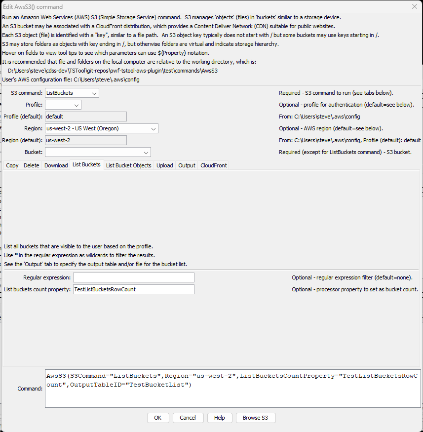
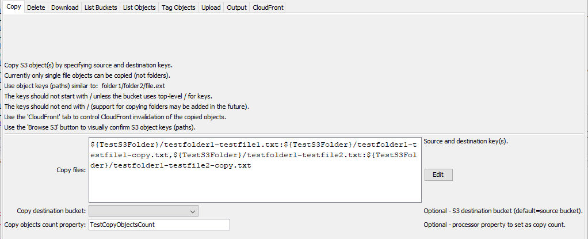
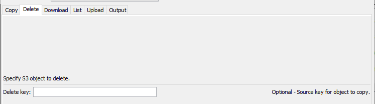
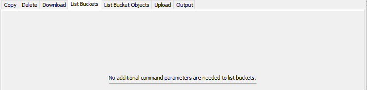
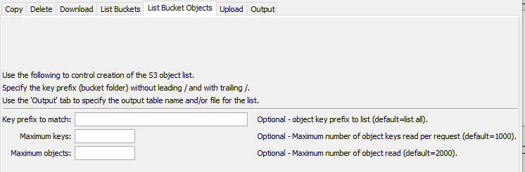
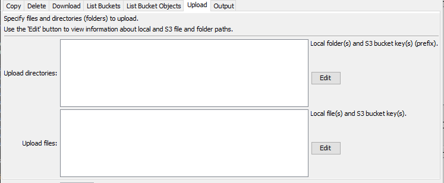
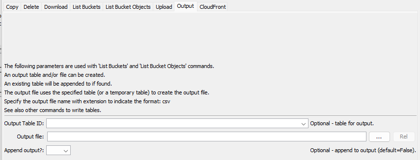
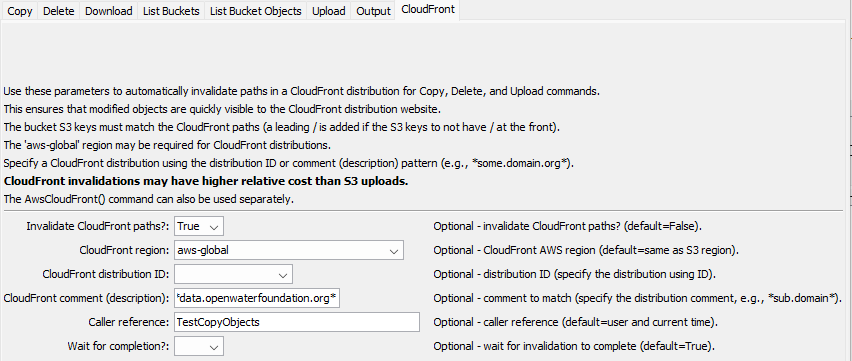

# TSTool / Command / AwsS3 #

*   [Overview](#overview)
*   [Command Editor](#command-editor)
    +   [Copy Objects](#copy-objects)
    +   [Delete Objects](#delete-objects)
    +   [Download Objects](#download-objects)
    +   [List Buckets](#list-buckets)
    +   [List Bucket Objects](#list-bucket-objects)
    +   [Upload Objects](#upload-objects)
    +   [Output](#output)
    +   [CloudFront](#cloudfront)
*   [Command Syntax](#command-syntax)
    +   [General Command Parameters](#general-command-parameters)
    +   [Copy Objects Command Parameters](#copy-objects-command-parameters)
    +   [Delete Objects Command Parameters](#delete-objects-command-parameters)
    +   [Download Objects Command Parameters](#download-objects-command-parameters)
    +   [List Buckets Command Parameters](#list-buckets-command-parameters)
    +   [List Bucket Objects Command Parameters](#list-bucket-objects-command-parameters)
    +   [Upload Objects Command Parameters](#upload-objects-command-parameters)
    +   [Output Command Parameters](#output-command-parameters)
    +   [CloudFront Command Parameters](#cloudfront-command-parameters)
*   [Examples](#examples)
*   [Troubleshooting](#troubleshooting)
*   [See Also](#see-also)

-------------------------

## Overview ##

The `AwsS3` command performs tasks for [Amazon S3](https://aws.amazon.com/s3/).
S3 is used for cloud storage, for example to provide access to files for data downloads and files for static websites.
S3 is often used with CloudFront (see the [`AwsCloudFront`](../AwsCloudFront/AwsCloudFront.md) command and the ***CloudFront*** parameter tab for this command)
because CloudFront provides `https` and caching of resources on multiple servers in order to improve performance
and provide a Content Delivery Network (CDN) solution.

S3 concepts and terminology are used in the `AwsS3` command parameters:

*   The AWS command line interface (CLI) [profile](https://docs.aws.amazon.com/cli/latest/userguide/cli-configure-profiles.html)
    is used to authenticate the AWS connection and provides the default region for the plugin.
*   An AWS [region](https://docs.aws.amazon.com/general/latest/gr/rande.html) is used identify the geographic location of the S3 request endpoint.
*   S3 uses [buckets](https://docs.aws.amazon.com/AmazonS3/latest/userguide/UsingBucket.html) as the top-level of file organization:
    +   buckets do not explicitly use folders to organize content
    +   S3 objects (see below) can have a key that ends in `/` but the object stores a file's contents
        and are therefore can be confusing
    +   S3 virtual folders correspond to the paths that contain files, but, again, the folders are not explicitly stored
*   S3 objects are identified by a [key](https://docs.aws.amazon.com/AmazonS3/latest/userguide/UsingObjects.html):
    +   similar to a file path
    +   the key is a string that includes a default delimiter of `/`,
        which makes the keys look like a path with virtual folders (directories)
    +   keys by default do not start with `/` but `/` can be used
*   A [prefix](https://docs.aws.amazon.com/AmazonS3/latest/userguide/using-prefixes.html) can be used to filter listing a bucket:
    +   without indicating that a virtual folder should be listed (`ListScope=All`), the prefix matches the start of keys
    +   with indicating that a virtual folder should be listed (`ListScope=Folder`),
        the delimiter (`/` by default) is used to remove the end of keys so that only a folder's objects are listed

The above complexities are handled by this command so that S3 technical constraints do not need to be fully understood:

*   as much as possible, treat object keys similar to paths on a file system
*   use "files" and "folders" in command parameters as much as possible
*   provide features to operate on folders even when the AWS S3 API does not provide these features
*   provide wildcard (`*` in keys) features

## Command Editor ##

The following dialog is used to edit the command and illustrates the syntax for the command.
Each `AwsS3` command has a tab for parameters specific to that command,
as well as the ***Output*** and ***CloudFront*** tabs,
which are used with multiple AWS S3 commands.

Command parameters are provided to help with automated tests and error checks.
For example the `ListBucketsCountProperty` parameter can be used to set a processor property
containing the number of buckets in the returned list.
Use the [`If`](https://opencdss.state.co.us/tstool/latest/doc-user/command-ref/If/If/) command to check the property value.

**<p style="text-align: center;">

</p>**

**<p style="text-align: center;">
`AwsS3` Command Editor (<a href="../AwsS3.png">see also the full-size image)</a>
</p>**

### Copy Objects ###

Use the `AwsCommand=CopyObjects` parameter to copy one or more S3 objects from a source to destination,
using keys to identify objects.  Currently, copying folders is not supported.

**<p style="text-align: center;">

</p>**

**<p style="text-align: center;">
`AwsS3` Command Editor for CopyObject Parameters (<a href="../AwsS3-copy.png">see also the full-size image)</a>
</p>**

### Delete Objects ###

**<p style="text-align: center;">

</p>**

**<p style="text-align: center;">
`AwsS3` Command Editor for DeleteObjects Parameters (<a href="../AwsS3-delete.png">see also the full-size image)</a>
</p>**

### Download Objects ###

**<p style="text-align: center;">

</p>**

**<p style="text-align: center;">
`AwsS3` Command Editor for DownloadObjects Parameters (<a href="../AwsS3-download.png">see also the full-size image)</a>
</p>**

### List Buckets ###

Use the `S3Command=ListBuckets` parameter to list buckets for the user profile.
Use the `ListBucketsRegEx` parameter to filter to a specific pattern,
for example to confirm that a specific bucket exists before continuing with a workflow.

Use the ***Output*** tab to set the output table and file.

**<p style="text-align: center;">

</p>**

**<p style="text-align: center;">
`AwsS3` Command Editor for ListBuckets Parameters (<a href="../AwsS3-list-buckets.png">see also the full-size image)</a>
</p>**

### List Bucket Objects ###

**<p style="text-align: center;">

</p>**

**<p style="text-align: center;">
`AwsS3` Command Editor for ListBucketObjects Parameters (<a href="../AwsS3-list-bucket-objects.png">see also the full-size image)</a>
</p>**

### Upload Objects ###

**<p style="text-align: center;">

</p>**

**<p style="text-align: center;">
`AwsS3` Command Editor for UploadObjects Parameters (<a href="../AwsS3-upload.png">see also the full-size image)</a>
</p>**

### Output ###

**<p style="text-align: center;">

</p>**

**<p style="text-align: center;">
`AwsS3` Command Editor for Output Parameters (<a href="../AwsS3-output.png">see also the full-size image)</a>
</p>**

### CloudFront ###

**<p style="text-align: center;">

</p>**

**<p style="text-align: center;">
`AwsS3` Command Editor for CloudFront Parameters (<a href="../AwsS3-cloudfront.png">see also the full-size image)</a>
</p>**

## Command Syntax ##

The command syntax is as follows:

```text
AwsS3(Parameter="Value",...)
```

The following tables list command parameters for each S3 command.
The general parameters apply to all S3 commands, except where noted.

### General Command Parameters ###

General command parameters are used with most of the commands, except where noted.
Note that because these parameters are used to provide information in the editor,
the `${Property}` notation is not supported for some parameters and will cause issues for interactive command editing.

**<p style="text-align: center;">
Command Parameters - General Parameters
</p>**

|**Parameter**&nbsp;&nbsp;&nbsp;&nbsp;&nbsp;&nbsp;&nbsp;&nbsp;&nbsp;&nbsp;&nbsp;&nbsp;&nbsp;&nbsp;&nbsp;&nbsp;&nbsp;&nbsp;&nbsp;&nbsp;&nbsp;&nbsp;&nbsp;&nbsp;&nbsp;|**Description**|**Default**&nbsp;&nbsp;&nbsp;&nbsp;&nbsp;&nbsp;&nbsp;&nbsp;&nbsp;&nbsp;&nbsp;&nbsp;&nbsp;&nbsp;&nbsp;&nbsp;&nbsp;&nbsp;&nbsp;&nbsp;&nbsp;&nbsp;&nbsp;&nbsp;&nbsp;&nbsp;&nbsp;|
|--------------|-----------------|-----------------|
|`S3Command`<br>**required**|The S3 command to run, which indicates which tab's parameters are used. | None - must be specified. |
|`Profile`|The AWS command line interface profile to use for authentication, can use `${Property}` syntax. | <ul><li>If a single profile exists in the configuration file, it is used.</li><li>If multiple profiles exist in the configuration file, the one named `default` is used.|
|`Region`| The AWS region to use for service requests. Use the [AWS Management Console website](https://aws.amazon.com/console/) to check which region is used for an account, can use `${Property}`. | Default region from the user's AWS configuration file. |
|`Bucket`| The S3 bucket containing objects, can use `${Property}` syntax. | Must be specified for all commands except `S3Command=ListBuckets`. |
|`IfInputNotFound`| Message level when input is not found:  `Ignore`, `Warn`, or `Fail`. This is under development. | `Warn` |

### Copy Objects Command Parameters ###

**<p style="text-align: center;">
Command Parameters - Copy Objects 
</p>**

|**Parameter**&nbsp;&nbsp;&nbsp;&nbsp;&nbsp;&nbsp;&nbsp;&nbsp;&nbsp;&nbsp;&nbsp;&nbsp;&nbsp;&nbsp;&nbsp;&nbsp;&nbsp;&nbsp;&nbsp;&nbsp;&nbsp;&nbsp;&nbsp;&nbsp;&nbsp;&nbsp;&nbsp;&nbsp;&nbsp;&nbsp;&nbsp;&nbsp;&nbsp;|**Description**|**Default** |
|-----|-----------------|-----------------|
|`CopyFiles`<br>**required for the `CopyObjects` command**| List of file objects to copy using syntax: `SourceKey1:DestKey1,SourceKey2:DestKey2`<ul><li>can use `${Property}` syntax</li><li>if the destination equals `*` the file will be copied to the root level of the bucket</li><li>if the destination ends in `/*`, the destination key will be destination key with the source file name appended</li></ul>| None - must be specified. |
|`CopyBucket` | Bucket to to receive the copied files. | Same as the S3 bucket (`Bucket`). |
|`CopyObjectsCountProperty`| Processor property to set containing the number of objects copied. | |

### Delete Objects Command Parameters ###

|***Delete***|`DeleteKey`| Object key to delete, can use `${Property}` syntax. | None - must be specified when `S3Command=DeleteObject`. |

### Download Objects Command Parameters ###

|***Download***|`DownloadDirectories`| List of directories (folders) to download using syntax: `key1:folder1,key2:folder2`, where the `key` identifies an S3 object and `folder` is a local folder name, can use `${Property}` syntax. | |
||`DownloadFiles`| List of files to download using syntax: `key1:file1,key2:file2`, where the `key` identifies an S3 object and `file` is a local file name, can use `${Property}` syntax. | |

### List Buckets Command Parameters ###

**<p style="text-align: center;">
Command Parameters - List Buckets 
</p>**

|**Parameter**&nbsp;&nbsp;&nbsp;&nbsp;&nbsp;&nbsp;&nbsp;&nbsp;&nbsp;&nbsp;&nbsp;&nbsp;&nbsp;&nbsp;&nbsp;&nbsp;&nbsp;&nbsp;&nbsp;&nbsp;&nbsp;&nbsp;&nbsp;&nbsp;&nbsp;&nbsp;&nbsp;&nbsp;&nbsp;&nbsp;&nbsp;&nbsp;&nbsp;|**Description**|**Default** |
|-----|-----------------|-----------------|
|`ListBucketsRegEx`| Regular expression to filter buckets:<ul><li>use `*` as a wildcard</li><li>`java:...` - specify a [Java regular expression](https://docs.oracle.com/javase/8/docs/api/java/util/regex/Pattern.html#sum) - **not fully tested**</li></ul> | All buckets are listed. |
|`ListBucketsCountProperty`| Processor property to set containing the number of buckets in the list. If appending to output (***Output*** `AppendOutput=True`) the count will be the total count. | |
| | Note:  The general `Bucket` parameter is not required since buckets are being listed. | |

### List Bucket Objects Command Parameters ###

|***List Bucket Objects***|`Prefix`| Prefix to filter objects in the output from the `S3Command=ListObjects` command.  Specify as a top-level directory such as `folder/folder2`. | All objects are listed. |
||`MaxKeys`| Maximum number of keys to list per request.  AWS limits the number of objects returned per request to 1000 and `MaxKeys` must be <= 1000. | `1000` (AWS limit). |
||`MaxObjects`| Maximum number of objects returned in an object list.  Care should be taken to limit the load on the system and there are S3 charges for downloads.  Large downloads should probably use the prefix to limit downloads. | `2000` |

### Upload Objects Command Parameters ###

|***Upload***|`UploadDirectories`| List of directories (folders) to upload using syntax: `folder1:key1,folder2:key2`, `folder` is a local folder name and `key` identifies an S3 object, can use `${Property}` syntax. | |
||`UploadFiles`| List of files to upload using syntax: `file1:key1,file2:key2`, where `file` is a local file name and the `key` identifies an S3 object, can use `${Property}` syntax.<br><br>The local file can contain `*` wildcard to match a pattern, in which case the last part of the key (the file in the path) must be `*` to indicate that the S3 file will have the same name as the local file. | |

### Output Command Parameters ###

The following parameters are used with `S3Command=ListBuckets` and `S3Command=ListBucketObjects` S3 commands.
Output from these S3 commands can be saved to a table and/or file.
If a table is output with an output file, the table is used to create the output file.
If outputting to a file only, a temporary table is used internally and then the file is created from the table.

**<p style="text-align: center;">
Command Parameters - General Parameters
</p>**

|**Parameter**&nbsp;&nbsp;&nbsp;&nbsp;&nbsp;&nbsp;&nbsp;&nbsp;&nbsp;&nbsp;&nbsp;&nbsp;&nbsp;&nbsp;&nbsp;&nbsp;&nbsp;&nbsp;&nbsp;&nbsp;&nbsp;&nbsp;&nbsp;&nbsp;&nbsp;|**Description**|**Default**&nbsp;&nbsp;&nbsp;&nbsp;&nbsp;&nbsp;&nbsp;&nbsp;&nbsp;&nbsp;&nbsp;&nbsp;&nbsp;&nbsp;&nbsp;&nbsp;&nbsp;&nbsp;&nbsp;&nbsp;&nbsp;&nbsp;&nbsp;&nbsp;&nbsp;&nbsp;&nbsp;|
|--------------|-----------------|-----------------|
|`OutputTableID`| Table identifier for output, used with list commands, can use `${Property}` syntax.  | |
|`OutputFile`| Name of file for output, used with list commands, can use `${Property}` syntax.  The file extension (`.csv`) indicates the format. Currently only `csv` format is supported.  If necessary, write the table to a different format using a separate command.| |
|`AppendOutput` | Append the output to an existing table (and file).  Create the table/file if they do not exist. | Overwrite the existing table and file without appending. |

### CloudFront Command Parameters ###

Command parameters are provided to allow changed S3 files to be invalidated in a CloudFront distribution,
which simplifies invalidation.
CloudFront invalidation uses "paths" to specify URL resources to invalidate.
The paths must match S3 object keys in order for this command's invalidation to work.
A leading `/` will be added to the paths if not present
(e.g., S3 file `folder/folder2/file.ext` becomes CloudFront path `/folder1/folder2/file.ext`).
CloudFront paths for invalidation can use `*` wildcards,
for example to invalidate all files in a folder that has been deleted or uploaded.

By default, CloudFront paths associated with S3 files will not
immediately be invalidated on CloudFront and won't be visible in URLs.

[CloudFront invalidation costs](https://aws.amazon.com/cloudfront/pricing/) are higher
than [S3 upload costs](https://aws.amazon.com/s3/pricing/) and therefore sometimes it makes sense to
invalidate files with one request after performing multiple S3 operations,
rather than to automatically invalidate changed S3 files.
Therefore, the CloudFront invalidation in this command is disabled by default.
If necessary, a separate [`AwsCloudFront`](../AwsCloudFront/AwsCloudFront.md) command can be used.

**<p style="text-align: center;">
Command Parameters - CloudFront Parameters
</p>**

|**Parameter**&nbsp;&nbsp;&nbsp;&nbsp;&nbsp;&nbsp;&nbsp;&nbsp;&nbsp;&nbsp;&nbsp;&nbsp;&nbsp;&nbsp;&nbsp;&nbsp;&nbsp;&nbsp;&nbsp;&nbsp;&nbsp;&nbsp;&nbsp;&nbsp;&nbsp;&nbsp;&nbsp;&nbsp;&nbsp;&nbsp;&nbsp;&nbsp;&nbsp;&nbsp;&nbsp;&nbsp;&nbsp;&nbsp;&nbsp;|**Description**|**Default**&nbsp;&nbsp;&nbsp;&nbsp;&nbsp;&nbsp;&nbsp;&nbsp;&nbsp;&nbsp;&nbsp;&nbsp;&nbsp;&nbsp;&nbsp;&nbsp;&nbsp;&nbsp;&nbsp;&nbsp;&nbsp;&nbsp;&nbsp;&nbsp;&nbsp;&nbsp;&nbsp;&nbsp;&nbsp;&nbsp;&nbsp;&nbsp;&nbsp;|
|--------------|-----------------|-----------------|
|`InvalidateCloudFront`| Indicate whether CloudFront invalidation should occur (`True`) or not (`False`). | `False` |
|`CloudFrontRegion`| The AWS region to use for CloudFront requests. The `aws-global` region may need to be used in any case (this is being evaluated). | `Region` parameter value. |
|`CloudFrontDistributionId`| CloudFront distribution ID to invalidate, can use `${Property}` syntax. | Must be specified if `CloudFrontComment` is not specified. |
|`CloudFrontComment`| CloudFront comment (description) pattern to match, to indicate the CloudFront distribution, using `*` for wildcards.  For example, if the comment includes the domain for the distribution (e.g., `data.openwaterfoundation.org`) it is easier to look up the distribution than using the distribution ID, which is a sequence of characters. Can use `${Property}` syntax. | Must be specified if `CloudFrontDistributionID` is not specified. |
|`CloudFrontCallerReference`| String to use to identify the invalidation, can use `${Property}` syntax.  | `TSTool-user-YYMMDDThhmmss` to uniquely identify the invalidation. |
|`CloudFrontWaitForCompletion`| Whether the software should wait until the invalidation finishes (and output is visible in URLs), typically a few seconds, but varies depending on the size of files and AWS performance level.  | |

## Examples ##

See the [automated tests](https://github.com/OpenWaterFoundation/owf-tstool-aws-plugin/tree/master/test/commands/AwsS3).
Automated tests require AWS permissions to run.

## Troubleshooting ##

If there is an error, view the TSTool log file using the ***Tools / Diagnostics - View Log File...*** menu.

### Uploaded File is Not Listed in S3 ###

Sometimes local files that are uploaded are not visible.

*   Check the log file and confirm that the remote path is correct.
*   The remote path may be incomplete, for example a folder, and may have been overwritten.

## See Also ##

*   [`AwsS3Catalog`](../AwsS3Catalog/AwsS3Catalog.md) command
*   [`AwsCloudFront`](../AwsCloudFront/AwsCloudFront.md) command
