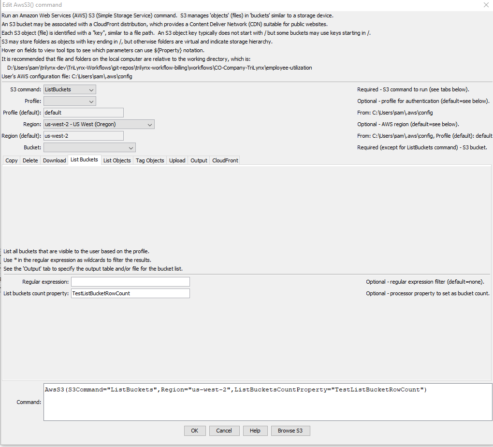
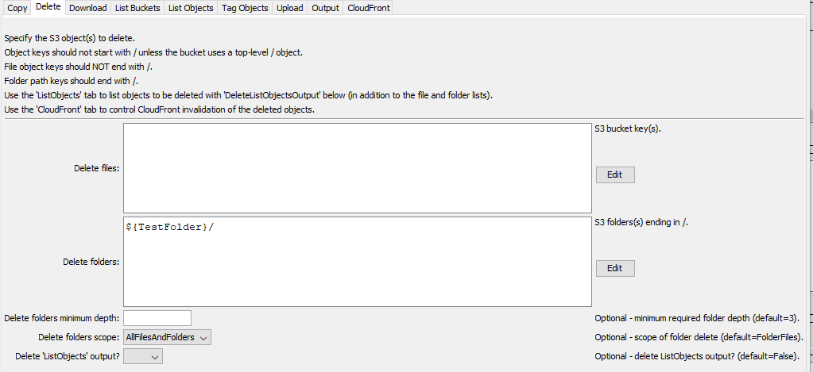
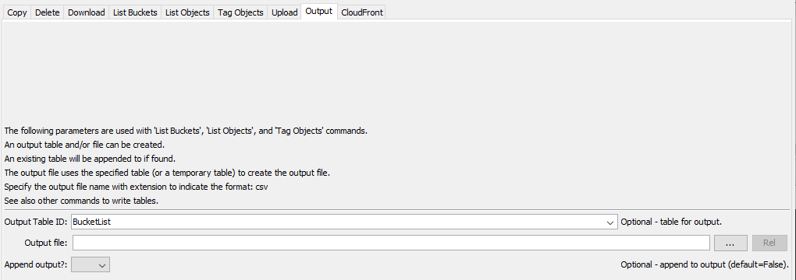

# TSTool / Command / AwsS3 #

*   [Overview](#overview)
*   [Command Editor](#command-editor)
    +   [Copy Objects](#copy-objects)
    +   [Delete Objects](#delete-objects)
    +   [Download Objects](#download-objects)
    +   [List Buckets](#list-buckets)
    +   [List Bucket Objects](#list-bucket-objects)
    +   [Upload Objects](#upload-objects)
    +   [Output](#output)
    +   [CloudFront](#cloudfront)
*   [Command Syntax](#command-syntax)
    +   [General Command Parameters](#general-command-parameters)
    +   [Copy Objects Command Parameters](#copy-objects-command-parameters)
    +   [Delete Objects Command Parameters](#delete-objects-command-parameters)
    +   [Download Objects Command Parameters](#download-objects-command-parameters)
    +   [List Buckets Command Parameters](#list-buckets-command-parameters-command-parameters)
    +   [List Bucket Objects Command Parameters](#list-bucket-objects-command-parameters)
    +   [Upload Objects Command Parameters](#upload-objects-command-parameters)
*   [Examples](#examples)
*   [Troubleshooting](#troubleshooting)
*   [See Also](#see-also)

-------------------------

## Overview ##

The `AwsS3` command performs tasks for [Amazon S3](https://aws.amazon.com/s3/).
S3 is used for cloud storage, for example to provide access to files for data downloads and files for static websites.
S3 is often used with CloudFront (see the [`AwsCloudFront`](../AwsCloudFront/AwsCloudFront.md) command)
because CloudFront provides `https` and caching of resources on multiple servers in order to improve performance
and provide a Content Delivery Network (CDN) solution.

S3 concepts and terminology are used in the `AwsS3` command parameters:

*   The AWS command line interface (CLI) [profile](https://docs.aws.amazon.com/cli/latest/userguide/cli-configure-profiles.html)
    is used to authenticate the AWS connection and provides the default region for the plugin.
*   An AWS [region](https://docs.aws.amazon.com/general/latest/gr/rande.html) is used identify the geographic location of the S3 request endpoint.
*   S3 uses [buckets](https://docs.aws.amazon.com/AmazonS3/latest/userguide/UsingBucket.html) as the top-level of file organization:
    +   buckets do not explicitly use folders to organize content
    +   S3 objects (see below) can have a key that ends in `/` but the object stores a file's contents
        and are therefore can be confusing
    +   S3 virtual folders correspond to the paths that contain files, but, again, the folders are not explicitly stored
*   S3 objects are identified by a [key](https://docs.aws.amazon.com/AmazonS3/latest/userguide/UsingObjects.html):
    +   similar to a file path
    +   the key is a string that includes a default delimiter of `/`,
        which makes the keys look like a path with directories (folders)
*   A [prefix](https://docs.aws.amazon.com/AmazonS3/latest/userguide/using-prefixes.html) can be used to filter listing a bucket:
    +   without indicating that a virtual folder should be listed, the prefix matches the start of keys
    +   with indicating that a virtual folder should be listed, the delimiter (`/` by default) is used to remove the end of keys

The above complexities are handled by this command so that S3 technical constraints do not need to be fully understood.

## Command Editor ##

The following dialog is used to edit the command and illustrates the syntax for the command.
Each `AwsS3` command has a tab for parameters specific to that command.

**<p style="text-align: center;">

</p>**

**<p style="text-align: center;">
`AwsS3` Command Editor (<a href="../AwsS3.png">see also the full-size image)</a>
</p>**

### Copy Objects ###

**<p style="text-align: center;">

</p>**

**<p style="text-align: center;">
`AwsS3` Command Editor for CopyObject Parameters (<a href="../AwsS3-copy.png">see also the full-size image)</a>
</p>**

### Delete Objects ###

**<p style="text-align: center;">

</p>**

**<p style="text-align: center;">
`AwsS3` Command Editor for DeleteObjects Parameters (<a href="../AwsS3-delete.png">see also the full-size image)</a>
</p>**

### Download Objects ###

**<p style="text-align: center;">

</p>**

**<p style="text-align: center;">
`AwsS3` Command Editor for DownloadObjects Parameters (<a href="../AwsS3-download.png">see also the full-size image)</a>
</p>**

### List Buckets ###

Use the `S3Command=ListBuckets` parameter to list buckets for the user profile.
Use the `ListBucketsRegEx` parameter to filter to a specific pattern,
for example to confirm that a specific bucket exists before continuing with a workflow.

Use the ***Output*** tab to set the output table and file.

**<p style="text-align: center;">

</p>**

**<p style="text-align: center;">
`AwsS3` Command Editor for ListBuckets Parameters (<a href="../AwsS3-list-buckets.png">see also the full-size image)</a>
</p>**

### List Bucket Objects ###

**<p style="text-align: center;">

</p>**

**<p style="text-align: center;">
`AwsS3` Command Editor for ListBucketObjects Parameters (<a href="../AwsS3-list-bucket-objects.png">see also the full-size image)</a>
</p>**

### Upload Objects ###

**<p style="text-align: center;">

</p>**

**<p style="text-align: center;">
`AwsS3` Command Editor for UploadObjects Parameters (<a href="../AwsS3-upload.png">see also the full-size image)</a>
</p>**

### Output ###

**<p style="text-align: center;">

</p>**

**<p style="text-align: center;">
`AwsS3` Command Editor for Output Parameters (<a href="../AwsS3-output.png">see also the full-size image)</a>
</p>**

### CloudFront ###

**<p style="text-align: center;">

</p>**

**<p style="text-align: center;">
`AwsS3` Command Editor for CloudFront Parameters (<a href="../AwsS3-cloudfront.png">see also the full-size image)</a>
</p>**

## Command Syntax ##

The command syntax is as follows:

```text
AwsS3(Parameter="Value",...)
```

The following tables list command parameters for each S3 command.
The general parameters apply to all S3 commands, except where noted.

### General Command Parameters ###

**<p style="text-align: center;">
Command Parameters - General Parameters
</p>**

|**Tab**|**Parameter**&nbsp;&nbsp;&nbsp;&nbsp;&nbsp;&nbsp;&nbsp;&nbsp;&nbsp;&nbsp;&nbsp;&nbsp;&nbsp;&nbsp;&nbsp;&nbsp;&nbsp;&nbsp;&nbsp;&nbsp;&nbsp;&nbsp;&nbsp;&nbsp;&nbsp;|**Description**|**Default**&nbsp;&nbsp;&nbsp;&nbsp;&nbsp;&nbsp;&nbsp;&nbsp;&nbsp;&nbsp;&nbsp;&nbsp;&nbsp;&nbsp;&nbsp;&nbsp;&nbsp;&nbsp;&nbsp;&nbsp;&nbsp;&nbsp;&nbsp;&nbsp;&nbsp;&nbsp;&nbsp;|
|--|--------------|-----------------|-----------------|
|***All***|`S3Command`<br>**required**|The S3 command to run, which indicates which tab's parameters are used, can use `${Property}` syntax. | None - must be specified. |
||`Profile`|The AWS command line interface profile to use for authentication, can use `${Property}` syntax. | Use the `default` profile or use the single profile if only one profile is provided in the configuration files.|
||`Region`| The AWS region to use for service requests. Use the [AWS Management Console website](https://aws.amazon.com/console/) to check which region is used for an account, can use `${Property}` syntax. | Default region from the user's AWS configuration file. |
||`Bucket`| The S3 bucket containing objects, can use `${Property}` syntax. | Must be specified for all commands except `S3Command=ListBuckets`. |
||`IfInputNotFound`| Message level when input is not found:  `Ignore`, `Warn`, or `Fail`. This is under development. | `Warn` |
|***Copy***|`CopySourceKey`| Object key for copy source. | None - must be specified for `CopyObject` S3 command. |
||`CopyDestKey`| Object key for copy destination, can use `${Property}` syntax. | None - must be specified when `S3Command=CopyObject`. |
|***Delete***|`DeleteKey`| Object key to delete, can use `${Property}` syntax. | None - must be specified when `S3Command=DeleteObject`. |
|***Download***|`DownloadDirectories`| List of directories (folders) to download using syntax: `key1:folder1,key2:folder2`, where the `key` identifies an S3 object and `folder` is a local folder name, can use `${Property}` syntax. | |
||`DownloadFiles`| List of files to download using syntax: `key1:file1,key2:file2`, where the `key` identifies an S3 object and `file` is a local file name, can use `${Property}` syntax. | |
|***List Bucket Objects***|`Prefix`| Prefix to filter objects in the output from the `S3Command=ListObjects` command.  Specify as a top-level directory such as `folder/folder2`. | All objects are listed. |
||`MaxKeys`| Maximum number of keys to list per request.  AWS limits the number of objects returned per request to 1000 and `MaxKeys` must be <= 1000. | `1000` (AWS limit). |
||`MaxObjects`| Maximum number of objects returned in an object list.  Care should be taken to limit the load on the system and there are S3 charges for downloads.  Large downloads should probably use the prefix to limit downloads. | `2000` |
|***Upload***|`UploadDirectories`| List of directories (folders) to upload using syntax: `folder1:key1,folder2:key2`, `folder` is a local folder name and `key` identifies an S3 object, can use `${Property}` syntax. | |
||`UploadFiles`| List of files to upload using syntax: `file1:key1,file2:key2`, where `file` is a local file name and the `key` identifies an S3 object, can use `${Property}` syntax.<br><br>The local file can contain `*` wildcard to match a pattern, in which case the last part of the key (the file in the path) must be `*` to indicate that the S3 file will have the same name as the local file. | |
|***Output***|`OutputFile`| Name of file for output, used with list commands, can use `${Property}` syntax.  The file extension (`.csv`) indicates the format. | |
||`OutputTableID`| Table identifier for output, used with list commands, can use `${Property}` syntax.  | |

### Copy Objects Command Parameters ###

### Delete Objects Command Parameters ###

### Download Objects Command Parameters ###

### List Buckets Command Parameters ###

**<p style="text-align: center;">
Command Parameters - List Buckets 
</p>**

|**Parameter**&nbsp;&nbsp;&nbsp;&nbsp;&nbsp;&nbsp;&nbsp;&nbsp;&nbsp;&nbsp;&nbsp;&nbsp;&nbsp;&nbsp;&nbsp;&nbsp;&nbsp;&nbsp;&nbsp;&nbsp;&nbsp;&nbsp;&nbsp;&nbsp;&nbsp;&nbsp;&nbsp;&nbsp;&nbsp;&nbsp;&nbsp;&nbsp;&nbsp;|**Description**|**Default** |
|-----|-----------------|-----------------|
|`ListBucketsRegEx`| Regular expression to filter buckets:<ul><li>use `*` as a wildcard</li><li>`java:...` - specify a [Java regular expression](https://docs.oracle.com/javase/8/docs/api/java/util/regex/Pattern.html#sum)</li></ul> | All buckets are listed. |
|`ListBucketsCountProperty`| Processor property to set containing the number of buckets in the list. If appending results the count will be the total count. | |
| | Note:  The general `Bucket` parameter is not required since buckets are being listed. | |

### List Bucket Objects Command Parameters ###

### Upload Objects Command Parameters ###

## Examples ##

See the [automated tests](https://github.com/OpenWaterFoundation/owf-tstool-aws-plugin/tree/master/test/commands/AwsS3).
Automated tests require AWS permissions to run.

## Troubleshooting ##

If there is an error, view the TSTool log file using the ***Tools / Diagnostics - View Log File...*** menu.

## See Also ##

*   [`AwsS3Catalog`](../AwsS3Catalog/AwsS3Catalog.md) command
*   [`AwsCloudFront`](../AwsCloudFront/AwsCloudFront.md) command
