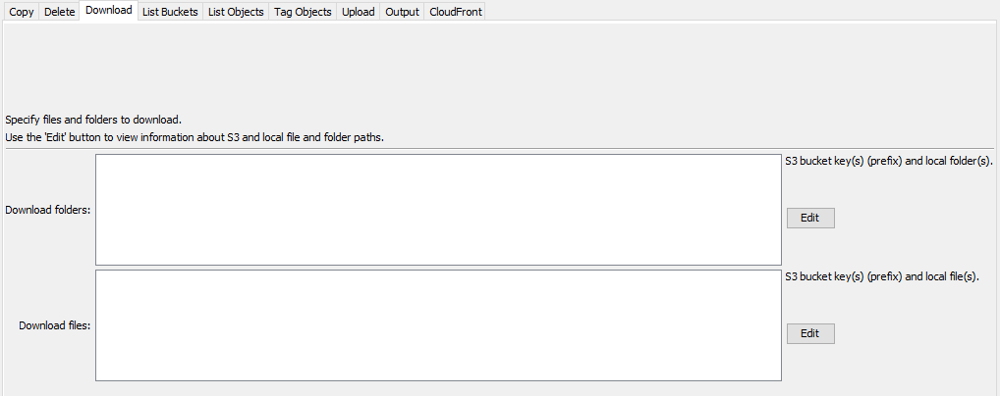
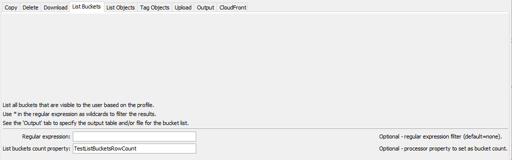
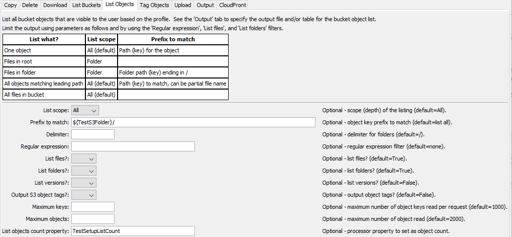
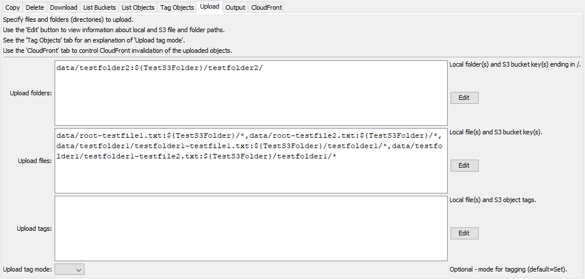
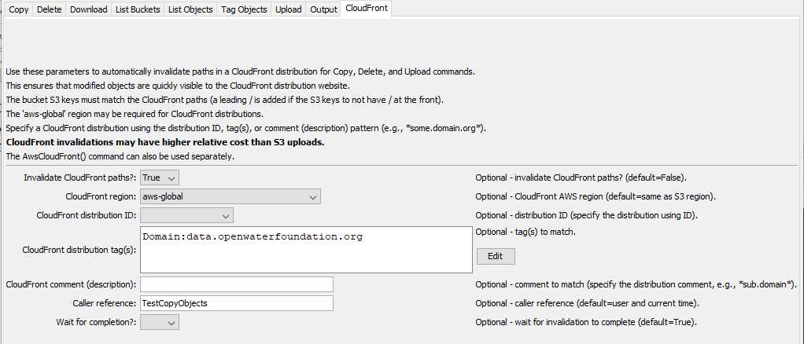

# TSTool / Command / AwsS3 #

*   [Overview](#overview)
    +   [S3 Concepts and Terminology](#s3-concepts-and-terminology)
    +   [Object Versions](#object-versions)
    +   [Object Tags](#object-tags)
*   [Command Editor](#command-editor)
    +   [Copy Objects](#copy-objects)
    +   [Delete Objects](#delete-objects)
    +   [Download Objects](#download-objects)
    +   [List Buckets](#list-buckets)
    +   [List Objects](#list-objects)
    +   [Tag Objects](#tag-objects)
    +   [Upload Objects](#upload-objects)
    +   [Output](#output)
    +   [CloudFront](#cloudfront)
*   [Command Syntax](#command-syntax)
    +   [General Command Parameters](#general-command-parameters)
    +   [Copy Objects Command Parameters](#copy-objects-command-parameters)
    +   [Delete Objects Command Parameters](#delete-objects-command-parameters)
    +   [Download Objects Command Parameters](#download-objects-command-parameters)
    +   [List Buckets Command Parameters](#list-buckets-command-parameters)
    +   [List Objects Command Parameters](#list-objects-command-parameters)
    +   [Tag Objects Command Parameters](#tag-objects-command-parameters)
    +   [Upload Objects Command Parameters](#upload-objects-command-parameters)
    +   [Output Command Parameters](#output-command-parameters)
    +   [CloudFront Command Parameters](#cloudfront-command-parameters)
*   [Examples](#examples)
*   [Troubleshooting](#troubleshooting)
*   [See Also](#see-also)

-------------------------

## Overview ##

The `AwsS3` command performs tasks for [Amazon S3](https://aws.amazon.com/s3/).
S3 is used for cloud storage, for example to provide access to files for data downloads and files for static websites
(websites that have no server-side application other than serving the files).
S3 is often used with CloudFront (see the [`AwsCloudFront`](../AwsCloudFront/AwsCloudFront.md) command and the ***CloudFront*** parameter tab for this command)
because CloudFront provides `https` and caching of resources on multiple servers in order to improve performance
and provide a Content Delivery Network (CDN) solution.

### S3 Concepts and Terminology ###

S3 concepts and terminology are used in the `AwsS3` command parameters:

*   The AWS command line interface (CLI) [profile](https://docs.aws.amazon.com/cli/latest/userguide/cli-configure-profiles.html)
    is used to authenticate the AWS connection and provides the default region for the plugin.
*   An AWS [region](https://docs.aws.amazon.com/general/latest/gr/rande.html) is used identify the geographic location of the S3 request endpoint.
    S3 storage buckets are associated with a region.
*   S3 uses [buckets](https://docs.aws.amazon.com/AmazonS3/latest/userguide/UsingBucket.html) as the top-level of file organization:
    +   buckets do not explicitly use folders to organize content (see `key` with delimiter below)
    +   S3 objects (see below) can have a key that ends in `/` but the object stores a file's contents
        and therefore the concepts of folders can be confusing
    +   S3 virtual folders correspond to the paths that contain files, but, again,
        the folders are not explicitly stored as on a computer
    +   the AWS Console allows creating folders but these are essentially objects that have keys that end in `/`
*   S3 objects are identified by a [key](https://docs.aws.amazon.com/AmazonS3/latest/userguide/UsingObjects.html):
    +   similar to a file path
    +   the key is a string that includes a default delimiter of `/`,
        which makes the keys look like a path with virtual folders (directories)
    +   keys by default do not start with `/` but `/` can be used at the start of a key
        (this can be confusing because it is not necessary)
*   A [prefix](https://docs.aws.amazon.com/AmazonS3/latest/userguide/using-prefixes.html)
    can be used to filter listing a bucket's objects:
    +   without indicating that a virtual folder should be listed (`ListScope=All`), the prefix matches the start of keys
    +   with indicating that a virtual folder should be listed (`ListScope=Folder`),
        the delimiter (`/` by default) is used to remove the end of keys so that only a folder's objects are listed

The above complexities are handled by this command so that S3 technical constraints do not need to be fully understood:

*   as much as possible, treat object keys similar to paths on a file system
*   use "files" and "folders" in command parameters as much as possible
*   provide features to operate on folders even when the AWS S3 API does not provide these features
    (this command behaves similar to the AWS Console)
*   provide wildcard features (`*` in local files and S3 keys)

### Object Versions ###

S3 buckets can enable versioning, which protects against accidental loss of files.
This is useful when many objects are edited interactively by applications.
However, versioned objects result in higher storage costs and if not managed,
versions can increase over time.

*   Use the `S3Command=ListBuckets` parameter to list buckets, which will indicate whether versioning is enabled for a bucket.
*   Use the `S3Command=ListObjects` and `ListVersions` parameters to list object versions,
    which will output the following for each object:
    +   `Key` - with the bucket, uniquely identifies the latest (current) object
    +   `VersionId` - with bucket and object key,  uniquely identifies the versioned object
    +   `IsLatest` - indicates whether the version is the object version is the latest (current) version
    +   `DeleteMarkerFound` - indicates whether the object is marked for delete
        (see the AWS documentation ["Working with delete markers"](https://docs.aws.amazon.com/AmazonS3/latest/userguide/DeleteMarker.html))

Objects that are marked for deletion or will be deleted by a lifecycle rule (see the next section)
are processed by AWS according to its policies and actions may take some time to complete.

### Object Tags ###

Each object can optionally be tagged with one or more `TagName=TagValue` tags,
which can be used to control how objects are handled.
For example, set a tag `Lifecycle=NoTags` and then implement a lifecycle rule to delete non-latest (non-current) versions
to ensure that unnecessary dynamically-created versioned objects are automatically deleted
(see the AWS documentation ["Managing the lifecycle of objects"](https://docs.aws.amazon.com/AmazonS3/latest/userguide/object-lifecycle-mgmt.html)). 

Tags can be set when uploading objects (`UploadTags` and `UploadTagMode` parameters)
and for existing files (`Tags` and `TagMode` parameters).
The AWS S3 API does not allow tags to be individually set (setting a tag resets all tags)
and tag operations require additional web service calls.
Therefore, processing tags slows down the `AwsS3` command and should be used appropriately.

## Command Editor ##

The following dialog is used to edit the command and illustrates the syntax for the command.
Each `AwsS3` command has a tab for parameters specific to that command.

**<p style="text-align: center;">
Command Editor Tabs and Use
</p>**

| ***Tab*** | ***Use*** | ***Related Tabs*** |
| -- | -- | -- |
| ***Copy*** | Copy S3 file objects to create new S3 objects. | ***CloudFront*** |
| ***Delete*** | Delete S3 file and folder objects. | ***CloudFront*** |
| ***Download*** | Download S3 objects to local files. | |
| ***List Buckets*** | List S3 buckets for all regions or a specific region. | ***Output*** |
| ***List Objects*** | List S3 objects. | ***Output*** |
| ***Tag Objects*** | Set tag(s) for existing S3 objects. | ***List Objects*** |
| ***Upload*** | Upload local files and folders to S3 file objects. | ***CloudFront*** |
| ***Output*** | Used to specify output table and file for the S3 command. | ***List Buckets***, ***List Objects***, ***Tag Objects*** |
| ***CloudFront*** | Used to specify CloudFront information to invalidate objects that are modified on S3 and need to be invalidated. | ***Copy***, ***Delete***, ***Upload*** |

Some command parameters are provided to help with automated tests and error checks.
For example the `ListBucketsCountProperty` parameter can be used to set a processor property
containing the number of buckets in the returned list.
Use the [`If`](https://opencdss.state.co.us/tstool/latest/doc-user/command-ref/If/If/) command to check the property value.

**<p style="text-align: center;">

</p>**

**<p style="text-align: center;">
`AwsS3` Command Editor (<a href="../AwsS3.png">see full-size image)</a>
</p>**

### Copy Objects ###

Use the `S3Command=CopyObjects` parameter to copy one or more S3 objects from a source to destination,
using keys to identify objects.  Currently, copying folders is not supported.

If `InvalidateCloudFront=True` in the ***CloudFront*** tab,
each copied object will be invalidated.

**<p style="text-align: center;">

</p>**

**<p style="text-align: center;">
`AwsS3` Command Editor for `S3Command=CopyObjects` Parameters (<a href="../AwsS3-copy.png">see full-size image)</a>
</p>**

### Delete Objects ###

Use the `S3Command=DeleteObjects` parameter to delete one or more S3 file or folder objects:

*   using a list of S3 file object keys
*   using a list of S3 folder object keys (key ending in `/`)
*   using the output table of the ***List Objects*** parameters to provide the list of object keys and
    optional version identifiers:
    +   use the ***List Objects*** `ListVersions` parameter to list object versions if it is desired to delete
        non-current versions

The S3 API does not provide a service to delete folders.
Therefore folder contents are listed first and then the corresponding files are deleted.
The API deletes up to 1000 objects at a time but this command can process a larger number by deleting files in batches.

Because deleting objects is a destructive action,
the `DeleteFoldersMinDepth` default value requires 3 levels of folder depth by default (so that high-level folders are not deleted)
and the `DeleteFoldersScope` default value of `FolderFiles` will only delete files in the folder,
not all files recursively.
These parameter values can be changed using the command editor.

If `InvalidateCloudFront=True` in the ***CloudFront*** tab,
the parent folders for deleted objects are invalidated, using a wildcard.

**<p style="text-align: center;">

</p>**

**<p style="text-align: center;">
`AwsS3` Command Editor for `S3Command=DeleteObjects` Parameters (<a href="../AwsS3-delete.png">see full-size image)</a>
</p>**

### Download Objects ###

Use the `S3Command=DownloadObjects` parameter to downloadload files and folders from S3 objects to local computer files and folders.

Currently, wildcards cannot be used to specify S3 objects to download.

**<p style="text-align: center;">

</p>**

**<p style="text-align: center;">
`AwsS3` Command Editor for `S3Command=DownloadObjects` Parameters (<a href="../AwsS3-download.png">see full-size image)</a>
</p>**

### List Buckets ###

Use the `S3Command=ListBuckets` parameter to list buckets for the user profile.
The buckets in the selected region will be listed (use `Region=*` to list all regions).
Use the `ListBucketsRegEx` parameter to filter to a specific pattern,
for example to confirm that a specific bucket exists before continuing with a workflow.

Use the ***Output*** tab to set the output table and file.

**<p style="text-align: center;">

</p>**

**<p style="text-align: center;">
`AwsS3` Command Editor for `S3Command=ListBuckets` Parameters (<a href="../AwsS3-list-buckets.png">see full-size image)</a>
</p>**

### List Objects ###

Use the `S3Command=ListObjects` parameter to list objects for the selected bucket and user profile.
AWS provides options for controlling the output, which can be confusing.
Refer to the table in the command editor for instructions on how to list file objects and virtual folders.

*   Listing the contents of a folder only (not all subfolders) will list subfolder names without their contents.
*   Listing all folders will only list file objects and file objects that happen to have a name ending in `/`,
    which are typically empty folder objects created by the AWS Console or have been accidentally created.
*   Listing versions will cause the version ID to be included in the output table.
*   Outputting the object tags is optional and if used will be slower because
    separate requests are required to retrieve object tags.

See the examples.

**<p style="text-align: center;">

</p>**

**<p style="text-align: center;">
`AwsS3` Command Editor for `S3Command=ListObjects` Parameters (<a href="../AwsS3-list-objects.png">see full-size image)</a>
</p>**

### Tag Objects ###

Use the `S3Command=TagObjects` parameter to set tags for existing objects for the selected bucket and user profile.
Use the ***List Objects*** and ***Output*** tab parameters to list objects of interest and the ***Tag Objects*** tab parameters to specify tag information.
The following applies:

*   AWS tags cannot be selectively set using the API.  All object tags must be set.
    Consequently, in order to retain previous tags, the existing tags must be retrieved, manipulated, and reset.
    Using tags will slow the command.
*   The `TagMode` parameter controls how tags are set,
    with `TagMode=Set` being the default, which is nondestructive.

**<p style="text-align: center;">

</p>**

**<p style="text-align: center;">
`AwsS3` Command Editor for `S3Command=TagObjects` Parameters (<a href="../AwsS3-tag-objects.png">see full-size image)</a>
</p>**

### Upload Objects ###

Use the `S3Command=UploadObjects` parameter to upload files and folders from a local computer to S3 for storage as S3 objects.
The filename on the local computer will automatically match the S3 object key for folder uploads.
File uploads can specify a different key for the S3 object.

If appropriate, the [`DeleteObjects`](#delete-objects) S3 command can be used to delete a folder before upload
to ensure that the S3 objects do not contain out of date files.

If `InvalidateCloudFront=True` in the ***CloudFront*** tab,
the uploaded files and folders (using wildcard) are invalidated.

**<p style="text-align: center;">

</p>**

**<p style="text-align: center;">
`AwsS3` Command Editor for `S3Command=UploadObjects` Parameters (<a href="../AwsS3-upload.png">see full-size image)</a>
</p>**

### Output ###

The ***Output*** tab is used to specify the output table and file that are used when listing buckets and objects,
and creating the object list to tag objects.

**<p style="text-align: center;">

</p>**

**<p style="text-align: center;">
`AwsS3` Command Editor for Output Parameters (<a href="../AwsS3-output.png">see full-size image)</a>
</p>**

### CloudFront ###

CloudFront parameters are used to control when S3 objects used by CloudFront are invalidated,
which is the case for ***Copy***, ***Delete***, and ***Uplaod*** commands.
Invalidation requires specifying a CloudFront distribution.
Because distribution identifiers may not be known and can be confusing,
several options are available to match the distribution.

The following example shows how to match a distribution using a tag.
Using a tag generally works well because unique tag values can be defined for CloudFront distributions.

**<p style="text-align: center;">

</p>**

**<p style="text-align: center;">
`AwsS3` Command Editor for CloudFront Parameters Using Tags (<a href="../AwsS3-cloudfront-tag.png">see full-size image)</a>
</p>**

The following example shows how to match a distribution using a comment substring.
Note the use of asterisk at front and back as wildcards.
Matching a comment can be prone to errors if the substring is found in multiple distribution comments.

**<p style="text-align: center;">

</p>**

**<p style="text-align: center;">
`AwsS3` Command Editor for CloudFront Parameters Using Comment (<a href="../AwsS3-cloudfront-comment.png">see full-size image)</a>
</p>**

## Command Syntax ##

The command syntax is as follows:

```text
AwsS3(Parameter="Value",...)
```

The following tables list command parameters for each S3 command.
The general parameters apply to all S3 commands, except where noted.

### General Command Parameters ###

General command parameters are used with most of the commands, except where noted.
Note that because these parameters are used to provide information in the editor,
the `${Property}` notation is not supported for some parameters and will cause issues for interactive command editing.

**<p style="text-align: center;">
Command Parameters - General
</p>**

|**Parameter**&nbsp;&nbsp;&nbsp;&nbsp;&nbsp;&nbsp;&nbsp;&nbsp;&nbsp;&nbsp;&nbsp;&nbsp;&nbsp;&nbsp;&nbsp;&nbsp;&nbsp;&nbsp;&nbsp;&nbsp;&nbsp;&nbsp;&nbsp;&nbsp;&nbsp;|**Description**|**Default**&nbsp;&nbsp;&nbsp;&nbsp;&nbsp;&nbsp;&nbsp;&nbsp;&nbsp;&nbsp;&nbsp;&nbsp;&nbsp;&nbsp;&nbsp;&nbsp;&nbsp;&nbsp;&nbsp;&nbsp;&nbsp;&nbsp;&nbsp;&nbsp;&nbsp;&nbsp;&nbsp;|
|--------------|-----------------|-----------------|
|`S3Command`<br>**required**|The S3 command to run, which indicates which tab's parameters are used. | None - must be specified. |
|`Profile`|The AWS command line interface profile to use for authentication, can use `${Property}` syntax. | <ul><li>If a single profile exists in the configuration file, it is used.</li><li>If multiple profiles exist in the configuration file, the one named `default` is used.|
|`Region`| The AWS region to use for service requests. Use the [AWS Management Console website](https://aws.amazon.com/console/) to check which region is used for an account, can use `${Property}`. The `S3Command=ListBuckets` parameter allows the region to be specfied as `*` to list the buckets for all regions. | Default region from the user's AWS configuration file. |
|`Bucket`| The S3 bucket containing objects, can use `${Property}` syntax. | Must be specified for all commands except `S3Command=ListBuckets`. |
|`IfInputNotFound`| Message level when input is not found:  `Ignore`, `Warn`, or `Fail`. This is under development. | `Warn` |

### Copy Objects Command Parameters ###

**<p style="text-align: center;">
Command Parameters - Copy Objects 
</p>**

|**Parameter**&nbsp;&nbsp;&nbsp;&nbsp;&nbsp;&nbsp;&nbsp;&nbsp;&nbsp;&nbsp;&nbsp;&nbsp;&nbsp;&nbsp;&nbsp;&nbsp;&nbsp;&nbsp;&nbsp;&nbsp;&nbsp;&nbsp;&nbsp;&nbsp;&nbsp;&nbsp;&nbsp;&nbsp;&nbsp;&nbsp;&nbsp;&nbsp;&nbsp;|**Description**|**Default** |
|-----|-----------------|-----------------|
|`CopyFiles`<br>**required for the `CopyObjects` command**| List of file objects to copy using syntax: `SourceKey1:DestKey1,SourceKey2:DestKey2`<ul><li>can use `${Property}` syntax</li><li>if the destination equals `*` the file will be copied to the root level of the bucket</li><li>if the destination ends in `/*`, the destination key will be destination key with the source file name appended</li></ul>| None - must be specified. |
|`CopyBucket` | Bucket to to receive the copied files. | Same as the S3 bucket (`Bucket`). |
|`CopyObjectsCountProperty`| Processor property to set containing the number of objects copied. | |

### Delete Objects Command Parameters ###

**<p style="text-align: center;">
Command Parameters - Delete Objects 
</p>**

|**Parameter**&nbsp;&nbsp;&nbsp;&nbsp;&nbsp;&nbsp;&nbsp;&nbsp;&nbsp;&nbsp;&nbsp;&nbsp;&nbsp;&nbsp;&nbsp;&nbsp;&nbsp;&nbsp;&nbsp;&nbsp;&nbsp;&nbsp;&nbsp;&nbsp;&nbsp;&nbsp;&nbsp;&nbsp;&nbsp;&nbsp;&nbsp;&nbsp;&nbsp;|**Description**|**Default** |
|-----|-----------------|-----------------|
| `DeleteFiles`| S3 object keys for files to delete, separated by commas, can use `${Property}` syntax. | Must specify files and/or folders to delete. |
| `DeleteFolders`| S3 object keys ending in `/` for folders to delete, separated by commas, can use `${Property}` syntax.  The files to delete are listed first and are then deleted. | Must specify files and/or folders to delete. |
| `DeleteFoldersMinDepth` | The minimum number of folders required in the key in order to delete, used to prevent accidental delete of high-level folder. For example, `folder1/folder2/file.ext` and `/folder1/folder2/file.ext` both have a folder depth of `2`. | `3` |
| `DeleteFoldersScope` | The scope of the delete for `DeleteFolders`:<ul><li>`AllFilesAndFolders` all files and folders, including the folder itself.</li><li>`FolderFiles` - only delete the files in the folder.</li></ul> | `FolderFiles` |
| `DeleteListObjectsOutput` | Whether to delete the output of ***List Objects*** parameters, `True` or `False`.  Each output table row's `Key` and `VersionId` are used to identify the object to delete.  This allows deleting many objects with one command.  | `False` |

### Download Objects Command Parameters ###

**<p style="text-align: center;">
Command Parameters - Download Objects 
</p>**

|**Parameter**&nbsp;&nbsp;&nbsp;&nbsp;&nbsp;&nbsp;&nbsp;&nbsp;&nbsp;&nbsp;&nbsp;&nbsp;&nbsp;&nbsp;&nbsp;&nbsp;&nbsp;&nbsp;&nbsp;&nbsp;&nbsp;&nbsp;&nbsp;&nbsp;&nbsp;&nbsp;&nbsp;&nbsp;&nbsp;&nbsp;&nbsp;&nbsp;&nbsp;|**Description**|**Default** |
|-----|-----------------|-----------------|
|`DownloadFolders`| List of folders (directories) to download using syntax: `key1:folder1,key2:folder2`, where the `key` identifies an S3 object and `folder` is a local folder name.  Can use `${Property}` syntax. Currently there is no way to remap the filenames to different local folder due to how the S3 API works. | |
|`DownloadFiles`| List of files to download using syntax: `key1:file1,key2:file2`, where the `key` identifies an S3 object and `file` is a local file name. Can use `${Property}` syntax. If the end of the local file part of the path is `*` (for root level files) or `/*` (for sub-folder files), then the local file name will be set to the S3 object name. | |

### List Buckets Command Parameters ###

Use the following parameters to list buckets.
The general `Bucket` parameter is not required since buckets are being listed.

**<p style="text-align: center;">
Command Parameters - List Buckets 
</p>**

|**Parameter**&nbsp;&nbsp;&nbsp;&nbsp;&nbsp;&nbsp;&nbsp;&nbsp;&nbsp;&nbsp;&nbsp;&nbsp;&nbsp;&nbsp;&nbsp;&nbsp;&nbsp;&nbsp;&nbsp;&nbsp;&nbsp;&nbsp;&nbsp;&nbsp;&nbsp;&nbsp;&nbsp;&nbsp;&nbsp;&nbsp;&nbsp;&nbsp;&nbsp;|**Description**|**Default** |
|-----|-----------------|-----------------|
|`ListBucketsRegEx`| Regular expression to filter buckets:<ul><li>use `*` as a wildcard</li><li>`java:...` - specify a [Java regular expression](https://docs.oracle.com/javase/8/docs/api/java/util/regex/Pattern.html#sum) - **not fully tested**</li></ul> | All buckets are listed. |
|`ListBucketsCountProperty`| Processor property to set containing the number of buckets in the list. If appending to output (***Output*** `AppendOutput=True`) the count will be the total count. | |

### List Objects Command Parameters ###

Use the following combination of parameters to list the desired objects.

**<p style="text-align: center;">
Parameter Combinations to List Objects
</p>**

| **List What?** | **`ListScope`** | **`Prefix`** |
| -- | -- | -- |
| One object | `All` (default) | Path (key) for the object. |
| Files in root | `Folder` | |
| Files in folder | `Folder` | Path (key) for the folder, ending in `/`. |
| All objects matching a leading path | `All` (default) | Path (key) to match, can be a partial file name. |
| All files in a bucket | `All` (default). | |

**<p style="text-align: center;">
Command Parameters - List Objects 
</p>**

|**Parameter**&nbsp;&nbsp;&nbsp;&nbsp;&nbsp;&nbsp;&nbsp;&nbsp;&nbsp;&nbsp;&nbsp;&nbsp;&nbsp;&nbsp;&nbsp;&nbsp;&nbsp;&nbsp;&nbsp;&nbsp;&nbsp;&nbsp;&nbsp;&nbsp;&nbsp;&nbsp;&nbsp;&nbsp;&nbsp;&nbsp;&nbsp;&nbsp;&nbsp;|**Description**|**Default** |
|-----|-----------------|-----------------|
|`ListObjectsScope` | Indicates how deep the listing is:<ul><li>`All` - list all files and subfolder contents</li><li>`Folder` - list only the contents of a specific folder but not the contents of subfolders</li></ul> Use the `ListFiles`, `ListFolders`, and `ListObjectsRegEx` parameters to further constrain output. | `All` |
|`Prefix`| Prefix to filter objects in the output:<ul><li>When listing a folder's contents, the prefix should indicate a folder to list with trailing `/` (e.g., `folder1/folder2/)`</li><li>When listing any prefix, specify a leading path to match (e.g., `folder`).</li></ul>. | All objects are listed without constraining to the prefix. |
| `Delimiter` | Delimiter to indicate folders.  The delimiter is automatically specified internally when needed to list folders.  | `/` |
|`ListObjectsRegEx`| Regular expression to filter objects:<ul><li>use `*` as a wildcard</li><li>`java:...` - specify a [Java regular expression](https://docs.oracle.com/javase/8/docs/api/java/util/regex/Pattern.html#sum) - **not fully tested**</li></ul> | All objects are listed. |
|`ListFiles` | Whether files (objects that have keys not ending in `/`) are listed, `True` or `False`. | `True` |
|`ListFolders` | Whether folders (objects that have keys ending in `/`) are listed, `True` or `False`. | `True` |
|`ListVersions` | Whether object versions are listed, `True` or `False`. If `True`, additional columns will be added to the output table. | `False` |
|`OutputObjectTags` | Whether object tags are included in output, `True` or `False`. If `True`, additional columns will be added to the output table for object tags. Processing tags requires additional AWS service calls and will cause the command to run slower. | `False` |
|`MaxKeys`| Maximum number of keys to list per request.  AWS limits the number of objects returned per request to 1000 and `MaxKeys` must be <= 1000. | `1000` (AWS limit). |
|`MaxObjects`| Maximum number of objects returned in the overall output.  Care should be taken to limit the load on the system and there are S3 charges for downloads.  Command parameters can generally be used to limit object listings. | `2000` |
|`ListObjectCountProperty`| Processor property to set containing the number of objects in the list. If appending to output (***Output*** `AppendOutput=True`) the count will be the total count. | |

### Tag Objects Command Parameters ###

Use the following parameters to set tags for the desired objects.
Use ***List Objects*** and ***Output*** parameters to an output table that specifies the objects to tag. 

**<p style="text-align: center;">
Command Parameters - Tag Objects 
</p>**

|**Parameter**&nbsp;&nbsp;&nbsp;&nbsp;&nbsp;&nbsp;&nbsp;&nbsp;&nbsp;&nbsp;&nbsp;&nbsp;&nbsp;&nbsp;&nbsp;&nbsp;&nbsp;&nbsp;&nbsp;&nbsp;&nbsp;&nbsp;&nbsp;&nbsp;&nbsp;&nbsp;&nbsp;&nbsp;&nbsp;&nbsp;&nbsp;&nbsp;&nbsp;|**Description**|**Default** |
|-----|-----------------|-----------------|
|`Tags` | Specify a pattern to match object keys and specify a tag using the syntax `Pattern1:TagName1=TagValue1`.  Multiple patterns can be specified by separating with commas.  Currently only one tag can be set per pattern.  If necessary, use multiple commands to set additional tags for the same pattern, or use a slightly different pattern.  The pattern can use wildcards with `*`. | |
|`TagMode` | How to handle tags:<ul><li>`Set` - set the specified tag(s) and keep other tags</li><li>`SetAll` - set (replace) all tags with the new tag(s)</li><li>`Delete` - delete the specified tag(s) and keep others (**future enhancement**)</li><li>`DeleteAll` - delete all tags (**future enhancement**)</li></ul> | `Set` |

### Upload Objects Command Parameters ###

**<p style="text-align: center;">
Command Parameters - Upload Objects 
</p>**

|**Parameter**&nbsp;&nbsp;&nbsp;&nbsp;&nbsp;&nbsp;&nbsp;&nbsp;&nbsp;&nbsp;&nbsp;&nbsp;&nbsp;&nbsp;&nbsp;&nbsp;&nbsp;&nbsp;&nbsp;&nbsp;&nbsp;&nbsp;&nbsp;&nbsp;&nbsp;&nbsp;&nbsp;&nbsp;&nbsp;&nbsp;&nbsp;&nbsp;&nbsp;|**Description**|**Default** |
|-----|-----------------|-----------------|
|`UploadFolders`| List of folders (directories) to upload using syntax: `folder1:key1,folder2:key2`, where `folder1` is a local folder name and `key1` (ending in `/`) identifies an S3 virtual folder. Can use `${Property}` syntax. | |
|`UploadFiles`| List of files to upload using syntax: `file1:key1,file2:key2`, where `file1` is a local file name and the `key1` identifies an S3 object. Can use `${Property}` syntax.<br><br>The local file can contain `*` wildcard in the last part to match a filename pattern in a folder (e.g., `somefolder/*.png`).<ul><li>If the local file uses a wildcard, then the last part of the S3 object key **must be** `*` (e.g., `/somefolder/*`) to indicate that the S3 file will have the same name as the local file.</li><li>If file names in a folder need to be specifically renamed on S3, don't use wildcards.</li><li>If the local file does not contain a wildcard, the S3 key can contain a wildcard in the file name part to use the local file name, as described above.</li></ul> | |
|`UploadTags` | Specify tags to set for uploaded files. Specify a pattern to match object keys and specify a tag using the syntax `Pattern1:TagName1=TagValue1`.  Multiple patterns can be specified by separating with commas.  Currently only one tag can be set per pattern.  The pattern can use wildcards with `*`. | |
|`UploadTagMode` | How to handle tags:<ul><li>`Set` - set the specified tag(s) and keep other tags</li><li>`SetAll` - set (replace) all tags with the new tag(s)</li><li>`Delete` - delete the specified tag(s) and keep others (**future enhancement**)</li><li>`DeleteAll` - delete all tags (**future enhancement**)</li></ul> | `Set` |

### Output Command Parameters ###

The following parameters are used with `S3Command=ListBuckets` and `S3Command=ListBucketObjects` S3 commands.
Output from these S3 commands can be saved to a table and/or file.
If a table is output with an output file, the table is used to create the output file.
If outputting to a file only, a temporary table is used internally and then the file is created from the table.

**<p style="text-align: center;">
Command Parameters - Output
</p>**

|**Parameter**&nbsp;&nbsp;&nbsp;&nbsp;&nbsp;&nbsp;&nbsp;&nbsp;&nbsp;&nbsp;&nbsp;&nbsp;&nbsp;&nbsp;&nbsp;&nbsp;&nbsp;&nbsp;&nbsp;&nbsp;&nbsp;&nbsp;&nbsp;&nbsp;&nbsp;|**Description**|**Default**&nbsp;&nbsp;&nbsp;&nbsp;&nbsp;&nbsp;&nbsp;&nbsp;&nbsp;&nbsp;&nbsp;&nbsp;&nbsp;&nbsp;&nbsp;&nbsp;&nbsp;&nbsp;&nbsp;&nbsp;&nbsp;&nbsp;&nbsp;&nbsp;&nbsp;&nbsp;&nbsp;|
|--------------|-----------------|-----------------|
|`OutputTableID`| Table identifier for output, used with list commands, can use `${Property}` syntax.  | |
|`OutputFile`| Name of file for output, used with list commands, can use `${Property}` syntax.  The file extension (`.csv`) indicates the format. Currently only `csv` format is supported.  If necessary, write the table to a different format using a separate command.| |
|`AppendOutput` | Append the output to an existing table (and file).  Create the table/file if they do not exist. | Overwrite the existing table and file without appending. |

### CloudFront Command Parameters ###

Command parameters are provided to allow changed S3 files to be invalidated in a CloudFront distribution,
which simplifies invalidation by not requiring a separate
[`AwsCloudFront`](../AwsCloudFront/AwsCloudFront.md) command.

CloudFront invalidation uses "paths" to specify URL resources to invalidate.
The paths must match S3 object keys in order for this command's invalidation to work.
A leading `/` will be added to the paths if not present
(e.g., S3 file `folder/folder2/file.ext` becomes CloudFront path `/folder1/folder2/file.ext`).
CloudFront paths for invalidation can use `*` wildcards,
for example to invalidate all files in a folder that has been deleted or uploaded.
However, this command does not automatically add `*` wildcard.
There is a limit of 15 paths with wildcards.
Use the [`AwsCloudFront`](../AwsCloudFront/AwsCloudFront.md) command for more control of invalidations.

By default, CloudFront paths associated with S3 files will not
be invalidated on CloudFront (`InvalidateCloudFront=False`)
and new or updated content won't be visible via CloudFront URLs.

[CloudFront invalidation costs](https://aws.amazon.com/cloudfront/pricing/) are higher
than [S3 upload costs](https://aws.amazon.com/s3/pricing/) and therefore sometimes it makes sense to
invalidate files with one request after performing multiple S3 operations,
rather than to automatically invalidate changed S3 files.
Therefore, the CloudFront invalidation in this command is disabled by default (`InvalidateCloudFront=False`)
but can be enabled as needed.
If necessary, a separate [`AwsCloudFront`](../AwsCloudFront/AwsCloudFront.md) command can be used.

**<p style="text-align: center;">
Command Parameters - CloudFront Parameters
</p>**

|**Parameter**&nbsp;&nbsp;&nbsp;&nbsp;&nbsp;&nbsp;&nbsp;&nbsp;&nbsp;&nbsp;&nbsp;&nbsp;&nbsp;&nbsp;&nbsp;&nbsp;&nbsp;&nbsp;&nbsp;&nbsp;&nbsp;&nbsp;&nbsp;&nbsp;&nbsp;&nbsp;&nbsp;&nbsp;&nbsp;&nbsp;&nbsp;&nbsp;&nbsp;&nbsp;&nbsp;&nbsp;&nbsp;&nbsp;&nbsp;|**Description**|**Default**&nbsp;&nbsp;&nbsp;&nbsp;&nbsp;&nbsp;&nbsp;&nbsp;&nbsp;&nbsp;&nbsp;&nbsp;&nbsp;&nbsp;&nbsp;&nbsp;&nbsp;&nbsp;&nbsp;&nbsp;&nbsp;&nbsp;&nbsp;&nbsp;&nbsp;&nbsp;&nbsp;&nbsp;&nbsp;&nbsp;&nbsp;&nbsp;&nbsp;|
|--------------|-----------------|-----------------|
|`InvalidateCloudFront`| Indicate whether CloudFront invalidation should occur (`True`) or not (`False`). | `False` |
|`CloudFrontRegion`| The AWS region to use for CloudFront requests. The `aws-global` region may need to be used in any case (this is being evaluated). | `Region` parameter value. |
|`CloudFrontDistributionId`| CloudFront distribution ID to invalidate, can use `${Property}` syntax. | Must specify `CloudFrontDistributionId`, `CloudFrontTags`, or `CloudFrontComment`. |
|`CloudFrontTags`| CloudFront distribution tags to match the distribution to invalidate, can use `${Property}` syntax. | Must specify `CloudFrontDistributionId`, `CloudFrontTags`, or `CloudFrontComment`. |
|`CloudFrontComment`| CloudFront comment (description) pattern to match, to indicate the CloudFront distribution, using `*` for wildcards.  For example, if the comment includes the domain for the distribution (e.g., `data.openwaterfoundation.org`) it is easier to look up the distribution than using the distribution ID, which is a sequence of characters. Can use `${Property}` syntax. | Must specify `CloudFrontDistributionId`, `CloudFrontTags`, or `CloudFrontComment`. |
|`CloudFrontCallerReference`| String to use to identify the invalidation, can use `${Property}` syntax.  | `TSTool-user-YYMMDDThhmmss` to uniquely identify the invalidation. |
|`CloudFrontWaitForCompletion`| Whether the software should wait until the invalidation finishes (and output is visible in URLs), typically a few seconds, but varies depending on the size of files and AWS performance level.  | |

## Examples ##

See the [automated tests](https://github.com/OpenWaterFoundation/owf-tstool-aws-plugin/tree/master/test/commands/AwsS3).
Automated tests require AWS permissions to run.

## Troubleshooting ##

If there is an error, view the TSTool log file using the ***Tools / Diagnostics - View Log File...*** menu.
If necessary, use the 
[`SetDebugLevel`](https://opencdss.state.co.us/tstool/latest/doc-user/command-ref/SetDebugLevel/SetDebugLevel/)
command to troubleshoot (turn debug on to the log file before a command and then set levels to zero after a command).

It can also be useful to list objects, including versioned objects, to confirm that objects exist and have expected properties.

If working with CloudFront distributions, make sure that paths are correct and invalidations are occurring.
Otherwise, updated objects will not be available.

### Files are not deleted as expected ###

Confirm all command parameters, in particular the `DeleteFoldersScope`.

### Uploaded File is Not Listed in S3 ###

Sometimes local files that are uploaded are not visible.

*   Check the log file and confirm that the remote path is correct.
*   The remote path may be incomplete, for example a folder, and may have been overwritten.

## See Also ##

*   [`AwsS3Catalog`](../AwsS3Catalog/AwsS3Catalog.md) command
*   [`AwsCloudFront`](../AwsCloudFront/AwsCloudFront.md) command
*   [`AwsS3LandingPage`](../AwsS3LandingPage/AwsS3LandingPage.md) command
*   [`If`](https://opencdss.state.co.us/tstool/latest/doc-user/command-ref/If/If/) command
*   [`SetDebugLevel`](https://opencdss.state.co.us/tstool/latest/doc-user/command-ref/SetDebugLevel/SetDebugLevel/) command
