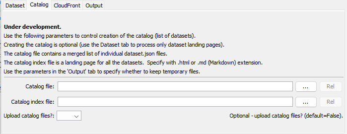

# TSTool / Command / AwsS3Catalog #

**This command is under development.
This documentation is currently not accurate and the command is not enabled.**

*   [Overview](#overview)
    +   [DCAT Background](#dcat-background)
    +   [Dataset Metadata](#dataset-metadata)
        -   [`dataset.json - Dataset Metadata`](#datasetjson-dataset-metadata)
        -   [`dataset.png` - Image for Dataset](#datasetpng-image-for-dataset)
        -   [`dataset-details.md` - Insert for Dataset Section](#dataset-detailsmd-insert-for-dataset-section)
    +   [Command Input Files](#command-input-files)
        - [Insert for `<head>`](#insert-for-head)
        - [Insert for `<body>`](#insert-for-body)
        - [Insert for `<footer>`](#insert-for-footer)
    +   [Command Output Files](#command-output-files)
        - [Dataset `index.html` Landing Page](#dataset-indexhtml-landing-page)
        - [Dataset `index.md` Landing Page](#dataset-indexmd-landing-page)
        - [Datasets `index.html` Landing Page](#datasets-indexhtml-landing-page)
        - [Datasets `datasets.json` Catalog File](#datasets-datasetsjson-catalog-file)
*   [Command Editor](#command-editor)
*   [Command Syntax](#command-syntax)
*   [Examples](#examples)
*   [Troubleshooting](#troubleshooting)
*   [See Also](#see-also)

-------------------------

## Overview ##

The `AwsS3Catalog` command generates a catalog and landing pages for datasets that have metadata files on S3.
This helps automate the workflow for individual datasets within a larger content distribution network (CDN).
The landing page can be an `index.html` or `index.md` (Markdown) file.

If the landing page is an HTML file,
the command allows HTML inserts to be provided for the `<head>`, `<body>`, and `<footer>` sections of the landing page,
which allows implementation of a standard "skin", such as a navigation menu for an organization's website.

If the landing page is a Markdown file, the website must provide functionality to convert Markdown files to
HTML to view the result in a browser.
Markdown files are easier to create than HTML but current do not display in browsers without an extension
or server-side software.

See the [`AwsS3`](../AwsS3/AwsS3.md) command documentation for information about S3 terminology and authentication.

This command searches an S3 bucket (specified with `Bucket` parameter) and
starting folder (specified with `Prefix` parameter) for files named `dataset.json` and performs the following tasks:

*   Create for each dataset:
    +   `index.html` (or `index.md`) - landing page for the dataset,
        which can be linked to from web pages
*   Create for the catalog of multiple datasets (**NOT YET IMPLEMENTED**):
    +   `index.html` - landing page for the dataset catalog,
        which lists the found datasets and allows navigating to each dataset landing page
    +   `datasets.json` - top-level catalog of dataset metadata,
        which combines all separate `dataset.json` files,
        suitable for tools such as search and discovery tools

Although this command does not yet automatically create the top-level landing page with a catalog of dataset versions,
it is possible to use this command to accomplish the result.
For example, use the [`AwsS3`](../AwsS3/AwsS3.md) command to list an S3 folder's contents into a table,
manipulate the table as needed,
and then use the TSTool [`WriteTableToMarkdown`](https://opencdss.state.co.us/tstool/latest/doc-user/command-ref/WriteTableToMarkdown/WriteTableToMarkdown/) command
to output content for the `dataset-details.md` file used by this command.
In this case, make sure that `ProcessSubdirectoris=False` since only the top-level main dataset should be processed.

### DCAT Background ###

The W3C Data Catalog Vocabulary (DCAT) is a standard for publishing dataset catalogs.
Each dataset includes the data files or server and DCAT metadata.
DCAT is an evolving standard.  See the following resources:

*   [Introduction to the W3C Data Catalog Vocabulary](https://op.europa.eu/documents/7525478/8087182/WINSTANLEY_presentation_Introduction_to_the_W3C_Data_Catalog_Vocabulary.pdf/51b659da-65e7-7a6d-f984-5eb37ded5367?t=1616618191119)
*   [DCAT3 Vocabulary](https://www.w3.org/TR/vocab-dcat-3/)
*   [DCAT2 Vocabulary](https://www.w3.org/TR/vocab-dcat-2/)
*   [Resource Description Framework (RDF)](https://en.wikipedia.org/wiki/Resource_Description_Framework)

DCAT is used by software that publishes datasets,
with support for different versions depending on the software product:

*   [CKAN](https://extensions.ckan.org/extension/dcat/)
*   [Socrata](https://open-source.socrata.com/philosophy/)
*   [Esri ArcGIS](https://doc.arcgis.com/en/hub/content/federate-data-with-external-catalogs.htm)

The design of this command is intended to adhere to DCAT.
However, because there are multiple DCAT specification versions and software has pressing design requirements,
the current implementation for this command mainly follows the concept.
Future versions of this command will be made consistent with DCAT JSON format.

### Dataset Metadata ###

To implement a workable solution, this command relies on dataset metadata JSON files named `dataset.json`
that have been previously uploaded to AWS S3 bucket folders.
This command locates the files and creates `index.html` (or `index.md`)
landing pages for each dataset and a master `datasets.json` catalog file
and landing page listing all matched datasets.

Several other files with standard names are also used for each dataset if found.
These files are described in the following sections
and are typically uploaded to S3 using the [`AwsS3`](../AwsS3/AwsS3.md) command
prior to running this `AwsS3Catalog` command.

The DCAT specification provides examples in "RDF" format.
However, the JSON format is useful for software integration and web services.
Consequently, this command implements a JSON dataset metadata format based on DCAT,
as illustrated in [CKAN examples](https://github.com/ckan/ckanext-dcat/blob/master/examples/catalog.json).
A specific CKAN example is shown below.

```
{
    "title": "An example catalog",
    "description": "A longer description of what the catalog is, who maintains it, etc. Special characters should be properly handed (if the file is utf8 encoded), for instance for catalogs from Sant Adri\u00e0.",
    "homepage": "",
    "issued": "2013-04-26T00:00:00Z",
    "modified": "2013-05-22T09:38:45Z",
    "language": "en",
    "license": "https://data.some.org/link/to/license",
    "dataset": [
        {
            "title": "Example dataset 1",
            "description": "A longer description of dataset 1: includes three distributions, a CSV file, a PDF file and an API. Some special characters: \u0398\u03b5\u03c3\u03c3\u03b1\u03bb\u03bf\u03bd\u03af\u03ba\u03b7.",
            "identifier": "https://data.some.org/catalog/datasets/1",
            "issued": "2013-04-26T00:00:00Z",
            "modified": "2013-04-26T00:00:00Z",
            "landingPage": "",
            "publisher": {
                "name": "Publishing Organization for dataset 1",
                "mbox": "contact@some.org"
            },
            "distribution": [
                {
                    "accessURL": "",
                    "byteSize": "",
                    "description": "A longer description for the distribution",
                    "downloadURL": "https://data.some.org/the/actual/catalog/datasets/1/resources/1.csv",
                    "format": "text/csv",
                    "issued": "",
                    "license": "https://data.some.org/link/to/license",
                    "modified": "",
                    "title": "A distribution for this dataset in CSV format"
                },
                {
                    "accessURL": "",
                    "byteSize": "",
                    "description": "A longer description for the distribution",
                    "downloadURL": "https://data.some.org/the/actual/catalog/datasets/1/resources/2.pdf",
                    "format": "application/pdf",
                    "issued": "",
                    "license": "https://data.some.org/link/to/license",
                    "modified": "",
                    "title": "A distribution for this dataset in PDF format"
                },
                {
                    "accessURL": "https://data.some.org/the/actual/catalog/link/to/an/api",
                    "byteSize": "",
                    "description": "A longer description for the distribution",
                    "downloadURL": "",
                    "format": "",
                    "issued": "",
                    "license": "",
                    "modified": "",
                    "title": "A distribution for this dataset as an API"
                }
            ],
            "keyword": [
                "stats",
                "pollution"
            ],
            "language": [
                "en"
            ]
        },
        {
            "title": "Example dataset 2",
            "description": "A longer description of dataset 2: with two distributions, a website and a PDF file. Some special characters: \u0141\u00f3d\u017a",
            "identifier": "https://data.some.org/catalog/datasets/2",
            "issued": "2012-06-21",
            "modified": "2013-04-01",
            "landingPage": "",
            "publisher": {
                "name": "Publishing Organization for dataset 2",
                "mbox": "contact@another.org"
            },
            "distribution": [
                {
                    "accessURL": "",
                    "byteSize": "",
                    "description": "A longer description for the distribution",
                    "downloadURL": "https://external.site.org/",
                    "format": "html",
                    "issued": "",
                    "license": "",
                    "modified": "",
                    "title": "A distribution for this dataset as an external website"
                },
                {
                    "accessURL": "",
                    "byteSize": "",
                    "description": "A longer description for the distribution",
                    "downloadURL": "https://data.some.org/the/actual/catalog/datasets/2/resources/2.pdf",
                    "format": "application/pdf",
                    "issued": "",
                    "license": "",
                    "modified": "",
                    "title": "A distribution for this dataset in PDF format"
                }
            ],
            "keyword": [
                "stats",
                "education",
                "sloths"
            ],
            "language": [
                "en"
            ]
        }
    ]
}
```

The above example is relatively easy to understand,
whereas full W3C specifications using RDF can be complex and JSON-LD (JSON linked data) is verbose.
This command relies on a few properties being defined to support the initial TSTool dataset catalog integration.
More complex dataset metadata and stricter DCAT compliance will be added in the future.

The following illustrates file organizations for typical versioned datasets for a cloud-hosted bucket.
The `dataset.json` file is a dataset metadata file similar to the above example.
The `*.geojson` file is a dataset file, in this case a GeoJSON file
that can be used directly or downloaded for processing.
Of particular note is that the DCAT3 specification has improved support for versions,
but the specification is a draft and JSON examples are limited.
Because the DCAT data include a `landingPage` property, it is possible to generate an `index.html`
landing page for each dataset that is listed in a master data catalog and complex datasets consisting of a
"bag of files" can be described in the landing page.
Access to any combination of files can be implemented by creating and uploading a `dataset-details.md` file.
This approach provides flexibility, rather than trying to implement a DCAT file that is limited.

```
bucket/                               Bucket.
   datasets/                          Top-level bucket folder
     state/co/                        Some organization layer, in this case spatial grouping.
       datasetA/                      Dataset is in one folder with no "latest" or versioned folders.
         dataset.json
         *.geojson
       datasetB/                      Dataset is in "latest" folder but no versions.
         latest/
           dataset.json
           *.geojson
       datasetC/                      Dataset has "latest" and versioned folders.
         dataset.json                 Main dataset metadata.
         latest/
           dataset.json               Dataset metadata for version.
           *.geojson
         2022-06-12/
           dataset.json               Dataset metadata for version.
           *.geojson
```

Conventions for organizing datasets are as follows.

**<p style="text-align: center;">
Dataset Versioning Types
</p>**

| **Dataset Versioning** | **Description** |
| -- | -- |
| Single version | This type of dataset has no `latest` or versioned folders, which is appropriate for relatively frequent updates where archiving snapshots is unnecessary or prohibitive due to the amount of data. In this case, the dataset files exist in the top level of the dataset's folder. |
| Only `latest` version | This type of dataset has a `latest` folder but no versioned folder(s), which is appropriate for a dataset that might have version snapshots in the future but currently only has a single latest version. |
| `latest` and versions | This type of dataset has versioned folders and a `latest` folder containing the latest version, which is appropriate for datasets that are periodically updated and need to have versioned snapshots.  A main folder `dataset.json` file may be used to provide most of the dataset properties, with property overrides in the versioned folders. |

#### `dataset.json` - Dataset Metadata ####

This file is automatically used if found and is not specified with a command parameter.

The `dataset.json` file indicates the home folder for a dataset,
in which downloadable files such as `*.geojson`, time series, or other files may exist.
The command searches for `dataset.json` files based on the `StartingPrefix` parameter.

The file contains dataset metadata properties as described in the following table.

**<p style="text-align: center;">
`dataset.json` Properties
</p>**

| **Property**&nbsp;&nbsp;&nbsp;&nbsp;&nbsp;&nbsp;&nbsp;&nbsp;&nbsp;&nbsp;&nbsp;&nbsp;&nbsp;&nbsp;&nbsp;&nbsp;&nbsp;&nbsp;&nbsp;&nbsp;&nbsp;&nbsp; | **Type** | **Description** | **Default** |
| -- | -- | -- | -- |
| `description` | string | Description of the dataset. | |
| `distribution` | Array of DCAT distribution | Under development. | |
| `modified` | string | A modification date/time using [ISO 8601](https://en.wikipedia.org/wiki/ISO_8601) syntax. | |
| `parentDatasetFile` | string | If the dataset has versions in subfolders, the path to the parent dataset file can be specified, typically `../dataset.json`.  The parent dataset metadata will be used unless the version provides properties. | |
| `version` | string | A version for the dataset consistent with the original data, for example:<ul><li>`1.2.3` - [semantic version](https://semver.org/)</li><li>`YYYY-MM-DD` - datestamped version</li><ul> | |

#### `dataset.json` with No Versions ####

The following is an example of a dataset that does not have versions:

```
{
  "title": "DatasetA",
  "description": "Example datasetA.",
  "identifier": "owf-data-co-datasetA",
  "landingPage": "https://test.openwaterfoundation.org/data/state/co/datasetA/",
  "issued": "2022-06-09",
  "keyword": [
    "line",
    "continental-divide"
  ],
  "publisher": {
    "name": "Open Water Foundation",
    "mbox": "info@openwaterfoundation.org"
  },
  "distribution": [
    {
      "accessURL": "https://test.openwaterfoundation.org/data/state/co/datasetA/example.geojson",
      "byteSize": null,
      "description": "GeoJSON example file stored in main folder",
      "format": "application/geo+json",
      "title": "Example in main folder"
    }
  ]
}
```

#### `dataset.json` with `latest` but No Versions ####

The following is an example of a dataset with a `latest` folder but no versions,
in which case there is no parent `dataset.json` file.
The file is similar to the previous except that the landing page is in the `latest` folder.

```
{
  "title": "DatasetB",
  "description": "Example datasetB.",
  "identifier": "owf-data-co-datasetB",
  "landingPage": "https://test.openwaterfoundation.org/data/state/co/datasetB/latest/",
  "issued": "2022-06-09",
  "keyword": [
    "line",
    "continental-divide"
  ],
  "publisher": {
    "name": "Open Water Foundation",
    "mbox": "info@openwaterfoundation.org"
  },
  "distribution": [
    {
      "accessURL": "https://test.openwaterfoundation.org/data/state/co/datasetB/latest/",
      "byteSize": null,
      "description": "Example dataset stored in latest foler.",
      "format": "application/geo+json",
      "title": "Example in latest"
    }
  ]
}
```

#### `dataset.json` with `latest` and Versioned Folders ####

The following is an example of a dataset with a `latest` and versioned folder(s),
in which case the parent folder provides a main `dataset.json` and each
version folder provides overriding information.

The following `dataset.json` exists in the main folder.

```
{
  "title": "DatasetC",
  "description": "Example datasetC.",
  "identifier": "owf-data-co-datasetC",
  "landingPage": "https://test.openwaterfoundation.org/data/state/co/datasetC/",
  "issued": "2022-06-09",
  "keyword": [
    "line",
    "continental-divide"
  ],
  "publisher": {
    "name": "Open Water Foundation",
    "mbox": "info@openwaterfoundation.org"
  }
}
```

The following `dataset.json` exists in the `latest` folder.


```
{
  "parentDatasetFile": "../dataset.json",
  "version": "latest",
  "modified": "2022-06-12",
  "description": "Example datasetC for latest snapshot",
  "distribution": [
    {
      "accessURL": "https://test.openwaterfoundation.org/data/state/co/datasetC/latest/example.geojson",
      "byteSize": null,
      "description": "GeoJSON example file stored in latest folder",
      "format": "application/geo+json",
      "title": "Example in latest folder"
    }
  ]
}
```

The following `dataset.json` exists in the `2022-06-12` folder.

```
{
  "parentDatasetFile": "../dataset.json",
  "version": "2022-06-12",
  "modified": "2022-06-12",
  "description": "Example datasetC for versioned snapshot",
  "distribution": [
    {
      "accessURL": "https://test.openwaterfoundation.org/data/state/co/datasetC/2022-06-12/example.geojson",
      "byteSize": null,
      "description": "GeoJSON example file stored in version folder",
      "format": "application/geo+json",
      "title": "Example in version folder"
    }
  ]
}
```

#### `dataset.png` - Image for Dataset ####

This file is automatically used if found and is not specified with a command parameter.

The `dataset.png` file can be provided in the main dataset folder
(no need to provide in every version folder).
All datasets should provide an image file in order to create a more visually-interesting landing page.
The image for a dataset version may change over time.
The file is used by the output `index.html` (or `index.md`) landing page to provide a visual for the dataset.

#### `dataset-details.md` - Insert for Dataset Section ####

This file is automatically used if found and is not specified with a command parameter.

The `dataset-details.md` file can be provided in the main or version dataset folder
to provide an insert into the ***Dataset Details*** section of the
output `index.html` landing page.

The file should NOT contain a header and subsections should use level 2 (`##`) headers and smaller.
Typical sections include:

*   ***Overview*** - explanation of the dataset
*   ***Downloads*** - links to download the dataset files
*   ***Workflow*** - a description of the workflow used to create the dataset files
*   ***Credits*** - if any credits are appropriate
*   ***License*** - license to use the dataset

### Command Input Files ###

This command accepts several input files,
which are processed to create the output files.
HTML insert files are read from local files to form the `index.html` dataset landing pages,
which are then uploaded to S3.

Inserts are used for every `index.html` file that are generated and are typically stored in a repository for the main website,
with the files shared between dataset repositories.
In other words, shared files are typically not stored in each dataset's repository.

#### Insert for `<head>` ####

This file is specified by the `DatasetIndexHeadFile` command parameter.

Specify the parameter to insert an HTML snippet at the top of the `<head>` section of the `index.html` landing page.
This can be used, for example, to insert the following:

*   Google Analytics tracking `<script>`.
*   `<meta>` elements, for example to specify cache control properties.
*   `<link>` elements to specify CSS files, favicon, etc.
    The CSS may be used by other content that is inserted.
*   `<script>` code blocks that define JavaScript functions and other code.
    The code may be used by other content that is inserted.

Because the insert may occur for landing pages at any point in a website hierarchy,
paths to files should be absolute and begin with `/`, for example `/css`, `/js`, `/images`, etc.

#### Insert for `<body>` ####

This file is specified by the `DatasetIndexBodyFile` command parameter.

Specify the parameter to insert an HTML snippet at the top of the `<body>` section of the `index.html` landing page,
for example:

*   `<nav>` block to insert page navigation, such as menus consistent with the overall website.
    The inserted HTML can use JavaScript code and CSS inserted in the `<body>` insert.

Because the insert may occur for landing pages at any point in a website hierarchy,
paths to files should be absolute and begin with `/`, for example `/css`, `/js`, `/images`, etc.

See the `dataset-details.md` file for how to insert dataset information as Markdown,
which allows providing content for a specific dataset,
whereas the `<body>` insert is for all generated dataset landing pages.

#### Insert for `<footer>` ####

This file is specified by the `DatasetIndexFooterFile` command parameter.

Specify the parameter to insert an HTML snippet after the `</body>` element of the `index.html` landing page:

*   The insert should contain a `<footer>` block to insert a page footer,
    for example to provide organization contact information.

Because the insert may occur for landing pages at any point in a website hierarchy,
paths to files should be absolute and begin with `/`, for example `/css`, `/js`, `/images`, etc.

### Command Output Files ###

This command creates output files based on the command parameters.
If `ProcessSubdirectories=True`, multiple datasets may be processed.
Therefore, use `DatasetIndexFile=Temp.html` or `DatasetIndexFile=Temp.md` to use temporary files for output files prior.
Otherwise output files for multiple datasets will overwrite.
If processing a single dataset, a specific output file (e.g., `DatasetIndexFile=index.html` or `DatasetIndexFile=index.md`) can be used.

*   Create for each dataset:
    +   `index.html` (or `index.md`) - landing page for the dataset
*   Create for the catalog (**NOT YET IMPLEMENTED**):
    +   `index.html` (or `index.md`) - landing page for the dataset catalog
    +   `datasets.json` - top-level catalog of dataset metadata,
        which combines all separate `dataset.json` files

#### Dataset `index.html` Landing Page ####

This file is created if `DatasetIndexFile` is specified with `.html` extension.

This file is created in the same S3 bucket folder as the `dataset.json` input file
and serves as the landing page for the dataset.
This command will upload the file to S3 and invalidate the file if CloudFront information is specified.

The created `index.html` file depends on several CSS class styles being defined,
typically in a CSS file that is referenced using a `<script>` element in the
[body insert](#insert-for-body).
The following is an example of CSS file contents.
CSS files are often cached by the web browser so the CSS filename should include a version
that is changed when the file contents are changed.

```
  /* The dataset image and property table layout is assumed to be as follows,
   * which relies on CSS for classes.
   *
   * <div class="dataset-content-container">
   *   <div class="dataset-image-and-property-container">
   *   |-----------------------------|      <div class="dataset-property-table-container>
   *   |  |      |----------------------------------------|
   *   |                             |      | Dataset properties table               |
   *   | Dataset                     |      | <table class="dataset-property-table"> |
   *   | image                       |      |----------+-----------------------------|
   *   |                             |      | Name     |   Value                     |
   *   |                             |      | Name     |   Value                     |
   *   |-----------------------------|      |----------+-----------------------------|</div> <!-- dataset-property-table-container -->
   *   </div> <!-- dataset-image-and-property-container -->
   * </div> <!-- dataset-content-container -->
   */

  /* Used with the <div> for the dataset description. */
  .dataset-content-container {
    margin: 100px 10px 0px 10px;
  }

  /* Used with the <div> for the dataset image and properties table. */
  .dataset-image-and-property-container {
    display: flex;
    margin: 0px 25px;
  }

  /* Used with  for the dataset image. */
  .dataset-image {
    height: 100%;
    width: 33%;
  }

  /* Used with the <div> for the for the dataset properties. */
  .dataset-property-table-container {
    display: flex;
    justify-content: center;
    align-items: flex-start;
    width: 66%;
    overflow: auto;
  }

  /* Used with the <table> for the dataset properties. */
  .dataset-property-table {
    width: 100%;
    margin: 0px 50px;
  }
```

#### Dataset `index.md` Landing Page ####

This file is created if `DatasetIndexFile` is specified with `.md` extension.

This file is created in the same S3 bucket folder as the `dataset.json` input file
and serves as the landing page for the dataset.
This command will upload the file to S3 and invalidate the file if CloudFront information is specified.
Because the website has a Markdown file and not `index.html`,
the web server or browser application mus be able to render Markdown to HTML for viewing.

The created `index.md` file is similar to the `index.html` (see previous section) but
the formatting is simpler because Markdown is simpler than HTML.
No HTML insert files are currently used; therefore the "skin" of the resulting page does not include website menus or other features
(unless more complex handling of the Markdown is implemented).
The output file has a layout similar to the following.


```
# <title from dataset.json> #

## Dataset: <title from dataset.json> ##

<dataset.png - NOT CURRENTLY INSERTED - layout in Markdown is not as flexible as HTML>

<table of properties from dataset.json>

## Dataset Publisher ##

<table of properties from dataset.json>

## Dataset Details ##

<contents of dataset-details.json if available on S3,
typically includes something like the following and
try to standardize in an organization across datasets:

## Overview ##

Summary of the dataset.

## Downloads ##

As much is needed to list files with links,
for example table of files, including versioned datasets in sub-folders.

## Workflow ##

Explain or link to workflow such as repository with TSTool workflow.

## Update Frequency and Versions ##

Explain frequency of udpates and how versions are handled.

## Credits ##

Credits, if any.

## License ##

Distribution license if any.

...end of dataset-details.md insert>

```

The command will auto-generate the top of the file from the `dataset.json` and `dataset.png` files.
If a `dataset-details.md` file is available on S3, it is appended as is under the "Dataset Details" section heading.
If any dynamic processing is needed to create the `dataset-details.md` file,
do that and upload to S3 before calling this command.

#### Datasets `index.html` Landing Page ####

**Not yet implemented.**

This file is created in the folder specified by `StartingPrefix`
and serves as the landing page to provide a catalog of all the datasets.
This command will upload the file to S3.

#### Datasets `datasets.json` Catalog File ####

**Not yet implemented.**

This file is created in the folder specified by `StartingPrefix`
and is a catalog of all the datasets,
with links to each dataset's landing page.
This command will upload the file to S3.

## Command Editor ##

The following dialog is used to edit the command and illustrates the syntax for the command.

**<p style="text-align: center;">

</p>**

**<p style="text-align: center;">
`AwsS3Catalog` Command Editor for Dataset Parameters (<a href="../AwsS3Catalog-dataset.png">see also the full-size image)</a>
</p>**

**<p style="text-align: center;">

</p>**

**<p style="text-align: center;">
`AwsS3Catalog` Command Editor for Catalog Parameters (<a href="../AwsS3Catalog-catalog.png">see also the full-size image)</a>
</p>**

**<p style="text-align: center;">

</p>**

**<p style="text-align: center;">
`AwsS3Catalog` Command Editor for CloudFront Parameters (<a href="../AwsS3Catalog-cloudfront.png">see also the full-size image)</a>
</p>**

**<p style="text-align: center;">

</p>**

**<p style="text-align: center;">
`AwsS3Catalog` Command Editor for Output Parameters (<a href="../AwsS3Catalog-output.png">see also the full-size image)</a>
</p>**

## Command Syntax ##

The command syntax is as follows:

```text
AwsS3Catalog(Parameter="Value",...)
```

**<p style="text-align: center;">
Command Parameters
</p>**

|**Tab**|**Parameter**&nbsp;&nbsp;&nbsp;&nbsp;&nbsp;&nbsp;&nbsp;&nbsp;&nbsp;&nbsp;&nbsp;&nbsp;&nbsp;&nbsp;&nbsp;&nbsp;&nbsp;&nbsp;&nbsp;&nbsp;&nbsp;&nbsp;&nbsp;&nbsp;&nbsp;&nbsp;&nbsp;&nbsp;&nbsp;|**Description**|**Default**&nbsp;&nbsp;&nbsp;&nbsp;&nbsp;&nbsp;&nbsp;&nbsp;&nbsp;&nbsp;&nbsp;&nbsp;&nbsp;&nbsp;&nbsp;&nbsp;&nbsp;&nbsp;&nbsp;&nbsp;&nbsp;&nbsp;&nbsp;&nbsp;&nbsp;&nbsp;&nbsp;|
|--|--------------|-----------------|-----------------|
|***All***|`S3Command`<br>**required**|The S3 command to run, which indicates which tab's parameters are used, can use `${Property}` syntax. | None - must be specified. |
||`Profile`|The AWS command line interface profile to use for authentication, can use `${Property}` syntax. | Use the `default` profile or use the single profile if only one profile is provided in the configuration files.|
||`Region`| The AWS region to use for service requests. Use the [AWS Management Console website](https://aws.amazon.com/console/) to check which region is used for an account, can use `${Property}` syntax. | Default region from the user's AWS configuration file. |
||`Bucket`| The S3 bucket containing objects, can use `${Property}` syntax. | Must be specified for S3 commands that act on specific bucket objects. |
||`StartingPrefix`| Starting prefix to search for in bucket, with no leading `/` but include trailing `/`, can use `${Property}` notation. | `/` (the underlying S3 maximum keys value will limit results). |
||`ProcessSubdirectories` | Whether to process subdirectories below the `StartingPrefix`:<ul><li>`False` - do not process subdirectories (used for granular updates to dataset landing pages)</li><li>`True` - process subdirectories (useful for bulk updates to a dataset web site)</li></ul> | `False` |
||`IfInputNotFound`| Message level when input is not found:  `Ignore`, `Warn`, or `Fail`. | `Warn` |
| **Dataset** |`DatasetIndexFile`| Dataset-level `index.html` (or `index.md`) file to create, which lists all files for a specific dataset, can use `${Property}` syntax:<ul><li>path to an `index.html` (or `index.md`) file to create, use when processing one dataset</li><li>`Temp.html` (or `Temp.md`) - create temporary index file, use when processing a hierarchy of datasets</li></ul> | Do not create the dataset index file(s). |
||`DatasetIndexHeadFile`| If creating an HTML index file, the dataset-level `index.html` insert file for the top of the `<head>` section, can use `${Property}`. | |
||`DatasetIndexBodyFile`| If creating an HTML index file, the dataset-level `index.html` insert file for the top of the `<body>` section, can use `${Property}`. | |
||`DatasetIndexFooterFile`| If creating an HTML index file, the dataset-level `index.html` insert file for the `<footer>` section (after `</body>`), can use `${Property}`. | |
||`UploadDatasetFiles`| Whether to upload dataset output files that are created to S3 (`True`) or not (`False`). | `False` (to encourage review before upload). |
|***Catalog***|`CatalogFile`| Top-level catalog JSON file to create, which lists all datasets that are found, can use `${Property}` syntax.  The filename should have a name `datasets.json` (plural). | Do not create the top-level catalog file. |
||`CatalogIndexFile`| Top-level `index.html` file to create, which lists all datasets that are found, can use `${Property}` syntax.  The filename should have a name index.html. | Do not create the top-level index file. |
||`UploadCatalogFiles`| Whether to upload catalog output files that are created to S3 (`True`) or not (`False`). `True` is typically specified when creating the main catalog after uploading datasets individually. | `False` (to encourage review before upload). |
| **CloudFront** |`DistributionId`| The CloudFront distribution identifier that is used to invalidate uploaded files.  Specify as the distribution ID or a `*wildcard*` pattern (preferred since usually more readable) matching the domain for the site. | Files are not invalidated after uploading. |
|***Output***|`OutputTableID`| Table identifier to create containing the list of processed datasets, can use `${Property}` syntax. | Do not create table. |
||`KeepFiles`| Whether to keep temporary output files that are created during processing (`True`) or not (`False`), useful for troubleshooting. | `False`|

## Examples ##

See the [automated tests](https://github.com/OpenWaterFoundation/owf-tstool-aws-plugin/tree/master/test/commands/AwsS3Catalog).
Automated tests require AWS permissions to run.

See the [TSTool workflow](https://github.com/OpenWaterFoundation/owf-data-us-continental-divide/blob/master/workflow/upload-dataset-to-s3.tstool)
used to upload the continental divide dataset to S3 and create its landing page.

## Troubleshooting ##

If there is an error, view the TSTool log file using the ***Tools / Diagnostics - View Log File...*** menu.

## See Also ##

*   [`AwsS3`](../AwsS3/AwsS3.md) command
*   [`AwsS3CloudFront`](../AwsCloudFront/AwsCloudFront.md) command
