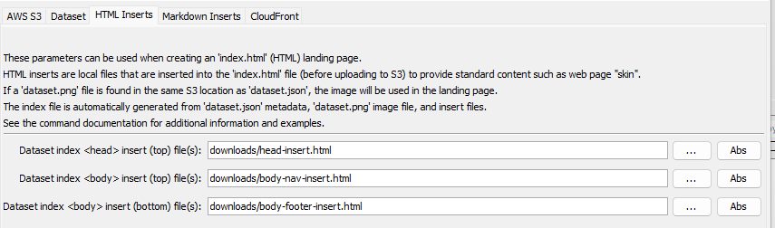

# TSTool / Command / AwsS3LandingPage #

This command provides functionality to create a website HTML or Markdown landing page for a dataset,
information product, or other electronic asset.

*   [Overview](#overview)
    +   [Background](#background)
    +   [DCAT Background](#dcat-background)
    +   [JSON-LD Background](#json-ld-background)
    +   [Dataset Metadata](#dataset-metadata)
        -   [`dataset.json - Dataset Metadata`](#datasetjson-dataset-metadata)
    +   [Command Input Files for HTML Landing Page](#command-input-files-for-html-landing-page)
        -   [`dataset.png` - Image for HTML Landing Page](#datasetpng-image-for-html-landing-page)
        -   [`dataset-details.md` - Insert for Dataset Details Section](#dataset-detailsmd-insert-for-dataset-details-section) - same as for Markdown
        -   [Inserts for `<head>`](#inserts-for-head)
        -   [Inserts for `<body>`](#inserts-for-body)
    +   [Command Input Files for Markdown Landing Page](#command-input-files-for-markdown-landing-page)
        -   [`dataset.png` - Image for Markdown Landing Page](#datasetpng-image-for-markdown-landing-page)
        -   [`dataset-details.md` - Insert for Dataset Details Section](#dataset-detailsmd-insert-for-dataset-details-section)
    +   [Command Output Files](#command-output-files)
        - [Dataset `index.html` HTML Landing Page](#dataset-indexhtml-html-landing-page)
        - [Dataset `index.md` Markdown Landing Page](#dataset-indexmd-markdown-landing-page)
*   [Command Editor](#command-editor)
*   [Command Syntax](#command-syntax)
*   [Examples](#examples)
    +   [HTML Landing Page](#html-landing-page)
        -   [Simple Dataset with HTML Landing Page](#simple-dataset-with-html-landing-page)
        -   [Dataset with Only Latest Version HMTL Landing Page](#dataset-with-only-latest-version-html-landing-page)
        -   [Dataset with Multiple Versions HMTL Landing Page](#dataset-with-multiple-versions-html-landing-page)
    +   [Markdown Landing Page](#markdoown-landing-page)
        -   [Simple Dataset with Markdown Landing Page](#simple-dataset-with-markdown-landing-page)
        -   [Dataset with Only Latest Version Markdown Landing Page](#dataset-with-only-latest-version-markdown-landing-page)
        -   [Dataset with Multiple Versions Markdown Landing Page](#dataset-with-multiple-versions-markdown-landing-page)
*   [Troubleshooting](#troubleshooting)
*   [See Also](#see-also)

-------------------------

## Overview ##

This command provides functionality to create a website HTML or Markdown landing page for a dataset,
information product, or other electronic asset.
Multiple dataset landing pages can then be listed in a dataset catalog created with the 
[`AwsS3Catalog`](../AwsS3Catalog/AwsS3Catalog.md) command.

### Background ###

The `AwsS3LandingPage` command generates a landing page for a dataset that is being published on AWS S3.
The command helps automate the workflow for individual datasets within a larger content distribution network (CDN),
as illustrated by the following diagram (see the two lower right boxes).
General dataset concepts are described in the [Overview / Dataset Commands](../overview.md#dataset-concepts) documentation.

**<p style="text-align: center;">

</p>**

**<p style="text-align: center;">
Dataset Design Example (<a href="../../dataset-design.png">see also the full-size image)</a>
</p>**

The landing page can be one of the following:

*   `index.html` (HTML):
    +    Can be viewed directly by a web browser when hosted on a website.
    +    Requires creating a valid HTML file (more complex formatting than Markdown).
*   `index.md` (Markdown):
    +    Can be viewed in a web application that is able to convert Markdown to HTML.
    +    Markdown files are simpler to format than HTML but can't be viewed directly in a web browser.

A typical high-level workflow to implement a dataset landing page is:

1.  Determine the organization and naming convention for dataset files, including S3 folder for files
    and corresponding CloudFront website URLs.
    The overall conventions are typically determined up front and are applied to multiple datasets.
    For example see the [`https://data.openwaterfoundation.org`](https://data.openwaterfoundation.org) website
    and specific dataset landing pages
    (e.g., the [Colorado Municipalities](https://data.openwaterfoundation.org/state/co/owf/municipalities/) dataset,
    which uses an `index.html` landing page file).
2.  Create dataset files locally, for example using TSTool commands or other software
    and automated workflows.
    The workflow files are typically maintained in a Git repository for the dataset,
    with each repository containing one or more datasets.
    For example, see the [`owf-data-co-municipalities`](https://github.com/OpenWaterFoundation/owf-data-co-municipalities)
    repository and `workflow` folder for Colorado municipalities. 
3.  Upload the dataset files to Amazon S3, for example using the
    [`AwsS3`](../AwsS3/AwsS3.md) command.
    Also invalidate the files for AWS CloudFront so that they are pushed to CloudFront servers.
    For example, see the `AwsS3` command at the start of the
    [TSTool command file for the above dataset](https://github.com/OpenWaterFoundation/owf-data-co-municipalities/blob/main/workflow/02-upload-dataset-to-s3.tstool).
4.  List the S3 dataset files and create a dataset landing page,
    for example using this `AwsS3LandingPage` command.
    This ensures that the landing page reflects all previously uploaded dataset files.
    Also invalidate the dataset landing page files for AWS CloudFront so that they are pushed to CloudFront servers.
    For example, see the `AwsS3LandingPage` command at the end of the
    [TSTool command file for the above dataset](https://github.com/OpenWaterFoundation/owf-data-co-municipalities/blob/main/workflow/02-upload-dataset-to-s3.tstool).
5.  Create/update the dataset catalog, which lists multiple datasets,
    for example using the [`AwsS3Catalog`](../AwsS3Catalog/AwsS3Catalog.md) command.
    This command is intended to create a wab page similar to
    [`https://data.openwaterfoundation.org`](https://data.openwaterfoundation.org).
    **This functionality is under development.**
6.  Use the published dataset files in applications by accessing dataset files with URLs.
    For example see the
    [Municipalities map in the Poudre Basin Information](https://poudre.openwaterfoundation.org/latest/map/entities-municipalities) website.

If the landing page is an `index.html` file,
this `AwsS3LandingPage` command allows HTML inserts to be provided for the `<head>` and `<body>` sections of the landing page,
which allows implementation of a standard "skin" and branding, such as a navigation menu for an organization's website.
The inserted files can reference shared files such as CSS for the entire website.

If the landing page is a Markdown file,
the website must provide functionality to convert Markdown files to HTML to view the result in a browser,
for example a web application that converts Markdown into HTML for viewing.
Markdown files are easier to create than HTML but typically do not automatically display in browsers without
a web browser extension, or application code such as [Showdown](https://showdownjs.com/),
which converts the Markdown file to HTML on the fly.

See the [`AwsS3`](../AwsS3/AwsS3.md) command documentation for information about
S3 terminology and authentication for uploads.

This command searches an S3 bucket (specified with `Bucket` parameter) and
starting folder (specified with `StartingFolder` parameter) for files named `dataset.json`,
which contain dataset metadata.
Although the command is designed to process multiple landing pages,
it is often applied to create a single landing page
or a landing page for a dataset version under a parent dataset.
This `AwsS3LandingPage` command is used in a workflow to perform the following tasks for each dataset landing page:

1.  Prior to using this `AwsS3LandingPage` command:
    1.  Typically, work in a Git repository's working files to create dataset files.
    2.  Data files that comprise the dataset should exist in local files and are uploaded to S3,
        for example using the [`AwsS3`](../AwsS3/AwsS3) command.
    3.  Typically, dynamic content such as output from a workflow, especially large files,
        is not committed to a repository,
        which is why publishing to a dataset landing page is needed.
2.  This `AwsS3LandingPage` command:
    1.  Finds dataset landing pages on S3 by searching for `dataset.json` metadata files.
    2.  Merges local input files and creates content based on the `dataset.json` file to create a local
        `index.html` (or `index.md`) landing page for the dataset,
    3.  Uploads the `index.html` (or `index.md`) landing page file to S3.
    4.  Optionally, invalidates the CloudFront distribution for the landing page
        so that the files are visible on the website.

This `AwsS3LandingPage` command can be used to create individual landing pages for each dataset version,
for example a dated snapshot, and can also be used to create a parent dataset landing page
that lists the versioned datasets.
For example, use the [`AwsS3`](../AwsS3/AwsS3.md) command to list versioned dataset folders into a table,
manipulate the table as needed,
and then use the TSTool [`WriteTableToMarkdown`](https://opencdss.state.co.us/tstool/latest/doc-user/command-ref/WriteTableToMarkdown/WriteTableToMarkdown/) command
to output content for the `dataset-details.md` file used by this command.
In this case, make sure that `AwsS3LandingPage(ProcessSubfolders=False,...)` since only the top-level main dataset should be processed.

### DCAT Background ###

See the [Dataset Metadata](#dataset-metadata) section for metadata used by this command.
The DCAT specification described below was evaluated when designing the dataset metadata used by this command.

One challenge for describing datasets is creating metadata that adheres to a standard.
Standard metadata allows compliant software tools to understand the datasets.
An attempt has been made to leverage dataset metadata standards;
however, these standards are not fully settled.
The design of this `AwsS3LandingPage` command has been informed by DCAT;
however, a simple approach has been implemented as discussed in the
[Dataset Metadata](#dataset-metadata) section.

The W3C Data Catalog Vocabulary (DCAT) is a standard for publishing dataset catalogs.
Each dataset includes the data files or server and DCAT metadata.
DCAT is an evolving standard.  See the following resources:

*   [Introduction to the W3C Data Catalog Vocabulary](https://op.europa.eu/documents/7525478/8087182/WINSTANLEY_presentation_Introduction_to_the_W3C_Data_Catalog_Vocabulary.pdf/51b659da-65e7-7a6d-f984-5eb37ded5367?t=1616618191119)
*   [DCAT3 Vocabulary](https://www.w3.org/TR/vocab-dcat-3/)
*   [DCAT2 Vocabulary](https://www.w3.org/TR/vocab-dcat-2/)
*   [Resource Description Framework (RDF)](https://en.wikipedia.org/wiki/Resource_Description_Framework)

DCAT is used by software that publishes datasets,
with support for different versions depending on the software product:

*   [CKAN + DCAT](https://extensions.ckan.org/extension/dcat/)
*   [Socrata - Open Source Philosophy](https://open-source.socrata.com/philosophy/)
*   [Esri ArcGIS - Federate Data and manage feeds](https://doc.arcgis.com/en/hub/content/federate-data-with-external-catalogs.htm)

The design of this command is intended to adhere to DCAT.
However, because there are multiple DCAT specification versions and this software has pressing design requirements,
the current implementation for this command mainly follows the concept.
Future versions of this command may support DCAT JSON format.

### JSON-LD Background ###

See the [Dataset Metadata](#dataset-metadata) section for metadata used by this command.
The JSON-LD specification described below was evaluated when designing the dataset metadata used by this command.

JSON Linked Data (JSON-LD) is a method of encoding linked data using JSON.
See the [JSON-LD Wikipedia article](https://en.wikipedia.org/wiki/JSON-LD).
JSON-LD is mentioned in resources related to DCAT.
Examples of JSON-LD implementations are:

*   [Dataverse Project](https://guides.dataverse.org/en/latest/developers/dataset-semantic-metadata-api.html)
*   [Internet of Water GeoConnex](https://internetofwater.org/blog/geoconnex/)

This `AwsS3LandingPage` command may be updated in the future to use JSON-LD dataset metadata standards.
However, currently this command implements a simple approach as discussed in the
[Dataset Metadata](#dataset-metadata) section.

### Dataset Metadata ###

To implement a workable solution, this `AwsS3LandingPage` command relies on a dataset metadata JSON file named `dataset.json`
for each dataset, which has been previously uploaded to the AWS S3 bucket folder that contains dataset files.
This command locates the files and creates `index.html` (or Markdown `index.md`)
landing pages for each dataset.

Several other files with standard names are also used for each dataset if found.
These files are described in the following sections
and are typically uploaded to S3 using the [`AwsS3`](../AwsS3/AwsS3.md) command
prior to running this `AwsS3LandingPage` command.

The DCAT specification provides examples in RDF format.
However, the DCAT JSON format is useful for software integration and web services.
Consequently, this command implements a JSON dataset metadata format based on DCAT,
as illustrated in [CKAN examples](https://github.com/ckan/ckanext-dcat/blob/master/examples/catalog.json).
A specific CKAN example is shown below.

```
{
    "title": "An example catalog",
    "description": "A longer description of what the catalog is, who maintains it, etc. Special characters should be properly handed (if the file is utf8 encoded), for instance for catalogs from Sant Adri\u00e0.",
    "homepage": "",
    "issued": "2013-04-26T00:00:00Z",
    "modified": "2013-05-22T09:38:45Z",
    "language": "en",
    "license": "https://data.some.org/link/to/license",
    "dataset": [
        {
            "title": "Example dataset 1",
            "description": "A longer description of dataset 1: includes three distributions, a CSV file, a PDF file and an API. Some special characters: \u0398\u03b5\u03c3\u03c3\u03b1\u03bb\u03bf\u03bd\u03af\u03ba\u03b7.",
            "identifier": "https://data.some.org/catalog/datasets/1",
            "issued": "2013-04-26T00:00:00Z",
            "modified": "2013-04-26T00:00:00Z",
            "landingPage": "",
            "publisher": {
                "name": "Publishing Organization for dataset 1",
                "mbox": "contact@some.org"
            },
            "distribution": [
                {
                    "accessURL": "",
                    "byteSize": "",
                    "description": "A longer description for the distribution",
                    "downloadURL": "https://data.some.org/the/actual/catalog/datasets/1/resources/1.csv",
                    "format": "text/csv",
                    "issued": "",
                    "license": "https://data.some.org/link/to/license",
                    "modified": "",
                    "title": "A distribution for this dataset in CSV format"
                },
                {
                    "accessURL": "",
                    "byteSize": "",
                    "description": "A longer description for the distribution",
                    "downloadURL": "https://data.some.org/the/actual/catalog/datasets/1/resources/2.pdf",
                    "format": "application/pdf",
                    "issued": "",
                    "license": "https://data.some.org/link/to/license",
                    "modified": "",
                    "title": "A distribution for this dataset in PDF format"
                },
                {
                    "accessURL": "https://data.some.org/the/actual/catalog/link/to/an/api",
                    "byteSize": "",
                    "description": "A longer description for the distribution",
                    "downloadURL": "",
                    "format": "",
                    "issued": "",
                    "license": "",
                    "modified": "",
                    "title": "A distribution for this dataset as an API"
                }
            ],
            "keyword": [
                "stats",
                "pollution"
            ],
            "language": [
                "en"
            ]
        },
        {
            "title": "Example dataset 2",
            "description": "A longer description of dataset 2: with two distributions, a website and a PDF file. Some special characters: \u0141\u00f3d\u017a",
            "identifier": "https://data.some.org/catalog/datasets/2",
            "issued": "2012-06-21",
            "modified": "2013-04-01",
            "landingPage": "",
            "publisher": {
                "name": "Publishing Organization for dataset 2",
                "mbox": "contact@another.org"
            },
            "distribution": [
                {
                    "accessURL": "",
                    "byteSize": "",
                    "description": "A longer description for the distribution",
                    "downloadURL": "https://external.site.org/",
                    "format": "html",
                    "issued": "",
                    "license": "",
                    "modified": "",
                    "title": "A distribution for this dataset as an external website"
                },
                {
                    "accessURL": "",
                    "byteSize": "",
                    "description": "A longer description for the distribution",
                    "downloadURL": "https://data.some.org/the/actual/catalog/datasets/2/resources/2.pdf",
                    "format": "application/pdf",
                    "issued": "",
                    "license": "",
                    "modified": "",
                    "title": "A distribution for this dataset in PDF format"
                }
            ],
            "keyword": [
                "stats",
                "education",
                "sloths"
            ],
            "language": [
                "en"
            ]
        }
    ]
}
```

The above example is relatively easy to understand,
whereas full W3C specifications using RDF can be complex and JSON-LD (JSON linked data) is verbose.
This `AwsS3LandingPage` command relies on a few properties being defined to support the initial TSTool dataset catalog integration.
More complex dataset metadata and stricter DCAT compliance will be added in the future.

The following illustrates file organizations for typical versioned datasets for a cloud-hosted S3 bucket.
The `dataset.json` file is a dataset metadata file similar to the above example,
but includes only the most important properties necessary to implement a simple dataset landing page.

The `*.geojson` file in the following example is a spatial data layer file, in this case a
[GeoJSON file](https://learn.openwaterfoundation.org/owf-learn-geojson/)
that can be used directly via dataset website URL or downloaded for processing.
The DCAT3 specification has improved support for versions;
however, the DCAT3 specification is a draft and JSON examples are limited.

The `dataset.json` dataset metadata file used by this command
includes a `landingPage` property (similar to the DCAT JSON file)
that corresponds to the `index.html` landing page for each dataset.
Complex datasets consisting of a
"bag of files" can be described in the landing page as appropriate for the dataaset.
The dataset landing page files can be listed in a data catalog.
This command allows using a `dataset-details.md` file to insert content into the landing page.
This approach provides flexibility and can evolve over time,
rather than trying to implement a DCAT file that is limited,
especially related to dataset versions.
The following is an example folder structure for a dataset website.

```
bucket/                               Bucket.
   datasets/                          Top-level bucket folder
     state/co/                        Some organization layer, in this case spatial grouping.
       datasetA/                      Dataset is in one folder with no "latest" or versioned folders.
         dataset.json
         *.geojson
       datasetB/                      Dataset is in "latest" folder but no versions.
         latest/
           dataset.json
           *.geojson
       datasetC/                      Dataset has "latest" and versioned folders.
         dataset.json                 Main dataset metadata.
         latest/
           dataset.json               Dataset metadata for version.
           *.geojson
         2022-06-12/
           dataset.json               Dataset metadata for version.
           *.geojson
```

Conventions for organizing datasets are as follows.

**<p style="text-align: center;">
Dataset Versioning Approaches
</p>**

| **Dataset Versioning** | **Description** |
| -- | -- |
| Single version | This type of dataset has no `latest` or versioned folders, which is appropriate for:<ul><li>datasets that seldom change (e.g., US state boundaries)</li><li>datasets with relatively frequent updates which are used in real-time displays (archiving snapshot versions is unnecessary or prohibitive due to the amount of data)</li></ul> In this case, the dataset files exist in the top level of the dataset's folder.  Applications can reference the single URL. |
| Only `latest` version | This type of dataset has a `latest` folder but no versioned folder(s), which is appropriate for a dataset that might have versioned snapshots in the future but currently only has a single `latest` version.  Applications can reference the `latest` URL for most cases and can implement links to versioned snapshots in the future. |
| `latest` and versions | This type of dataset has versioned folders (e.g., `2023-02-10`, `1.2.3`, `1.2.3-2022-02-10`, or some other variation) and a `latest` folder containing the latest version (e.g., a copy of or redirect link to the most recent version), which is appropriate for datasets that are periodically updated and need to have versioned snapshots.  For example, this approach is appropriate for annual data snapshots. A main (parent) folder `dataset.json` file may be used to provide most of the dataset properties, with property overrides in the versioned folder `dataset.json` file. |

#### `dataset.json` - Dataset Metadata ####

This `AwsS3LandingPage` command uses a dataset metadata file named `dataset.json` to provide information about the dataset.
This file is automatically used if found and is not specified with a command parameter.

The presence of the `dataset.json` file in S3 indicates the home folder for a dataset,
which contains downloadable files such as `*.geojson`, time series, and other files.
The command searches for `dataset.json` files based on `Bucket` and `StartingFolder` parameters.

The file contains dataset metadata properties as described in the following table.

**<p style="text-align: center;">
`dataset.json` Properties
</p>**

| **Property**&nbsp;&nbsp;&nbsp;&nbsp;&nbsp;&nbsp;&nbsp;&nbsp;&nbsp;&nbsp;&nbsp;&nbsp;&nbsp;&nbsp;&nbsp;&nbsp;&nbsp;&nbsp;&nbsp;&nbsp;&nbsp;&nbsp;&nbsp;&nbsp;&nbsp;&nbsp; | **Type** | **Description** | **Default** |
| -- | -- | -- | -- |
| `description` | string | Description of the dataset, typically once sentence. | |
| `distribution` | array | Array of DCAT distribution.  Under development - not currently used because a "bag of files" dataset can contain multiple files using different formats. | |
| `issued` | string (date/time) | The issue date for the dataset.  See also `modified`. | |
| `keyword` | array | An array of keyword phrases that can be used by searching tools. | |
| `landingPage` | string (URL) | The URL to the dataset folder, typically ending in `/` (omit the `index.html`). | |
| `landingPageOriginal` | string (URL) | The URL to the original dataset folder, typically ending in `/` (omit the `index.html`). **This is under consideration for value-added datasets.** | |
| `modified` | string (date/time) | A modification date/time using [ISO 8601](https://en.wikipedia.org/wiki/ISO_8601) syntax, for example `2023-02-10` or `2023-02-10T01:02:03`. | |
| `parentDatasetFile` | string | If the dataset has versions in subfolders, the path to the parent dataset file can be specified, typically `../dataset.json`.  The parent dataset metadata will be used unless the version provides properties. For example, the parent metadata file may provide most of the properties and the version's metadata file may provide the `modified` and `version` properties. | |
| `publisher` | object | The dataset publisher, including properties `name` for organization name and `mbox` for email address. | |
| `publisherOriginal` | object | The original dataset publisher, including properties `name` for organization name and `mbox` for email address. **This is under consideration for value-added datasets.** | |
| `title` | string | A short title for the dataset, suitable for a top-level page heading and catalog listing. | |
| `version` | string | A version for the dataset consistent with the original data, for example as follows, typically consistent with the landing page folder:<ul><li>`1.2.3` - [semantic version](https://semver.org/)</li><li>`YYYY-MM-DD` - datestamped version</li><ul> | |

#### `dataset.json` with No Versions ####

The following is an example of a dataset that does not have versions.

*   this configuration is appropriate when a single dataset version is published
*   the folder containing the `dataset.json` file also contains the `index.html` or `index.md` file
    created by this `AwsS3LandingPage` command
*   the index file has links to dataset files in the same folder (or subfolder(s) if appropriate)
*   the landing page can be listed in a dataset catalog webpage

```
{
  "title": "DatasetA",
  "description": "Example datasetA.",
  "identifier": "owf-data-co-datasetA",
  "landingPage": "https://test.openwaterfoundation.org/data/state/co/datasetA/",
  "issued": "2022-06-09",
  "keyword": [
    "line",
    "continental-divide"
  ],
  "publisher": {
    "name": "Open Water Foundation",
    "mbox": "info@openwaterfoundation.org"
  },
  "distribution": [
    {
      "accessURL": "https://test.openwaterfoundation.org/data/state/co/datasetA/example.geojson",
      "byteSize": null,
      "description": "GeoJSON example file stored in main folder",
      "format": "application/geo+json",
      "title": "Example in main folder"
    }
  ]
}
```

#### `dataset.json` with `latest` but No Versions ####

The following is an example of a dataset with a `latest` folder but no versions.

*   this configuration is appropriate when multiple dataset versions may be published in the future
    but only the latest is currently available
*   the `dataset.json` file is similar to the previous example except that the landing page is in the `latest` folder
*   the `latest` folder contains the `dataset.json` file and the `index.html` or `index.md` file
*   the index file has links to dataset files in the same folder (or subfolder if appropriate).
*   the landing page can be listed in a dataset catalog webpage

If additional versioned folders are added in the future,
a parent index file can be added similar to the example in the next section.

```
{
  "title": "DatasetB",
  "description": "Example datasetB.",
  "identifier": "owf-data-co-datasetB",
  "landingPage": "https://test.openwaterfoundation.org/data/state/co/datasetB/latest/",
  "issued": "2022-06-09",
  "keyword": [
    "line",
    "continental-divide"
  ],
  "publisher": {
    "name": "Open Water Foundation",
    "mbox": "info@openwaterfoundation.org"
  },
  "distribution": [
    {
      "accessURL": "https://test.openwaterfoundation.org/data/state/co/datasetB/latest/",
      "byteSize": null,
      "description": "Example dataset stored in latest foler.",
      "format": "application/geo+json",
      "title": "Example in latest"
    }
  ]
}
```

#### `dataset.json` with `latest` and Versioned Folders ####

The following is an example of a dataset with a `latest` and versioned folder(s).

*   this configuration is appropriate when dataset snapshots contains dated content
*   main (parent) dataset folder:
    +   the parent folder provides a main `dataset.json`,
        which contains links to the `latest` and versioned dataset landing pages
    +   the main landing page can be listed in a dataset catalog webpage
*   versioned folder:
    +   the `latest` and versioned folders contains a `dataset.json` file and the `index.html` or `index.md` file
    +   version folder 'dataset.json' provides overriding information including `landingPage`, `version`, and `issued` properties
        and also includes the `parentDatasetFile` property indicating that the versioned dataset
        is underneath a main (parent) dataset
    +   the index file has links to dataset files in the same folder (or subfolder if appropriate).
    +   applications that use the data can reference data files in the `latest` folder or versions as needed

The following `dataset.json` exists in the main (parent) folder.

```
{
  "title": "DatasetC",
  "description": "Example datasetC.",
  "identifier": "owf-data-co-datasetC",
  "landingPage": "https://test.openwaterfoundation.org/data/state/co/datasetC/",
  "issued": "2022-06-09",
  "keyword": [
    "line",
    "continental-divide"
  ],
  "publisher": {
    "name": "Open Water Foundation",
    "mbox": "info@openwaterfoundation.org"
  }
}
```

The following `dataset.json` exists in the `latest` folder.


```
{
  "parentDatasetFile": "../dataset.json",
  "version": "latest",
  "modified": "2022-06-12",
  "description": "Example datasetC for latest snapshot",
  "distribution": [
    {
      "accessURL": "https://test.openwaterfoundation.org/data/state/co/datasetC/latest/example.geojson",
      "byteSize": null,
      "description": "GeoJSON example file stored in latest folder",
      "format": "application/geo+json",
      "title": "Example in latest folder"
    }
  ]
}
```

The following `dataset.json` exists in the `2022-06-12` folder.

```
{
  "parentDatasetFile": "../dataset.json",
  "version": "2022-06-12",
  "modified": "2022-06-12",
  "description": "Example datasetC for versioned snapshot",
  "distribution": [
    {
      "accessURL": "https://test.openwaterfoundation.org/data/state/co/datasetC/2022-06-12/example.geojson",
      "byteSize": null,
      "description": "GeoJSON example file stored in version folder",
      "format": "application/geo+json",
      "title": "Example in version folder"
    }
  ]
}
```

### Command Input Files for HTML Landing Page ###

This command accepts several input files,
which are processed to create the output `index.html` file.
HTML insert files are read from local files to form the `index.html` dataset landing pages,
which are then uploaded to S3.

Inserts are used for every `index.html` file that is generated and are typically stored in a repository for the main website,
with the files shared between dataset repositories.
In other words, shared files are typically not stored in each dataset's repository.
Shared files such as css can be stored in a website's root folders and accessed with absolute locations in URLs.

See also the 
[`dataset-details.md` - Insert for Dataset Details Section](#dataset-detailsmd-insert-for-dataset-section)
discussion.  If the `dataset-details.md` file is found, it is converted to HTML and inserted.

#### `dataset.png` - Image for HTML Landing Page ####

The file is used by the output `index.html` landing page to provide a visual for the dataset.

The `dataset.png` file can be provided in the main dataset folder
(no need to provide in every version folder)
and if provided in a versioned dataset will be used instead of the main image.
All datasets should provide an image file in order to create a more visually interesting landing page,
for example a screen shot of map if the dataset is a spatial data layer.
The image for a dataset version may change over time as the data changes.

#### Inserts for `<head>` ####

One or more files can be inserted in the `<head>` section using the `DatasetIndexHeadInsertTopFiles` command parameter.

Specify the parameter to insert HTML snippets at the top of the `<head>` section of the `index.html` landing page.
This can be used, for example, to insert the following:

*   Google Analytics tracking `<script>`.
*   `<meta>` elements, for example to specify cache control properties.
*   `<link>` elements to specify CSS files, favicon, etc.
*   `<script>` code blocks that define JavaScript functions and other code.
*   CSS and JavaScript files that are referenced in the inserts must be packaged with the inserts
    or must exist on the deployed website and be accessible.

Because the insert may occur for landing pages at any point in a website hierarchy,
paths to shared files should be absolute and begin with `/`, for example `/css`, `/js`, `/images`, etc.
For example, CSS files can be named with a version or use a general name,
be uploaded to the top of the website files, and be referenced by different dataset landing pages.
It is a website design decision as to whether the style of pages should be frozen as snapshots or used
shared configuration.

#### Inserts for `<body>` ####

One or more files can be inserted in the `<body>` section using the `DatasetIndexBodyInsertTopFiles`
and `DatasetIndexBodyInsertBottomFiles` command parameters.

Inserts for the top of the `<body>` section might include:

*   `<nav>` block to insert page navigation, such as menus consistent with the overall website.
    The inserted HTML can use JavaScript code and CSS inserted in the `<head>` insert.

Inserts for the bottom of the `<body>` section might include:

*   `<footer>` block to insert a page footer,
    for example to provide organization contact information.

Because the insert may occur for landing pages at any point in a website hierarchy,
paths to files should be absolute and begin with `/`, for example `/css`, `/js`, `/images`, etc.

### Command Input Files for Markdown Landing Page ###

The following files are used when creating an `index.md` Markdown landing page.

#### `dataset.png` - Image for Markdown Landing Page ####

The file is used by the output `index.md` landing page to provide a visual for the dataset.

The `dataset.png` file can be provided in the main dataset folder
(no need to provide in every version folder).
All datasets should provide an image file in order to create a more visually-interesting landing page,
for example a screen shot of map if the dataset is a spatial data layer.
The image for a dataset version may change over time.

#### `dataset-details.md` - Insert for Dataset Details Section ####

This file is automatically used if found and is not specified with a command parameter.
It is handled similarly for HTML and Markdown landing page files.

The `dataset-details.md` file can be provided in the main or version dataset folder
to provide an insert into the ***Dataset Details*** section of the
output `index.html` landing page.

The file should NOT contain a header and subsections should use level 2 (`##`) headers and smaller.
Typical sections include:

*   ***Overview*** - explanation of the dataset
*   ***Downloads*** - links to download the dataset files
*   ***Workflow*** - a description of the workflow used to create the dataset files
*   ***Credits*** - if any credits are appropriate
*   ***License*** - license to use the dataset


### Command Output Files ###

This command creates output files based on the command parameters.
If `ProcessSubfolders=True`, multiple datasets may be processed.
Therefore, use `DatasetIndexFile=temp.html` or `DatasetIndexFile=temp.md` to use temporary files for output files prior.
Otherwise output files for multiple datasets will overwrite.
If processing a single dataset, a specific output file (e.g., `DatasetIndexFile=index.html` or `DatasetIndexFile=index.md`) can be used.

*   Create for each dataset:
    +   `index.html` (or `index.md`) - landing page for the dataset

#### Dataset `index.html` HTML Landing Page ####

This file is created if `DatasetIndexFile` is specified with `.html` extension.

This file is created in the same S3 bucket folder as the `dataset.json` input file
and serves as the landing page for the dataset.
This command will upload the file to S3 and invalidate the file if CloudFront information is specified.

The created `index.html` file depends on several CSS class styles being defined,
typically in a CSS file that is referenced using a `<script>` element in the
[`<body>` inserts](#inserts-for-body).
The following is an example of CSS file contents.
CSS files are often cached by the web browser so the CSS filename should include a version
that is changed when the file contents are changed.

```
  /* The dataset image and property table layout is assumed to be as follows,
   * which relies on CSS for classes.
   *
   * <div class="dataset-content-container">
   *   <div class="dataset-image-and-property-container">
   *   |-----------------------------|      <div class="dataset-property-table-container>
   *   |  |      |----------------------------------------|
   *   |                             |      | Dataset properties table               |
   *   | Dataset                     |      | <table class="dataset-property-table"> |
   *   | image                       |      |----------+-----------------------------|
   *   |                             |      | Name     |   Value                     |
   *   |                             |      | Name     |   Value                     |
   *   |-----------------------------|      |----------+-----------------------------|</div> <!-- dataset-property-table-container -->
   *   </div> <!-- dataset-image-and-property-container -->
   * </div> <!-- dataset-content-container -->
   */

  /* Used with the <div> for the dataset description. */
  .dataset-content-container {
    margin: 100px 10px 0px 10px;
  }

  /* Used with the <div> for the dataset image and properties table. */
  .dataset-image-and-property-container {
    display: flex;
    margin: 0px 25px;
  }

  /* Used with  for the dataset image. */
  .dataset-image {
    height: 100%;
    width: 33%;
  }

  /* Used with the <div> for the for the dataset properties. */
  .dataset-property-table-container {
    display: flex;
    justify-content: center;
    align-items: flex-start;
    width: 66%;
    overflow: auto;
  }

  /* Used with the <table> for the dataset properties. */
  .dataset-property-table {
    width: 100%;
    margin: 0px 50px;
  }
```

#### Dataset `index.md` Markdown Landing Page ####

This file is created if `DatasetIndexFile` is specified with `.md` extension.

This file is created in the same S3 bucket folder as the `dataset.json` input file
and serves as the landing page for the dataset.
This command will upload the file to S3 and invalidate the file if CloudFront information is specified.
Because the website has a Markdown file and not `index.html`,
the web server or browser application must be able to render Markdown to HTML for viewing,
for example by implementing the [Showdown](https://showdownjs.com/) library or other software.

The created `index.md` file is similar to the `index.html` (see previous section) but
the formatting is simpler because Markdown is simpler than HTML.
No HTML insert files are currently used; therefore the "skin" of the resulting page does not include website menus or other features
(unless more complex handling of the Markdown is implemented).
The output file has a layout similar to the following.


```
# <title from dataset.json> #

## Dataset: <title from dataset.json> ##

<dataset.png - NOT CURRENTLY INSERTED - layout in Markdown is not as flexible as HTML>

<table of properties from dataset.json>

## Dataset Publisher ##

<table of properties from dataset.json>

## Dataset Details ##

<contents of dataset-details.md if available on S3,
typically includes something like the following and
try to standardize in an organization across datasets:

## Overview ##

Summary of the dataset.

## Downloads ##

As much is needed to list files with links,
for example table of files, including versioned datasets in sub-folders.

## Workflow ##

Explain or link to workflow such as repository with TSTool workflow.

## Update Frequency and Versions ##

Explain frequency of udpates and how versions are handled.

## Credits ##

Credits, if any.

## License ##

Distribution license if any.

...end of dataset-details.md insert>

```

The command will auto-generate the top of the file from the `dataset.json` and `dataset.png` files.
If a `dataset-details.md` file is available on S3, it is appended as is under the "Dataset Details" section heading.
If any dynamic processing is needed to create the `dataset-details.md` file,
do that and upload to S3 before calling this command,
for example, using a separate script or TSTool command file.
For example, the `dataset-details.md` file can be created dynamically bymerging content using the following TSTool commands:

* [`AwsS3` command](../AwsS3/AwsS3.md) - list S3 files into a table, which can be used in the landing page
* [`WriteTableToMarkdown`](https://opencdss.state.co.us/tstool/latest/doc-user/command-ref/WriteTableToMarkdown/WriteTableToMarkdown/) - write the table from the above to a Markdown file
* [`ReadPropertiesFromFile(FileFormat=Value,...)`](https://opencdss.state.co.us/tstool/latest/doc-user/command-ref/ReadPropertiesFromFile/ReadPropertiesFromFile/) - read the Markdown file into a single property
* [`TextEdit`](https://opencdss.state.co.us/tstool/latest/doc-user/command-ref/TextEdit/TextEdit/) - merge the property from above into a template `dataset-details.md` file

Using the above commands in sequence in an automated workflow allows creation of a Markdown landing page
that reflects current S3 contents.
This workflow can be run when a dataset is updated and can be run on a schedule to automate updates.

## Command Editor ##

The following dialog is used to edit the command and illustrates the syntax for the command.

**<p style="text-align: center;">

</p>**

**<p style="text-align: center;">
`AwsS3LandingPage` Command Editor for AWS S3 Parameters (<a href="../AwsS3LandingPage-aws-s3.png">see also the full-size image)</a>
</p>**

**<p style="text-align: center;">

</p>**

**<p style="text-align: center;">
`AwsS3LandingPage` Command Editor for Dataset Parameters (<a href="../AwsS3LandingPage-dataset.png">see also the full-size image)</a>
</p>**

**<p style="text-align: center;">

</p>**

**<p style="text-align: center;">
`AwsS3LandingPage` Command Editor for HTML Insert Parameters (<a href="../AwsS3LandingPage-html.png">see also the full-size image)</a>
</p>**

**<p style="text-align: center;">

</p>**

**<p style="text-align: center;">
`AwsS3LandingPage` Command Editor for Markdown Insert Parameters (<a href="../AwsS3LandingPage-markdown.png">see also the full-size image)</a>
</p>**

**<p style="text-align: center;">

</p>**

**<p style="text-align: center;">
`AwsS3LandingPage` Command Editor for CloudFront Parameters (<a href="../AwsS3LandingPage-cloudfront.png">see also the full-size image)</a>
</p>**

## Command Syntax ##

The command syntax is as follows:

```text
AwsS3LandingPage(Parameter="Value",...)
```

**<p style="text-align: center;">
Command Parameters - AWS S3
</p>**

|**Parameter**|**Description**|**Default**|
|--------------|-----------------|-----------------|
|`Profile`|The AWS command line interface profile to use for authentication, can use `${Property}` syntax. | <ul><li>if a single profile is provided in the configuration files, use it</li><li>if more than one profile is provided, use the `default` profile if available</li></ul> |
`Region`| The AWS region to use for S3 service requests. Use the [AWS Management Console website](https://aws.amazon.com/console/) to check which region is used for an account, can use `${Property}` syntax. | Default region from the user's AWS configuration file. |
`Bucket`| The S3 bucket containing objects, can use `${Property}` syntax. | None - must be specified. |

**<p style="text-align: center;">
Command Parameters - Dataset
</p>**

|**Parameter**&nbsp;&nbsp;&nbsp;&nbsp;&nbsp;&nbsp;&nbsp;&nbsp;&nbsp;&nbsp;&nbsp;&nbsp;&nbsp;&nbsp;&nbsp;&nbsp;&nbsp;&nbsp;&nbsp;&nbsp;&nbsp;|**Description**|**Default**|
|--------------|-----------------|-----------------|
|`DatasetIndexFile`| Dataset `index.html` (HTML) or or `index.md` (Markdown) landing page file to create, can use `${Property}` syntax:<ul><li>path to an `index.html` (or `index.md`) file to create, use when processing one dataset</li><li>`temp.html` (or `temp.md`) - create temporary index file, use when processing a hierarchy of datasets</li></ul> | Do not create the dataset index file(s). |
|`StartingFolder`| Starting folder to search in the S3 bucket, including the trailing `/`, can use `${Property}` notation. Use a leading `/` only if the S3 bucket objects use a top-level `/` in object keys. | All files in the bucket will be checked. |
|`ProcessSubfolders` | Whether to process folders below the `StartingFolder`:<ul><li>`False` - do not process subfolders (used to update a single dataset landing page)</li><li>`True` - process subfolders (useful for bulk updates to a dataset website)</li></ul> | `False` |
|`KeepFiles`| Whether to keep temporary output files that are created during processing (`True`) or not (`False`), useful for troubleshooting. | `False`|
|`UploadFiles`| Whether to upload dataset output files that are created to S3 (`True`) or not (`False`). | `False` (to encourage review before upload). |

**<p style="text-align: center;">
Command Parameters - HTML Inserts
</p>**

|**Parameter**&nbsp;&nbsp;&nbsp;&nbsp;&nbsp;&nbsp;&nbsp;&nbsp;&nbsp;&nbsp;&nbsp;&nbsp;&nbsp;&nbsp;&nbsp;&nbsp;&nbsp;&nbsp;&nbsp;&nbsp;&nbsp;&nbsp;&nbsp;&nbsp;&nbsp;&nbsp;&nbsp;&nbsp;&nbsp;&nbsp;&nbsp;&nbsp;&nbsp;&nbsp;&nbsp;&nbsp;&nbsp;&nbsp;&nbsp;&nbsp;&nbsp;&nbsp;&nbsp;&nbsp;&nbsp;&nbsp;&nbsp;&nbsp;&nbsp;&nbsp;&nbsp;|**Description**|**Default**&nbsp;&nbsp;&nbsp;&nbsp;&nbsp;&nbsp;&nbsp;&nbsp;&nbsp;&nbsp;&nbsp;&nbsp;&nbsp;&nbsp;&nbsp;&nbsp;&nbsp;&nbsp;&nbsp;&nbsp;&nbsp;&nbsp;&nbsp;&nbsp;&nbsp;&nbsp;&nbsp;|
|--------------|-----------------|-----------------|
|`DatasetIndexHeadInsertTopFiles`| If creating a dataset HTML `index.html` file, insert one or more files at the top of the `<head>` section, can use `${Property}`. Specify multiple files separated by commas. | |
|`DatasetIndexBodyInsertTopFiles`| If creating a dataset HTML `index.html` file, insert one or more files at the top of the `<body>` section, can use `${Property}`. Specify multiple files separated by commas. | |
|`DatasetIndexBodyInsertBottomFiles`| If creating a dataset HTML `index.html` file, insert one or more files at the bottom of the `</body>` section, can use `${Property}`. Specify multiple files separated by commas. | |

**<p style="text-align: center;">
Command Parameters - CloudFront
</p>**

|**Parameter**&nbsp;&nbsp;&nbsp;&nbsp;&nbsp;&nbsp;&nbsp;&nbsp;&nbsp;&nbsp;&nbsp;&nbsp;&nbsp;&nbsp;&nbsp;&nbsp;&nbsp;&nbsp;&nbsp;&nbsp;&nbsp;&nbsp;&nbsp;&nbsp;&nbsp;&nbsp;&nbsp;&nbsp;&nbsp;&nbsp;&nbsp;&nbsp;&nbsp;&nbsp;&nbsp;&nbsp;&nbsp;&nbsp;&nbsp;|**Description**|**Default**&nbsp;&nbsp;&nbsp;&nbsp;&nbsp;&nbsp;&nbsp;&nbsp;&nbsp;&nbsp;&nbsp;&nbsp;&nbsp;&nbsp;&nbsp;&nbsp;&nbsp;&nbsp;&nbsp;&nbsp;&nbsp;&nbsp;&nbsp;&nbsp;&nbsp;&nbsp;&nbsp;|
|--------------|-----------------|-----------------|
|`InvalidateCloudFront`| Indicate whether CloudFront invalidation should occur (`True`) or not (`False`). | `False` |
|`CloudFrontRegion`| The AWS region to use for CloudFront requests. The `aws-global` region may need to be used in any case (this is being evaluated). | `Region` parameter value. |
|`CloudFrontDistributionId`| CloudFront distribution ID to invalidate, can use `${Property}` syntax. | Must be specified if `CloudFrontComment` is not specified. |
|`CloudFrontComment`| CloudFront comment (description) pattern to match, to indicate the CloudFront distribution, using `*` for wildcards.  For example, if the comment includes the domain for the distribution (e.g., `data.openwaterfoundation.org`) it is easier to look up the distribution than using the distribution ID, which is a sequence of characters. Can use `${Property}` syntax. | Must be specified if `CloudFrontDistributionID` is not specified. |
|`CloudFrontCallerReference`| String to use to identify the invalidation, can use `${Property}` syntax.  | `TSTool-user-YYMMDDThhmmss` to uniquely identify the invalidation. |
|`CloudFrontWaitForCompletion`| Whether the software should wait until the invalidation finishes (and output is visible in URLs), typically a few seconds, but varies depending on the size of files and AWS performance level.  | |

## Examples ##

See the [automated tests](https://github.com/OpenWaterFoundation/owf-tstool-aws-plugin/tree/master/test/commands/AwsS3LandingPage).
Automated tests require AWS permissions to run.

See the [TSTool workflow](https://github.com/OpenWaterFoundation/owf-data-us-continental-divide/blob/master/workflow/upload-dataset-to-s3.tstool)
used to upload the continental divide dataset to S3 and create its landing page.

### HTML Landing Page ###

#### Simple Dataset with HTML Landing Page ####

#### Dataset with Only Latest Version HMTL Landing Page ####

#### Dataset with Multiple Versions HMTL Landing Page ####

### Markdown Landing Page ###

#### Simple Dataset with Markdown Landing Page ####

#### Dataset with Only Latest Version Markdown Landing Page ####

#### Dataset with Multiple Versions Markdown Landing Page ####

## Troubleshooting ##

If there is an error, view the TSTool log file using the ***Tools / Diagnostics - View Log File...*** menu.

## See Also ##

*   [`AwsS3`](../AwsS3/AwsS3.md) command
*   [`AwsS3Catalog`](../AwsS3Catalog/AwsS3Catalog.md) command
*   [`AwsS3CloudFront`](../AwsCloudFront/AwsCloudFront.md) command
