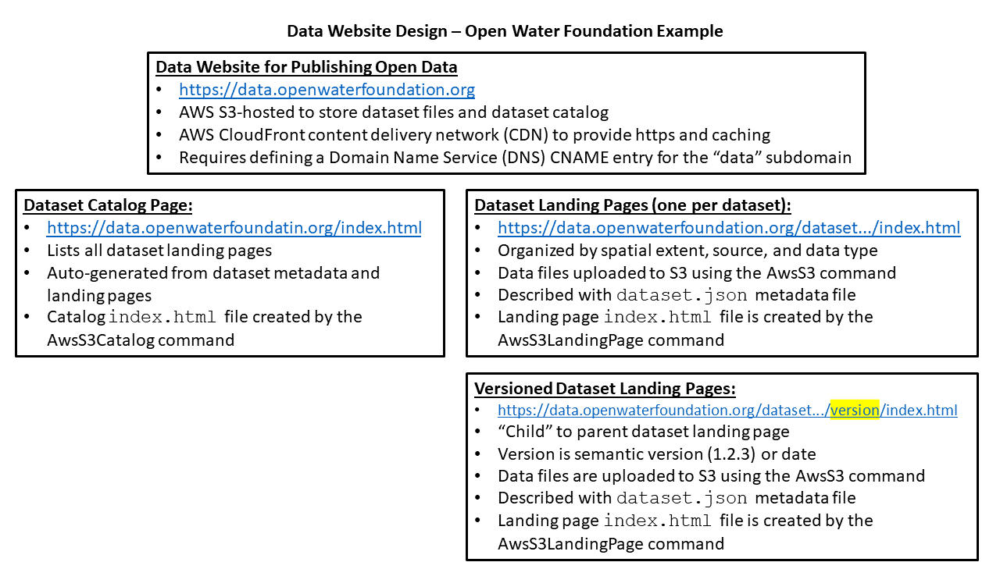

# TSTool / Command Reference / Overview #

*   [Introduction](#introduction)
*   [AWS Commands](#aws-commands)
*   [Dataset Commands](#dataset-commands)
    +   [Dataset Concepts](#dataset-concepts)
    +   [Data Website Design](#data-website-design)
    +   [Creating Dataset Landing Pages](#creating-dataset-landing-pages)
    +   [Creating Dataset Catalogs](#creating-dataset-catalogs)

-------------------

## Introduction ##

This reference section of the documentation provides information about TSTool commands specific to the AWS plugin.

The TSTool core product also has many commands (see the
[TSTool documentation](https://opencdss.state.co.us/tstool/latest/doc-user/command-ref/overview/)).
Additional plugin functionality may be added in the future by enhancing existing commands or adding new commands.

## AWS Commands ##

The following commands provide integration with core AWS services.

**

TSTool AWS Plugin Commands - AWS Integration

**

| **Command**&nbsp;&nbsp;&nbsp;&nbsp;&nbsp;&nbsp;&nbsp;&nbsp;&nbsp;&nbsp;&nbsp;&nbsp; | **Description** |
| -- | -- |
| [`AwsS3`](AwsS3/AwsS3.md) | AWS S3 service integration, which provides features to manage cloud storage files. |
| [`AwsCloudFront`](AwsCloudFront/AwsCloudFront.md) | AWS CloudFront integration, which provides features to manage content deliver network (CDN) files. |

## Dataset Commands ##

The following commands provide functionality built on core AWS features to create and manage datasets, including:

*   Creating landing pages for specific datasets (e.g.,
    [US HUC Basins](https://data.openwaterfoundation.org/country/us/usgs/huc-basins/)).
*   Creating landing pages for versioned datasets under a parent dataset,
    for exaxmple where the version is a [semantic version](https://semver.org/)
    or an effective date.
*   Creating a catalog page to list datasets (e.g.,
    [`https://data.openwaterfoundation.org`](https://data.openwaterfoundation.org)).

**

TSTool AWS Plugin Commands - Dataset Commands

**

| **Command** | **Description** |
| -- | -- |
| [`AwsS3Catalog`](AwsS3Catalog/AwsS3Catalog.md) | AWS S3 catalog page generator for a collection of landing pages. |
| [`AwsS3LandingPage`](AwsS3Catalog/AwsS3LandingPage.md) | AWS S3 landing page generator for datasets and other products. |

### Dataset Concepts ###

A dataset is a collection of related data, for example containing:

*   one or more tables
*   one or more map layers
*   one or more time series
*   one or data files such as Excel workbook, csv, etc.
*   one or more images to visualize the data
*   narrative content explaining the dataset
*   a combination of the above and other files

In some cases, the format of dataset files may be simple, such as a single map layer file.
These datasets may be well-suited for management in a software system such as a database,
geospatial server, open data portal, or other software system.

In other cases, datasets may be comprised of a "bag of files" that are difficult to organize in a standard way.
The design described in this documentation focuses on this type of dataset and uses a dataset landing page
(see the next section) to list the dataset files.

Regardless of the organization of the dataset,
each file or "asset" in the dataset is typically maintained using a primary format and may be
published using one or more standard formats that can be used with commonly available software tools.
Simple data representations such as tables can use simple data formats, such as comma-separated-value (CSV) files.
More complex data require more complex formats and more specific software.

For example, spatial data layers can be published using formats that require specific geographic information system (GIS)
software or may be published using open formats such as GeoJSON,
which is supported in a larger number of tools.

There are common challenges regardless of the complexity of data.
For example, CSV files do not by themselves provide information about column data type (e.g., integer, floating point, string),
format of the data (e.g., precision for floating point numbers), missing data value (e.g., `NaN` for floating point or `null`).
Additional metadata can be provided with simple file formats or more complex formats such as JSON can be used.
However, more complex formats require more complex tools.
Much ongoing effort is invested to develop open data standards and technologies to support data interoperability.

### Data Website Design ###

Datasets can be published using a conceptually straightforward approach that leverages cloud technologies
and automated workflows.
The following figure illustrates the design used by the Open Water Foundation to implement open datasets.
The implementation does involve complexities that are addressed by software including
TSTool and this AWS plugin.

**

**

**

Dataset Design Example (<a href="../dataset-design.png">see full-size image)</a>

**

The initial focus of implementation has been on dataset landing pages
and the [`AwsS3LandingPage`](AwsS3LandingPage/AwsS3LandingPage.md) command,
as described in the following section.

Additional development will occur to fully enable the creation of dataset catalogs using the
[`AwsS3Catalog`](AwsS3Catalog/AwsS3Catalog.md) command.

### Creating Dataset Landing Pages ###

A dataset landing page is an `index.html` page that can be displayed in a web browser and provides access to dataset assets.
The landing page may be a pregenerated file, such as stored on AWS S3 and published on a CloudFront website.
This is the approach taken when using the [`AwsS3LandingPage`](AwsS3LandingPage/AwsS3LandingPage.md) command
A landing page can also be provided by tools such as open data portals for example provided by Socrata, CKAN, and Esri software.

The creation of a dataset landing page may require custom configuration.
This can be accomplished by automating creation of the landing page by merging file inputs such as lists of dataset files.
Workflows can be implemented to automate creation of the landing page.
For example, see the workflow files for the
[US HUC Basins dataset](https://github.com/OpenWaterFoundation/owf-data-us-huc-basins/tree/main/workflow).

Datasets may contain a single version that is updated and overwritten.
A single version may be appropriate when there is no need to access historical dataset snapshots.

In other cases, a parent dataset landing page may be required to organize a list of versioned child datasets.
The versioned datasets may have distinct and separate time context,
for example a snapshot of land use at a point in time.
In other cases, a dataset may represent cumulative time up to the point of the snapshot,
for example time series of land use by categories.
In either case, a timestamp on the dataset is appropriate to provide temporal context and a "latest"
copy may also published to facilitate access by tools without having to specify a version.

The version is often a date or timestamp indicating the time of measurement or an effective time.
It may also be appropriate to use [semantic versioning](https://semver.org/) to indicate major and minor version updates.
It may also be appropriate to use a combination of semantic and time-based versioning.
The time-based version can be implemented in a child dataset's folder and fileanames.

### Creating Dataset Catalogs ###

A dataset catalog is a listing of datasets, with links to dataset landing pages.
The catalog provides enough metadata to allow review, searching, and filtering.
Once a dataset has been identified, applications can link directly to dataset resources.
For example, the [https://data.openwaterfoundation.org](https://data.openwaterfoundation.org) web page
provides a catalog of datasets.  **This website is currently not generaged using the [`AwsS3Catalog`](AwsS3Catalog/AwsS3Catalog.md) command
but will be in the future.**
